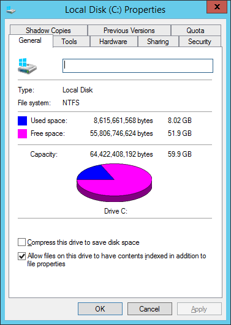
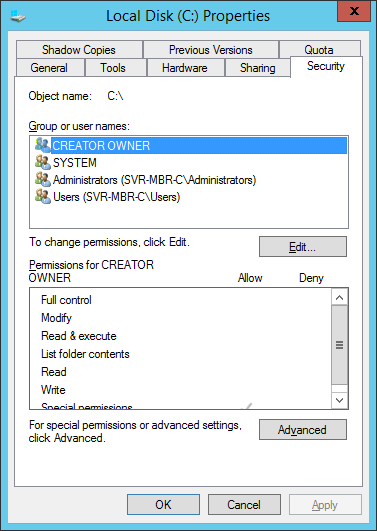
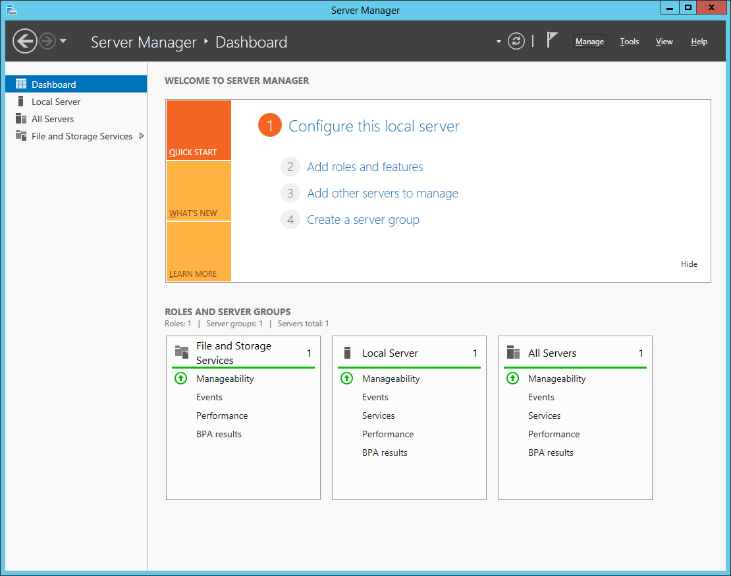
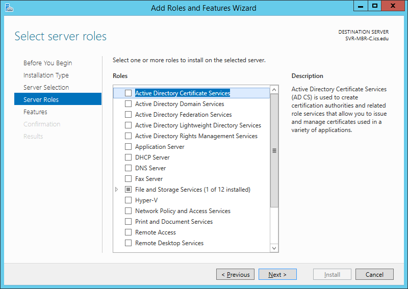

# Week 02 — Introducing Windows Server 2012 R2

**Objective:** identify system requirements across the Windows Server 2012 R2 editions, compare them against a Windows 10 Enterprise client and a real lab PC, then get a first look at NTFS permissions and the Server Manager role catalog.

## Task I — System requirements

| Component | Datacenter / Standard / Essentials / Foundation | Windows 10 Enterprise |
|---|---|---|
| Processor | Min: 1.4 GHz 64-bit · Recommended: 3.1 GHz+ multicore | 1 GHz or faster / SoC |
| Display | Super VGA or higher | 800×600 |
| Memory | Min: 512 MB (2 GB on Essentials) · Recommended: 2–8 GB | 1 GB (32-bit) / 2 GB (64-bit) |
| Disk | Min: 32 GB (90 GB on Essentials) · Recommended: 60 GB+ | 16 GB (32-bit) / 20 GB (64-bit) |
| Optical/USB | DVD drive | DVD drive |
| NIC | Gigabit Ethernet | Gigabit Ethernet |

A lab PC (i7-4790 @ 3.60 GHz, 1920×1080, 16 GB RAM, 466 GB free disk) comfortably clears every one of these minimums, so **yes**, it could be upgraded to run Windows Server 2012 R2 Datacenter.

## Task II — Windows Server Catalog

Cross-checked NIC, display, and USB hardware against the official Windows Server Catalog compatibility list before committing to an install — every component checked came back listed as compatible with both Windows Server 2012 R2 Datacenter and Windows 10 Enterprise. Skipping this step and installing with unlisted hardware risks a system that doesn't run reliably — low RAM, storage, or an unsupported processor can all cause problems down the line.

## Task III — NTFS permissions and attributes

|  |  |
|---|---|

- **File system on C:\\** — NTFS (New Technology File System).
- **Is FAT/FAT32 recommended for the Windows Server 2012 R2 install partition?** No — Microsoft's modern OSes (Server 2012 R2, Windows 10, Windows 7) are all built around NTFS, and NTFS has always been the more capable file system of the two.
- **Administrators' default file permissions:** Full control, Modify, Read & execute, List folder contents, Read, Write.
- **Users' default file permissions:** Read & execute, List folder contents, Read.
- **File attribute checkboxes** on a new text file: Read-only and Hidden.
- **Advanced attributes** split into two groups: *File attributes* (ready for archiving; allow indexing) and *Compress or Encrypt* (compress to save disk space; encrypt to secure contents).

## Task IV — Exploring server roles

Connected to the class file share (`\\10.1.100.51`), copied the lab files to an external SSD, then powered on **410Server1** in VMware Workstation.

- The Dashboard showed **2 roles and 1 server group** already configured.
- **Add Roles and Features** requires three preliminary steps before you reach the role list: *Before You Begin*, *Installation Type*, and *Server Selection*.

- **20 roles** are available in the list; **one** — DNS Server — was already installed.

---
**Next Section**: [Week 03 — Installing Windows Server 2012 R2](week03-installing-server-2012r2.md)