# Week 04 — Configuring File and Printer Services

**Objective:** manage NTFS permissions and ownership, create and lock down Windows file shares, then install, share, and connect to a network printer.

## Task I — Securing access with NTFS permissions

Set up a new virtual disk in VMware (SCSI, 10 GB, split into multiple files) as the sandbox for the permissions exercises, then walked through the textbook's file-permission activities on it.

- A freshly created volume ships with **five** default groups/users in its ACL: **Everyone, CREATOR OWNER, SYSTEM, Administrators, Users**.
- Their default permissions:
  - **Everyone** and **CREATOR OWNER** — Special permissions only.
  - **SYSTEM** and **Administrators** — Full control (Modify, Read & execute, List folder contents, Read, Write).
  - **Users** — Read & execute, List folder contents, Read, Special permissions.
  - → Everyone/CREATOR OWNER share the same baseline, and SYSTEM/Administrators share the same baseline.
- Permissions can be changed via the **Advanced** button on the Security tab (true).
- To let *everyone* edit a file in a folder, the **Modify** box needs to be checked in basic permissions (true).

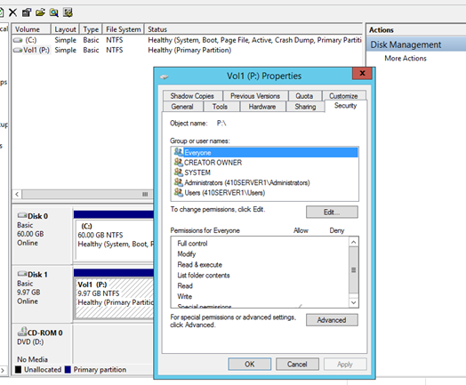

**ACE (Access Control Entry)** is a single permission grant assigned to a specific user or group. Entries can appear grayed out in the Security tab when they're **inherited** from a parent folder — you can't edit an inherited entry directly.

A newly created *file* (as opposed to folder) has no **CREATOR OWNER** entry in its Security tab, because that entry only applies to folders, not files.

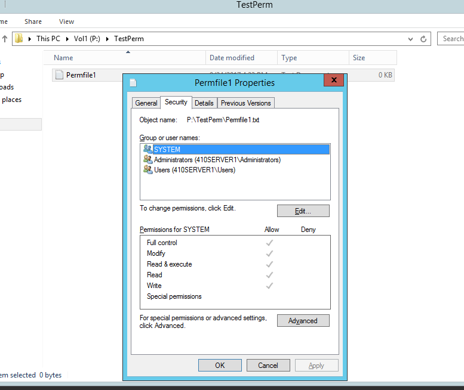

Working through a locked-down `TestPerm` folder surfaced the practical effect of permissions:
- Renaming a file to reveal extensions worked fine (e.g. seeing `.txt` on a file).
- Opening a file without Read & execute rights threw *"Windows cannot access the specified device, path, or file."*
- Editing and saving that file failed for the same reason — read access alone doesn't grant write/execute.
- Double-clicking a file you no longer have access to raises *Access is denied*.
- The fix in every case: add yourself back into the file's Security tab with the permissions you need.

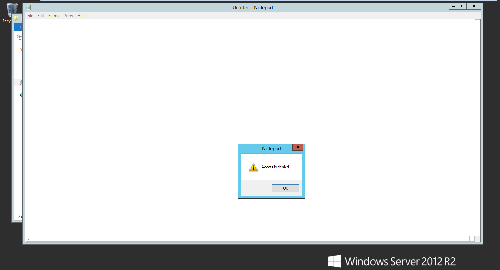

## Task II — Creating Windows file shares

- A newly created share is accessible by default to the **Administrator** user and **Administrators** group only.
- Once mapped, a share shows up under **Network** in File Explorer as `\\410SERVER1\TestShare12`.
- Default share permissions for **Everyone** and **Administrators**: Full control, Change, Read.

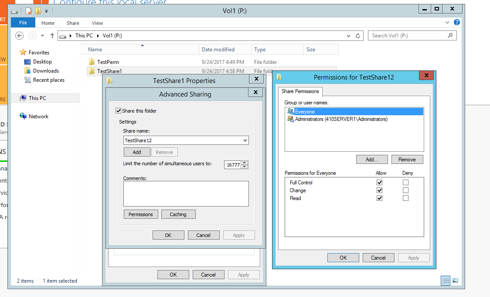

Ownership and permission interplay:
- A regular test user can't delete a file owned by Administrators — deleting requires the owner's permission, which surfaces as *Access Denied*.
- A file a test user creates is owned by that user, who gets full control of it; Administrators (as the built-in owning group) also retains full control.
- A user without access to another user's share hits a network error trying to open it — again, straightforward permission enforcement rather than a bug.

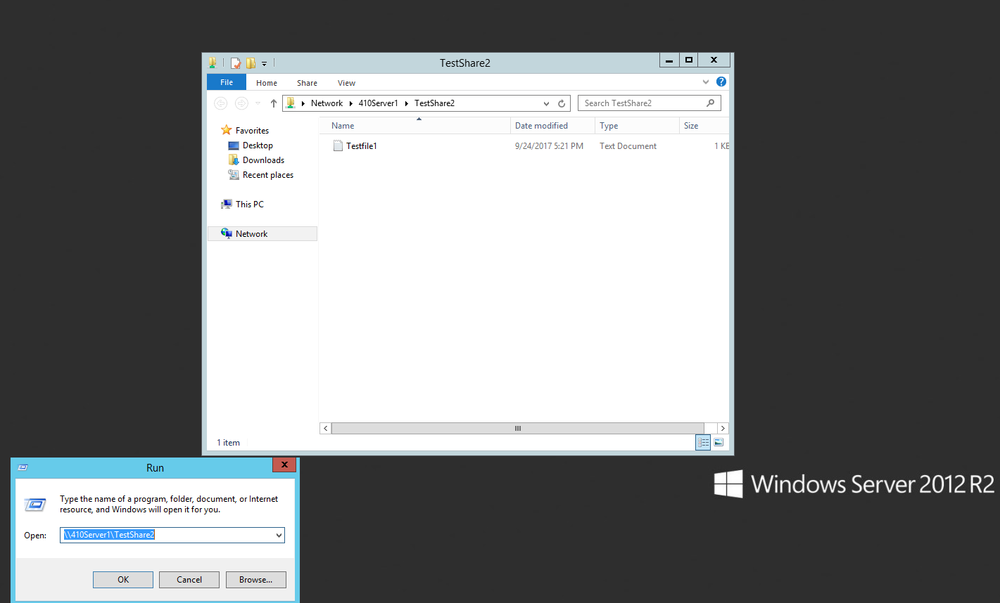
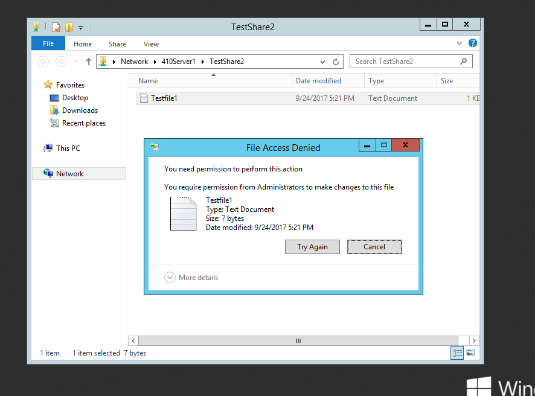
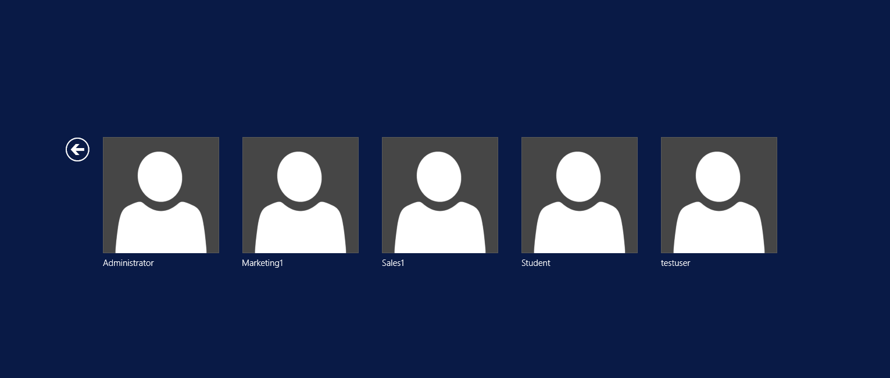
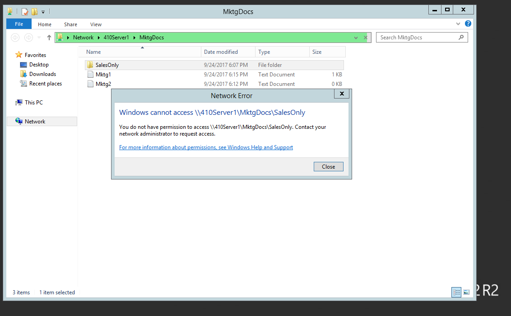

## Task III — Installing and sharing a printer

- **"Add a printer using a TCP/IP address or hostname"** vs. **"Add a local printer with manual settings"** — both let you target a printer by IP, but the manual-settings path also lets you attach to an existing port (USB, LPT, local, TCP/IP) and manually install a driver if Windows doesn't have one.
- Printer used: `10.16.251.6` (LBJ 2315 Self Instruction Lab).
- Printed a test page successfully after setup.

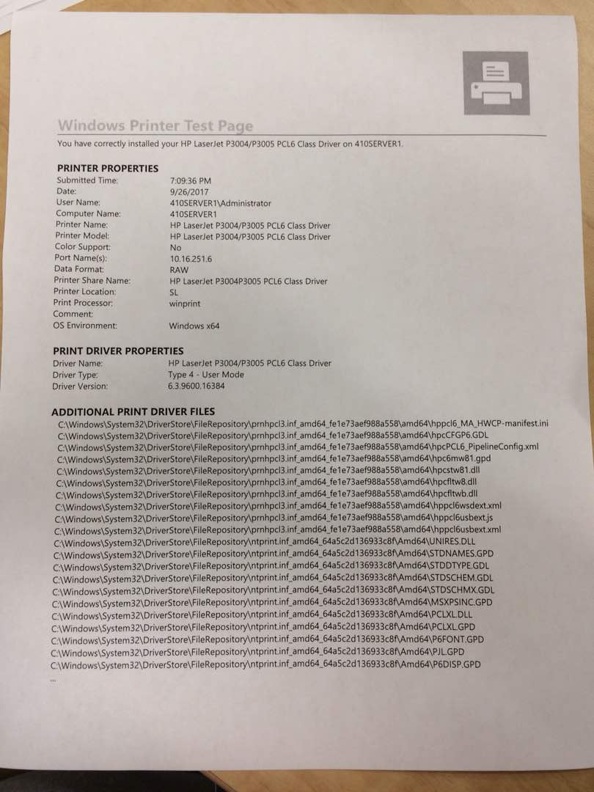

- In the printer's Security tab: **Everyone** has permission to manage the printer; **CREATOR OWNER** has permission to manage the documents they printed.

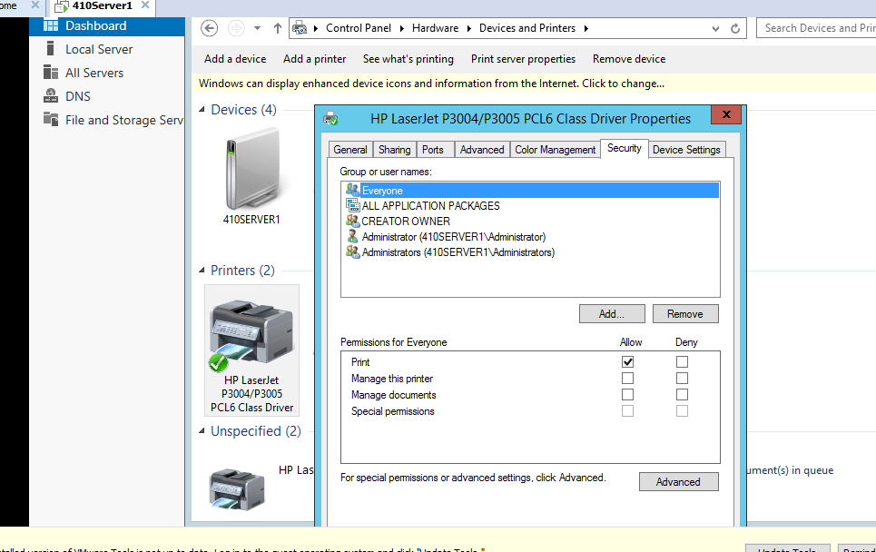
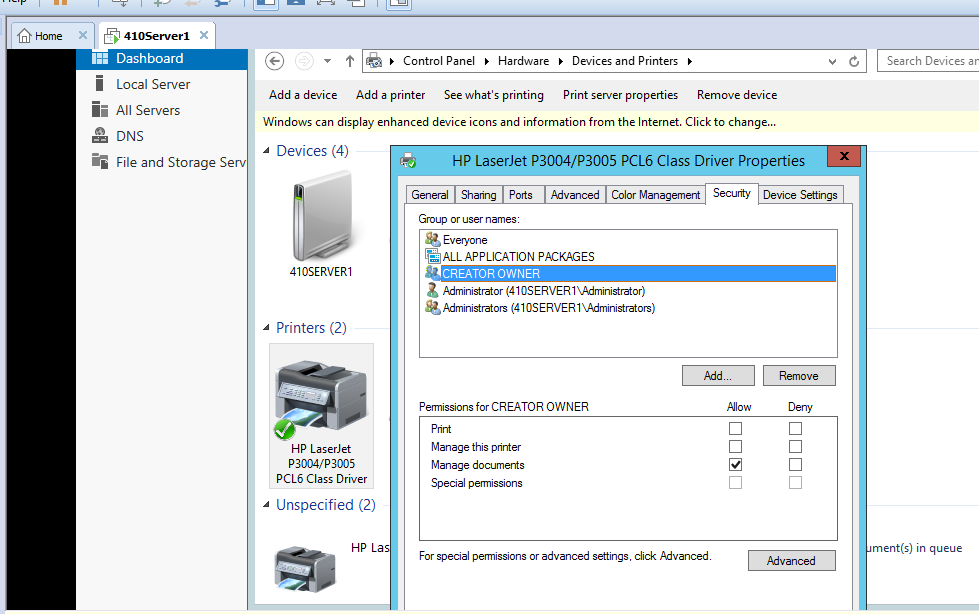

## Task IV — Connecting to a shared printer

Connected a client to the shared printer and printed a test page successfully.

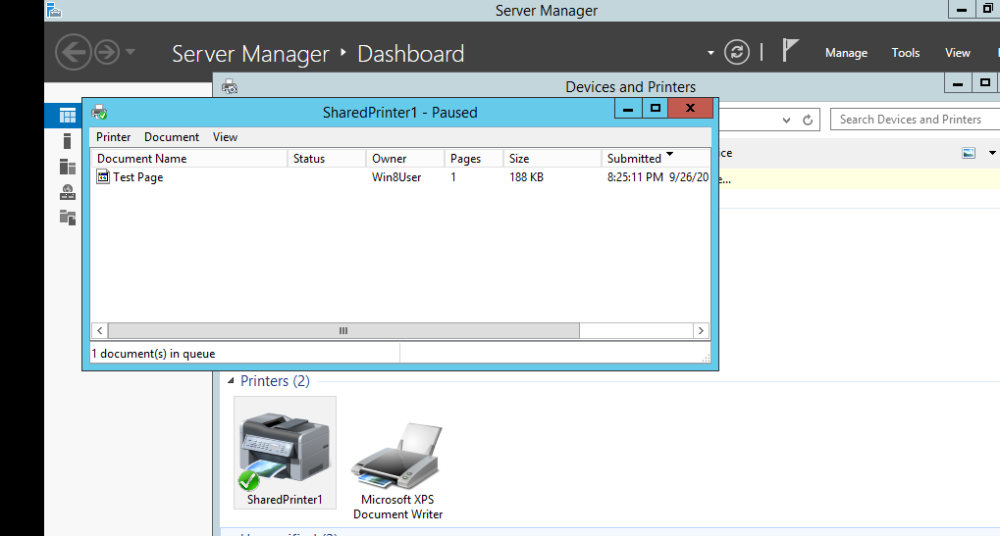

Canceling a queued print job from the client left it paused on the server — resolved by having the server administrator un-pause the printer to release the job.

---
**Next Section**: [Week 05 — Introducing Active Directory](week05-active-directory-intro.md)