# Week 05 — Introducing Active Directory

**Objective:** install AD DS as the first domain controller in a new forest, explore Active Directory's container objects, then get a first look at Group Policy.

## Task I — Installing and configuring AD DS

**Activity 6-1 — Install AD DS and DNS on 410Server1**

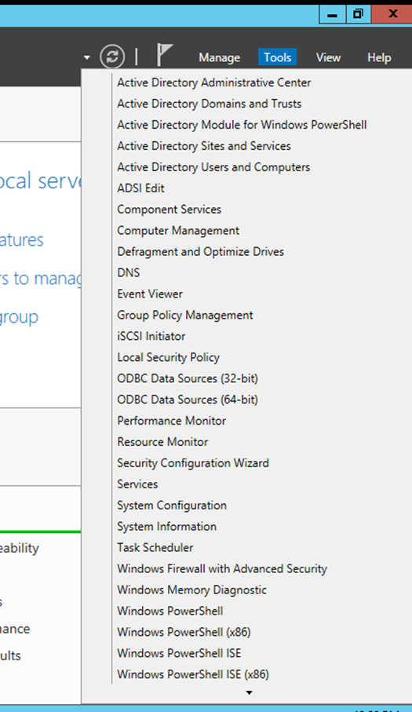

- After the roles install, the server needs a manual restart to complete promotion to a domain controller.
- Post-restart, the logon screen's domain changed to `410Server2012\Administrator` — visible confirmation the box is now a domain controller.
- **MMC** = Microsoft Management Console — the framework admins use to open, save, and arrange the various administrative snap-in tools Windows provides.

**Activity 6-2 — Domain/forest functional level & default groups**

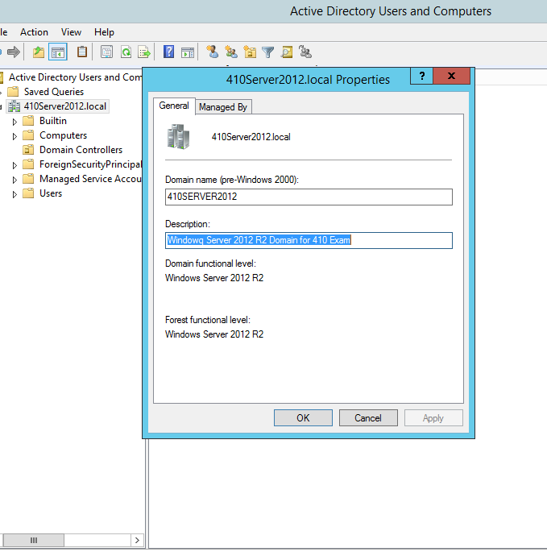

- Confirmed both the domain and forest functional levels report **Windows Server 2012 R2**.
- The default **Users** container lists **27** built-in group accounts.

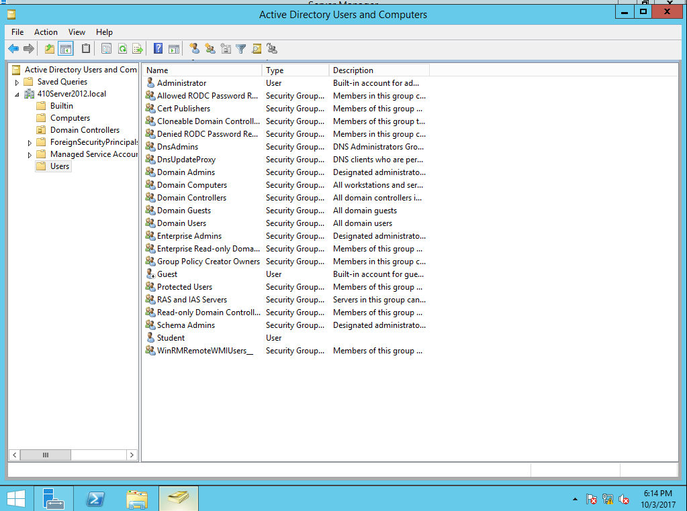

**Activity 6-3 — Simple file sharing & user properties**

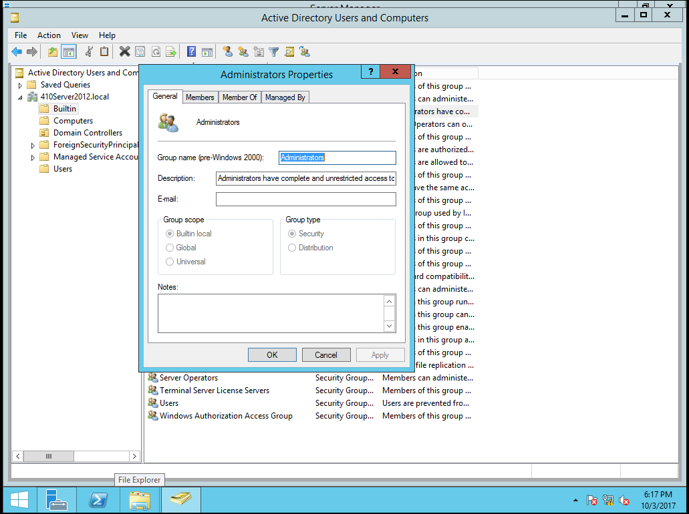

- A built-in group's **Member Of** tab is empty and its Add/Remove buttons are disabled — built-in groups can't themselves be members of other groups.
- The **Operating System** tab on the domain controller's computer object reports **Windows Server 2012 R2 Datacenter, Version 6.3 (9600)**.

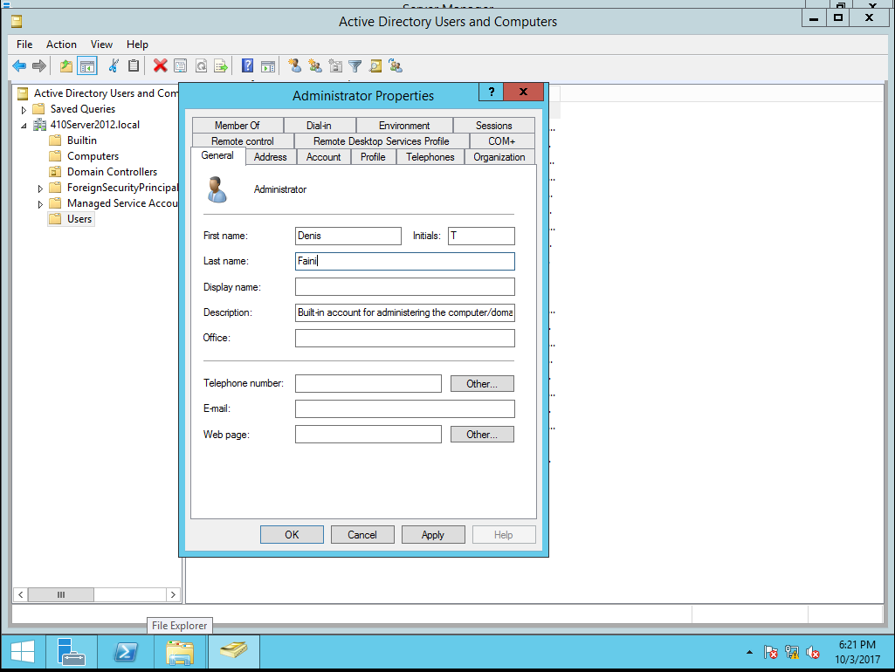

- Comparing the **Account** tab for the built-in **Administrator** vs. **Guest** users: Administrator has every account-restriction checkbox disabled by default, while Guest has three enabled out of the box — *User cannot change password*, *Password never expires*, and *Account is disabled*.

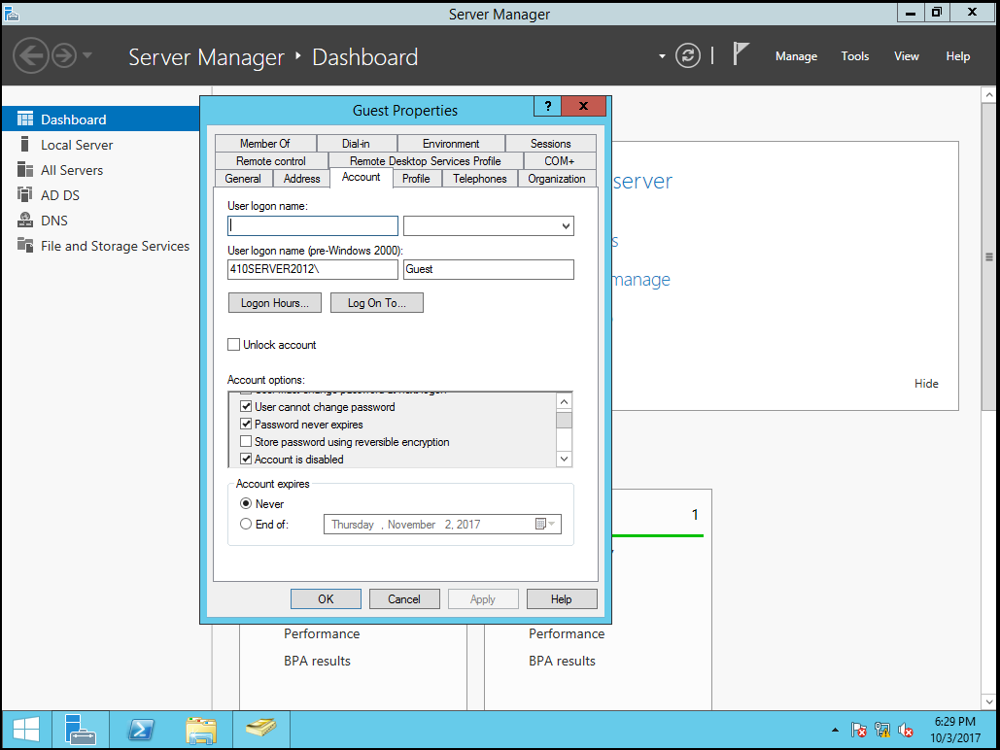

**Activity 6-4 — Password policy enforcement**

- Creating a new user with a weak password fails with an error explaining the domain's password policy — minimum length, and a mix of uppercase, lowercase, numbers, and a special character (e.g. `@#!$`).

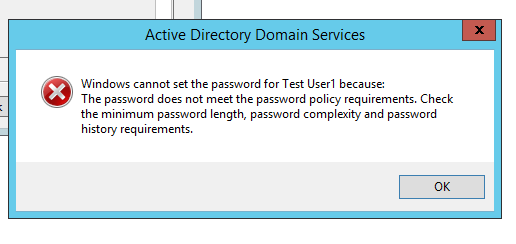

- Group membership after adding a test account: member shown is **Test User1**.

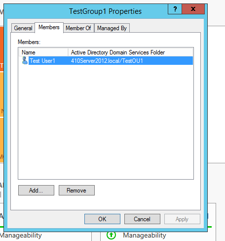

**Activity 6-5 — `dsadd` from the command line**

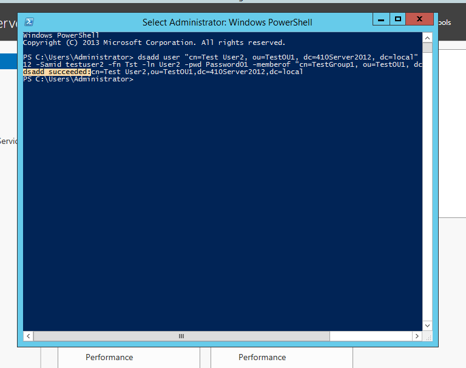

Verified the new object (Test User 2) appears correctly inside its target OU (`TestOU1`).

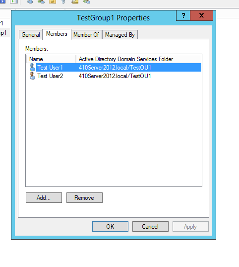

**Activities 6-6 / 6-8 — Find Now, and publishing a share in AD**

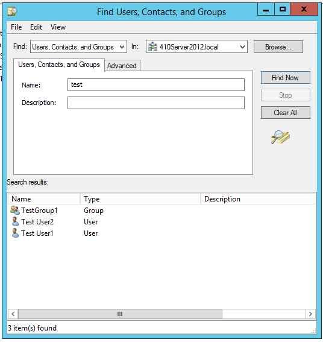
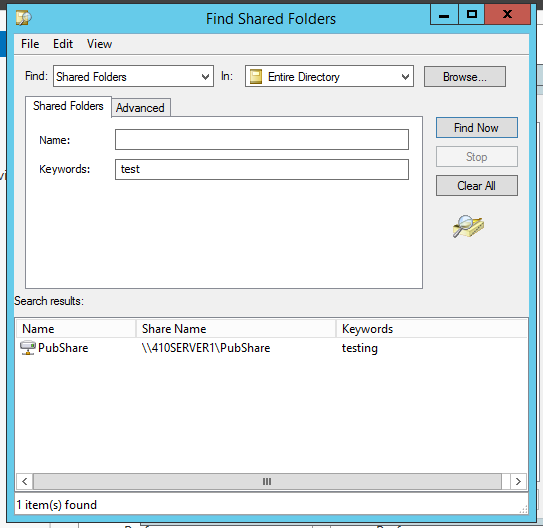
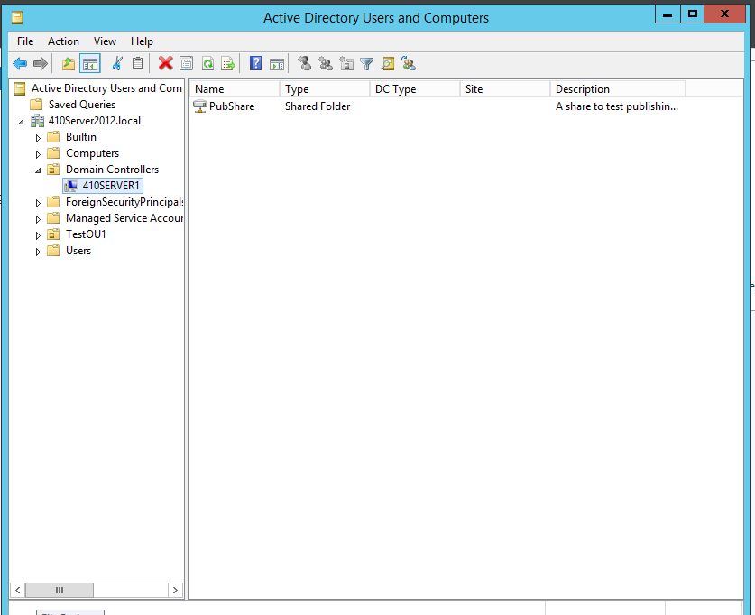

- Toggling **View → Users, Contacts, Groups, and Computers as containers** off changes what the right pane shows when clicking **Domain Controllers** on the left — it switches from showing that container's contents to showing the domain controller computer object itself.

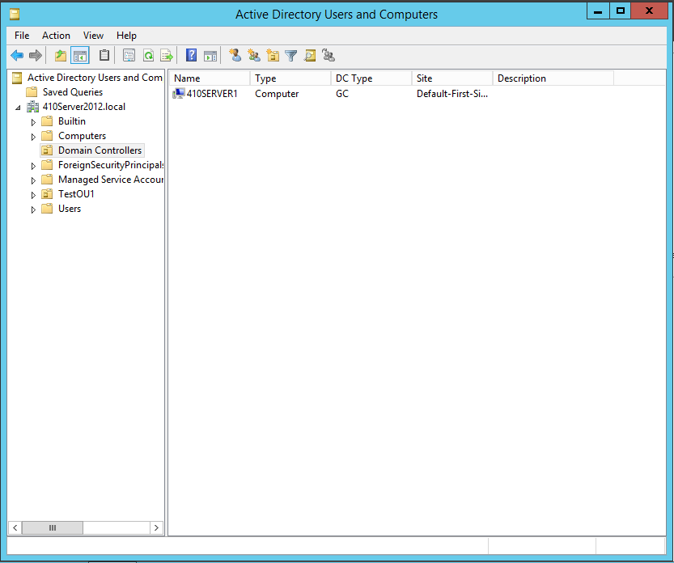

## Task II — Introducing Group Policy

**Activity 6-11 — Default Domain Policy**

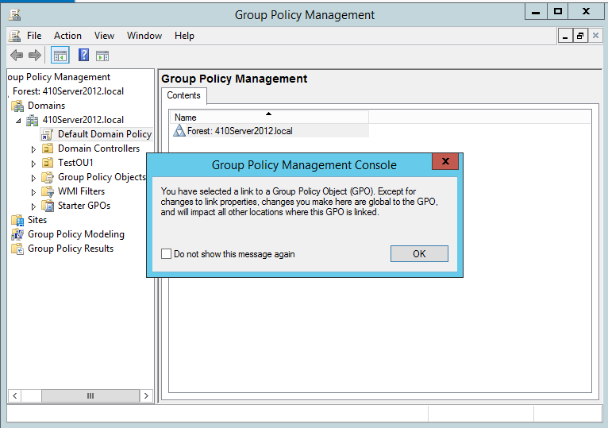

- Editing the **Default Domain Policy** triggers a warning because it's *linked* — any change made here applies everywhere the GPO is linked, not just to the object you clicked from.

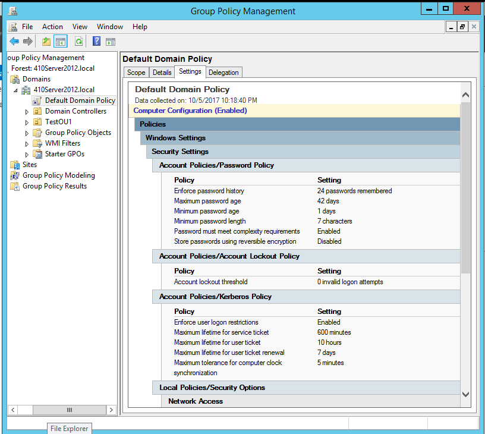

Reviewing **Account Policies / Password Policy**:
- *Enforce password history: 24 remembered* — prevents users from cycling back to recently-used passwords.
- *Maximum password age: 42 days* — forces expiration on a schedule that roughly matches typical business cycles, limiting the exposure window if a password leaks.
- *Password must meet complexity requirements: Enabled* — requires the same length/character-mix rule seen earlier (600 minutes, for reference, is 10 hours).
- The **User Configuration** node shows no settings yet because nothing has been configured there.
- The Policies folder splits into three subfolders: **Software Settings**, **Windows Settings**, **Administrative Templates**.
- The three defined policies visible under **Local Policies**: **Audit Policy**, **User Rights Assignment**, **Security Options**.
- On a fresh domain, **Account Policies** has no explicit settings, but a number of **User Rights Assignments** are already defined — by default, most administrative actions are restricted to the Administrators, Backup Operators, and Server Operators groups.

**Activity 6-12 — Testing a Control Panel restriction policy**

- With **Enabled**, users covered by the policy lose access to Control Panel/PC Settings; **Disabled** restores access; **Not Configured** means the policy has no effect either way.
- Logging in as `testuser1` under the enabled restriction produced a sign-in error — the account is blocked from logging on locally to the server.

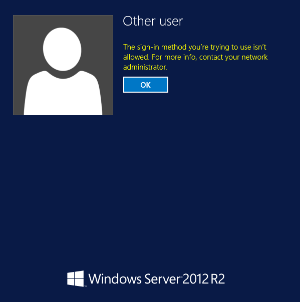

- After adjusting the policy, `testuser1` was able to log on successfully.
- Opening Control Panel produced a restriction message; opening **Screen Resolution** produced the same restriction plus an `explorer.exe` error.
- Opening **Server Manager** prompted a User Account Control box asking for administrator credentials — `testuser1` doesn't have permission to change system configuration.
- `testuser1` was also unable to shut down the server (true) — another effect of the same restricted rights assignment.
- 
---
**Next Section**: [Week 06 — Managing OUs and Active Directory Accounts](week06-ch7-ous-and-ad-accounts.md)