# Week 06 — Managing OUs and Active Directory Accounts

**Objective:** work through Chapter 7's Organizational Unit and AD account management activities on **410Server1** — this lab assumes DNS and AD DS are already installed (see [Week 05](week05-active-directory-intro.md)).

Evidence captured at the checkpoint noted for each activity:

| Activity | Checkpoint | Screenshot |
|---|---|---|
| 7-1 | Step 5 | 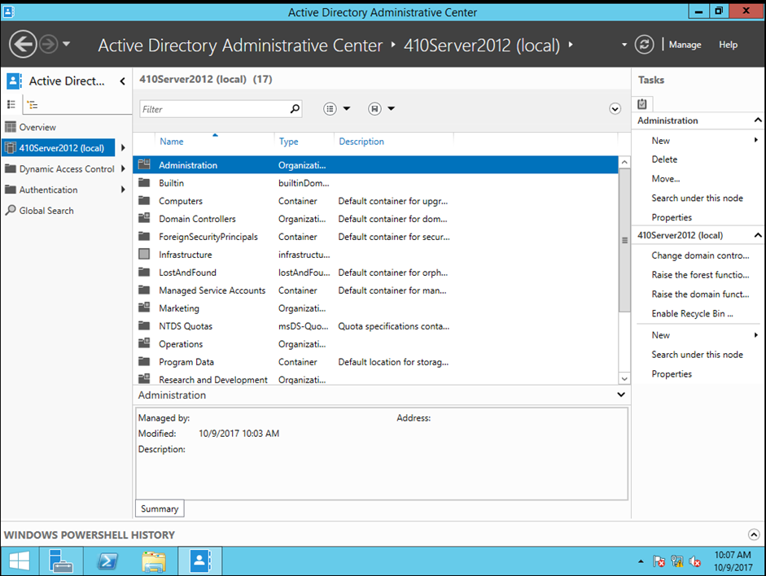 |
| 7-2 | Step 7 | 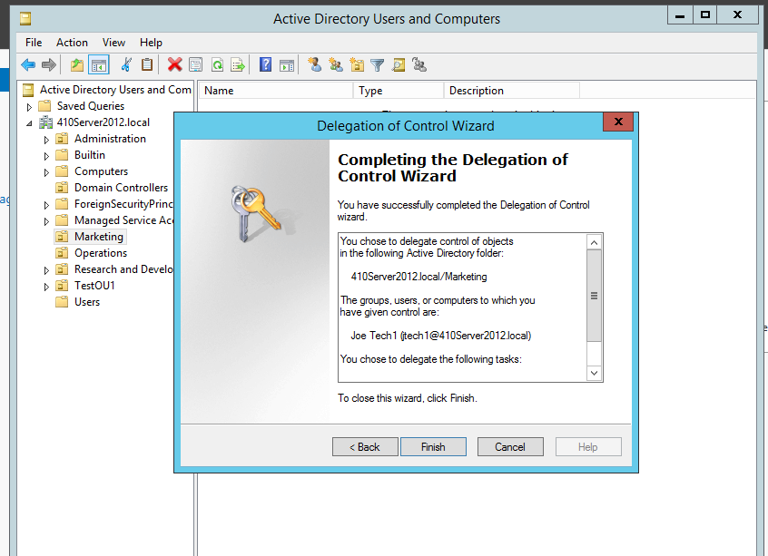 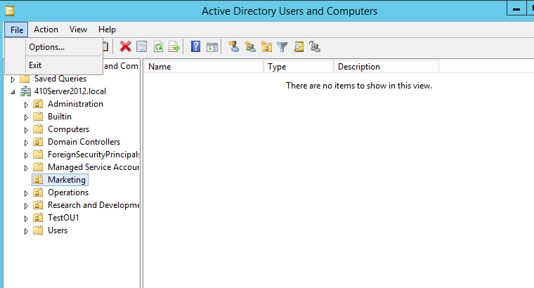 |
| 7-4 | Step 11 | 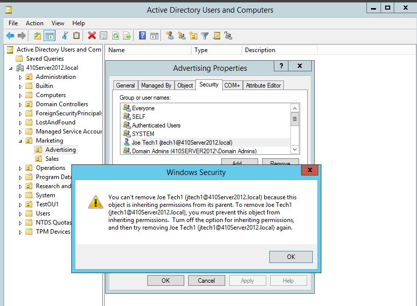 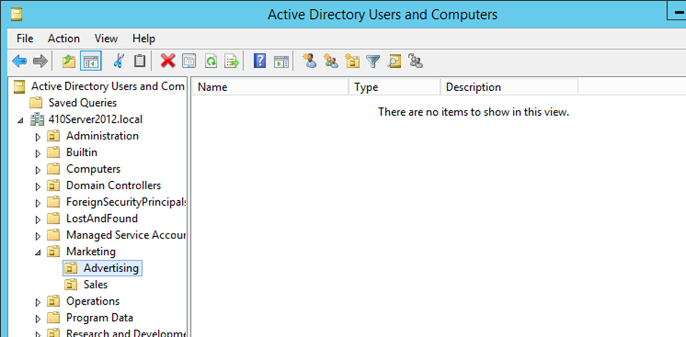 |
| 7-5 | Steps 12, 13, 26 | 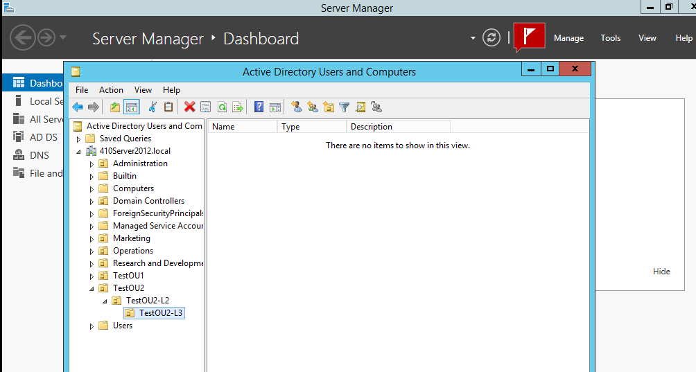 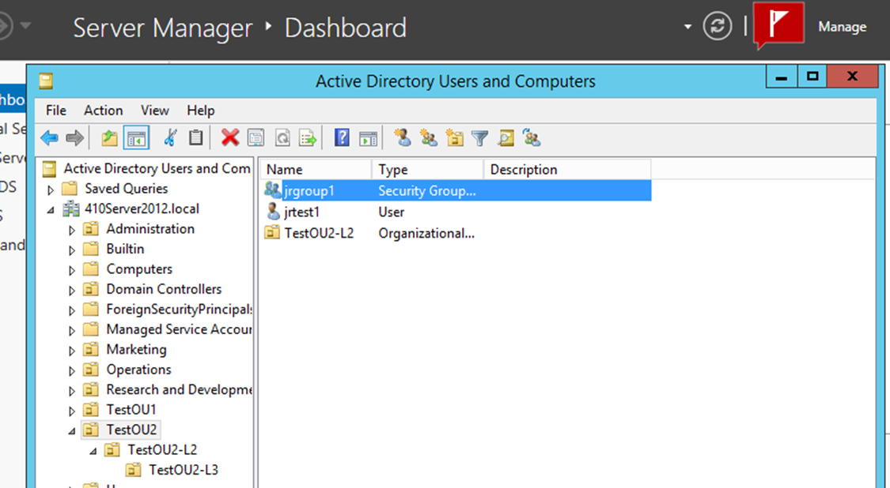 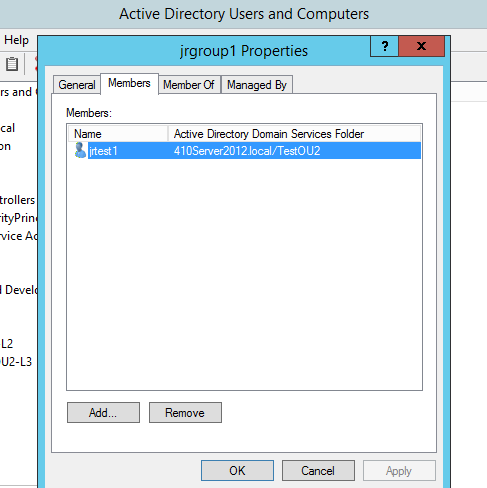 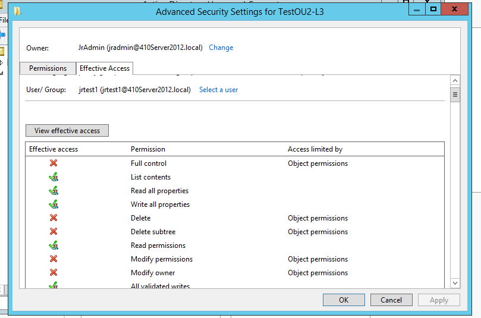 |
| 7-6 | Step 11 | 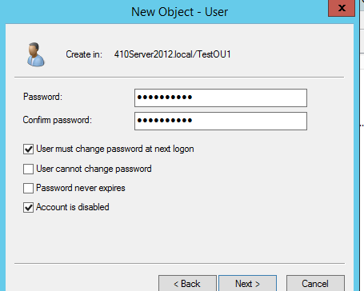 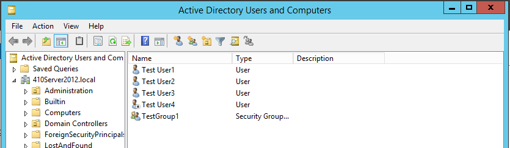 |
| 7-7 | Steps 7 & 9 | 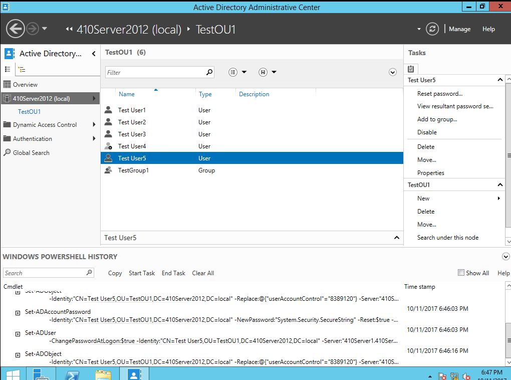 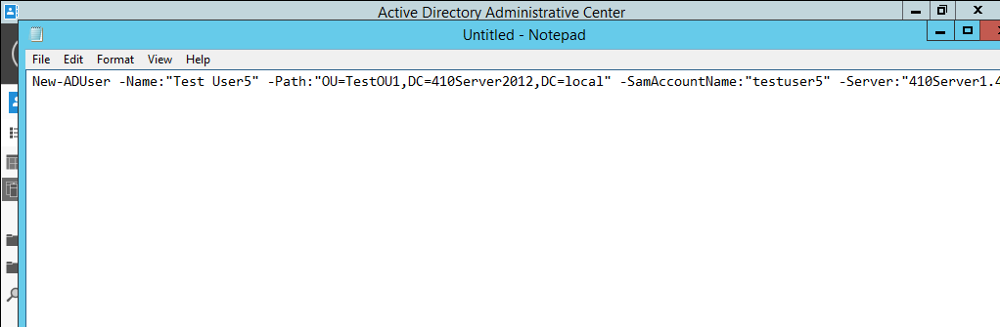 |
| 7-8 | Step 12 | 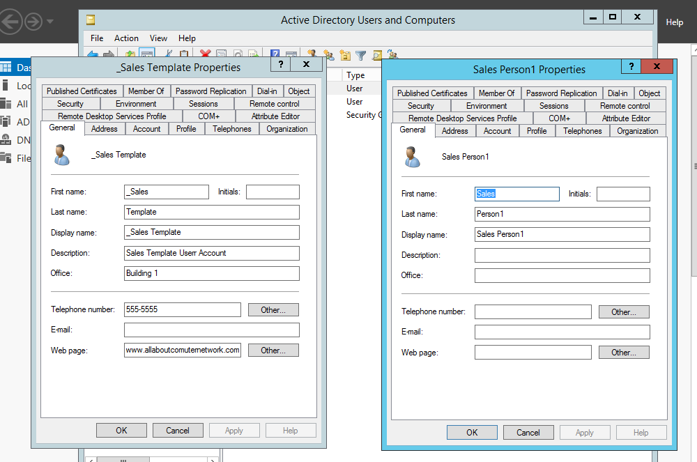 |
| 7-10 | Step 8 | 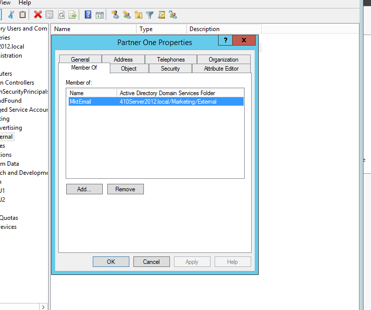 |
| 7-11 | Step 11 | 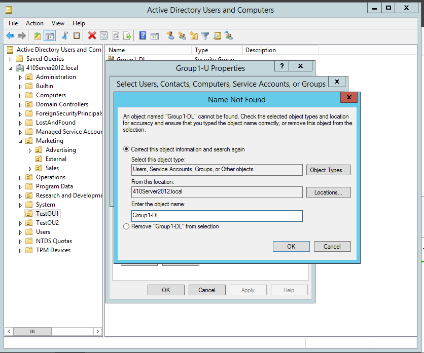 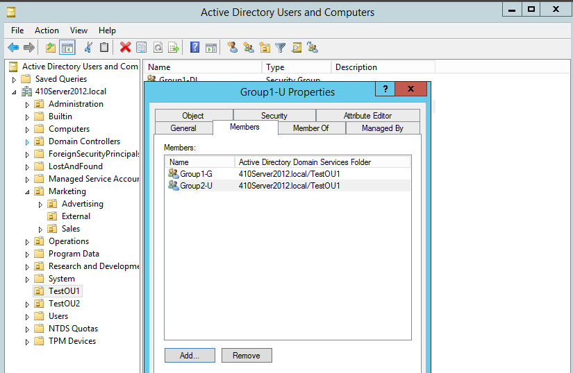 |
| 7-13 | Step 7 | 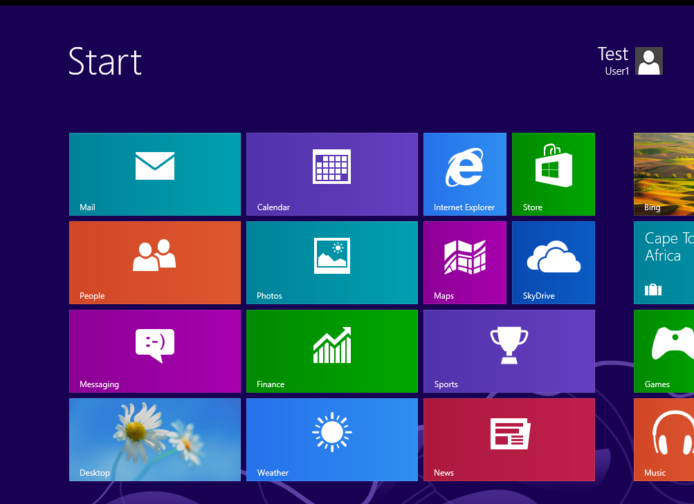 |
| 7-14 | Step 9 | 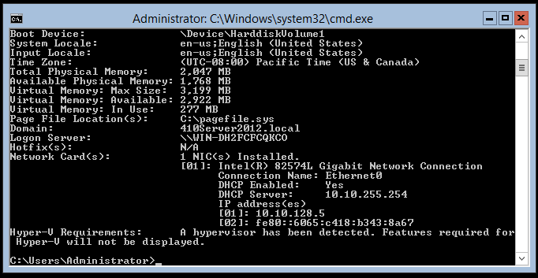 |
| 7-15 | Step 9 (AdvUser1, AdvUser2, AdvUser3) | 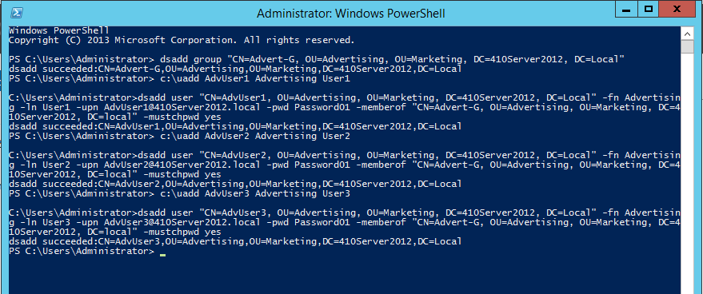 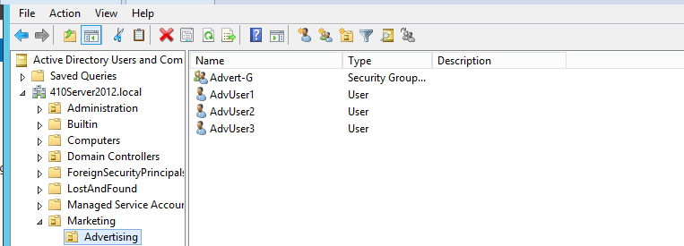 |

These activities cover creating and organizing OUs, bulk-creating user accounts, moving/renaming/deleting objects, and using the account-creation wizard's advanced options — the working set that Group Policy in [Week 07](week07-ch8-group-policies.md) gets applied against.

---
**Next Section**: [Week 07 — Configuring Group Policies (Chapter 8)](week07-ch8-group-policies.md)