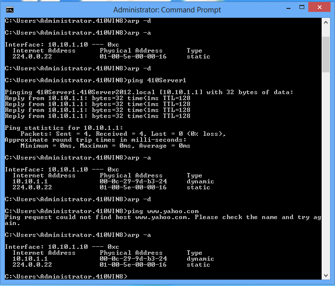
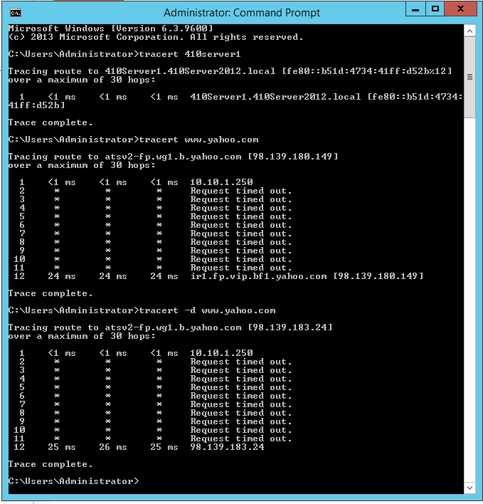
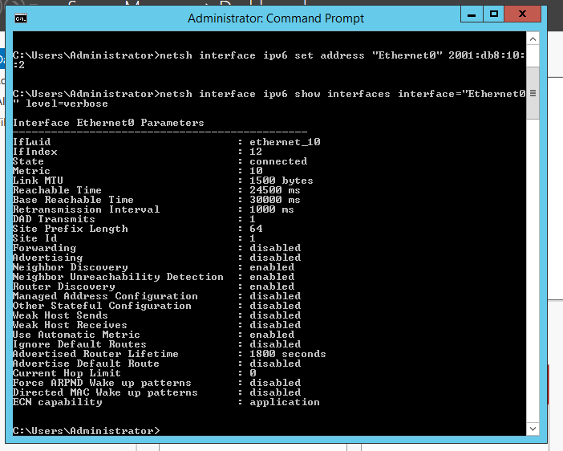
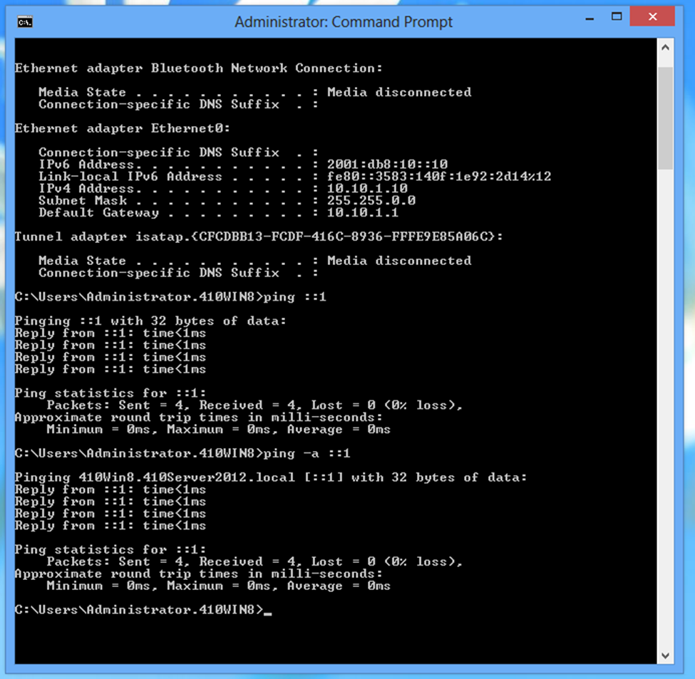
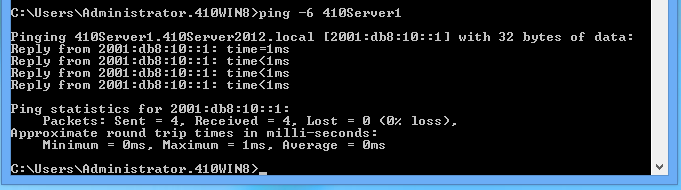
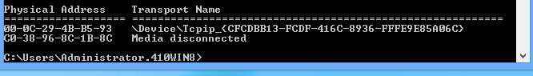
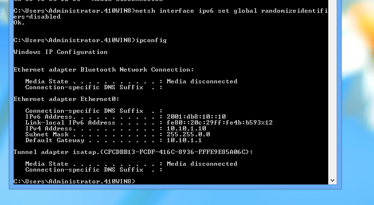

# Week 09 — Configuring TCP/IP (Chapter 9)

**Objective:** drill binary/decimal conversion, CIDR math, and hands-on TCP/IP tooling (`arp`, `tracert`, `ping -6`, static IPv6) across the lab's Windows machines.

## Activity 9-1 — Decimal → binary

| Decimal | Binary |
|---|---|
| 167 | 10100111 |
| 149 | 10010101 |
| 252 | 11111100 |
| 128 | 10000000 |
| 64 | 01000000 |
| 240 | 11110000 |
| 255 | 11111111 |
| 14 | 00001110 |
| 15 | 00001111 |
| 63 | 00111111 |
| 188 | 10111100 |
| 224 | 11100000 |

## Activity 9-2 — Binary → decimal

| Binary | Decimal |
|---|---|
| 00110101 | 53 |
| 11111000 | 248 |
| 00011111 | 31 |
| 10101010 | 170 |
| 01010101 | 85 |
| 11111110 | 254 |
| 11111100 | 252 |
| 00111011 | 59 |
| 11001100 | 204 |
| 00110011 | 51 |
| 00000111 | 7 |
| 00111100 | 60 |

## Activity 9-3 — Working with CIDR notation

| Network/Prefix | Subnet Mask | Host Bits | Usable Hosts |
|---|---|---|---|
| 172.16.1.0/24 | 255.255.255.0 | 8 | 254 |
| 10.1.100.128/26 | 255.255.255.192 | 6 | 62 |
| 10.1.96.0/19 | 255.255.224.0 | 13 | 8190 |
| 192.168.1.0/24 | 255.255.255.0 | 8 | 254 |
| 172.31.0.0/16 | 255.255.0.0 | 16 | 65534 |
| 10.255.255.252/30 | 255.255.255.252 | 2 | 2 |
| 172.28.240.0/20 | 255.255.240.0 | 12 | 4094 |
| 10.44.108.0/22 | 255.255.252.0 | 10 | 1022 |
| 192.168.100.24/21 | 255.255.248.0 | 11 | 2046 |
| 172.23.64.0/18 | 255.255.192.0 | 13 | 8190 |
| 192.168.5.128/25 | 255.255.255.128 | 7 | 126 |

## Activity 9-4 — Determining the correct prefix

| Network ID | Required Hosts | Host Bits Needed | Network ID/Prefix |
|---|---|---|---|
| 172.16.1.0 | 254 | 8 | 172.16.1.0/24 |
| 10.1.100.128 | 62 | 6 | 10.1.100.128/26 |
| 10.1.96.0 | 8190 | 13 | 10.1.96.0/19 |
| 192.168.1.0 | 200 | 8 | 192.168.1.0/24 |
| 172.31.0.0 | 65000 | 16 | 172.31.0.0/16 |
| 10.255.255.252 | 2 | 2 | 10.255.255.252/30 |
| 172.28.240.0 | 4000 | 12 | 172.28.240.0/20 |
| 10.44.108.0 | 900 | 10 | 10.44.108.0/22 |
| 192.168.240.0 | 2200 | 11 | 192.168.240.0/21 |
| 172.23.64.0 | 1600 | 11 | 172.23.64.0/21 |
| 192.168.5.128 | 110 | 7 | 192.168.5.128/25 |

## Activity 9-5 — Using `arp`

- `www.yahoo.com` resolves to a **Class A** address.
- That address is a **public** IP.

## Activity 9-6 — Using `tracert`

- Trace to the target completed in **12 hops**.
- Difference between the two trace commands: one reports IP addresses along the path, the other reports hop count — the two outputs together give you both the path and its length.

## Activity 9-7 — Setting a static IPv6 address

## Activity 9-8 — Working with IPv6

- `ping ::1` — Windows replies because it's pinging its own loopback address.
- `ping -a ::1` — the `-a` flag tells `ping` to resolve and display the hostname for that address (in this case, the local machine's own name).

- `ping -6 <host>` — the `-6` flag forces `ping` to use IPv6 explicitly.

- Checked the local MAC address via `ipconfig /all`.

---
**Next Section**: [Week 10 — Configuring DNS](week10-dns.md)