# Week 11 — Configuring DHCP

**Objective:** install and configure the DHCP server role — scopes, exclusions, reservations, and lease behavior — and verify clients pick up addresses correctly.

| Activity | Checkpoint | Screenshot |
|---|---|---|
| 11-1 | Step 2 | 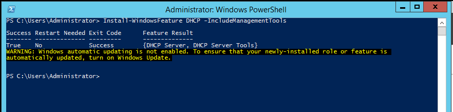 |
| 11-1 | Step 7 | 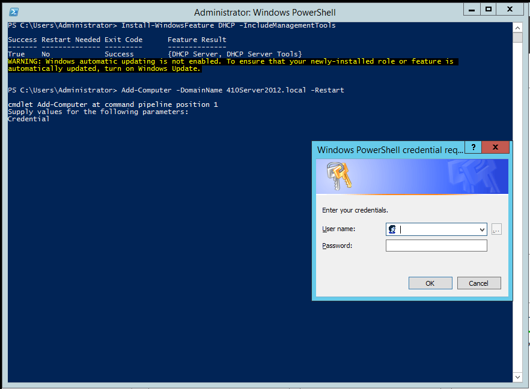 |
| 11-1 | Step 11 | 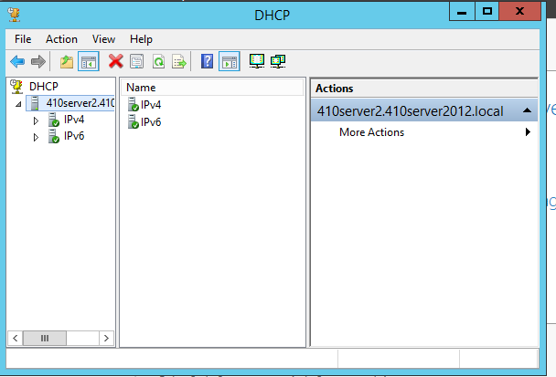 |
| 11-2 | Step 9 | 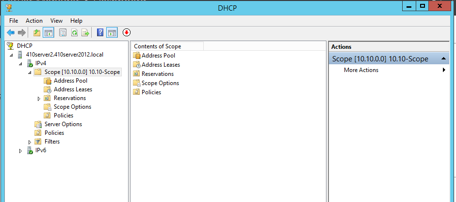 |
| 11-2 | Step 11 | 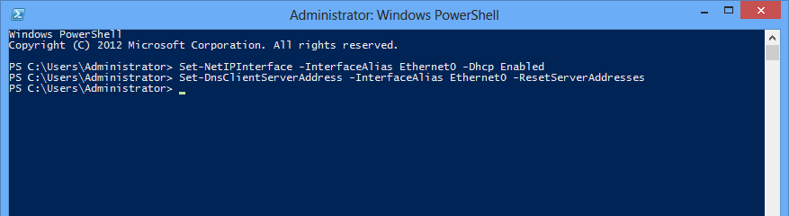 |
| 11-2 | Step 13 | 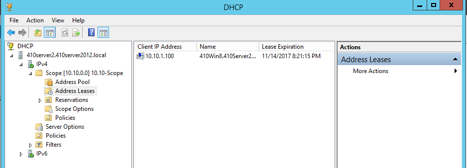 |
| 11-3 | Step 4 | 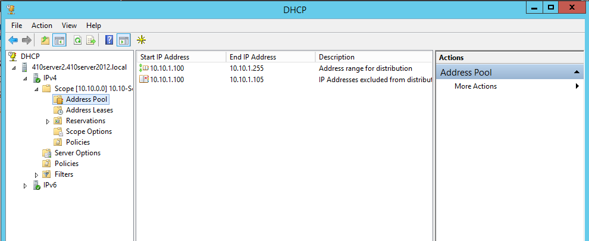 |
| 11-3 | Step 6 | 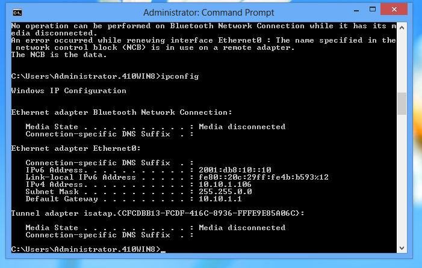 |
| 11-3 | Step 10 | 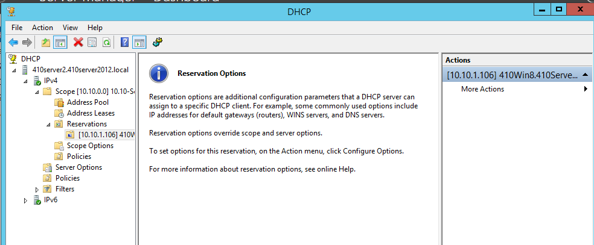 |
| 11-3 | Step 12 | 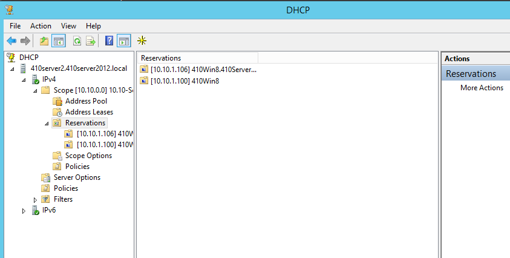 |
| 11-3 | Step 13 | 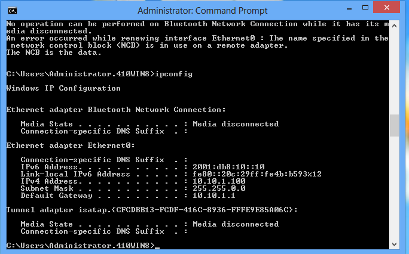 |
| 11-4 | Step 5 | 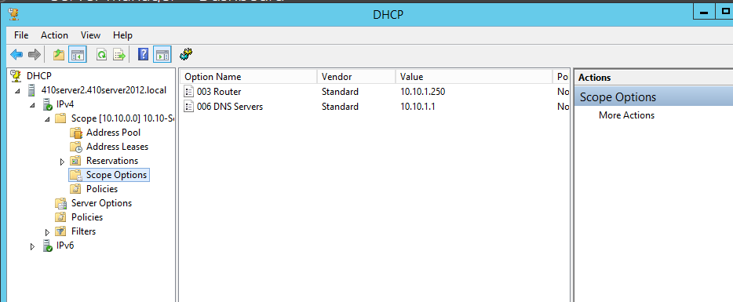 |
| 11-4 | Step 6 | 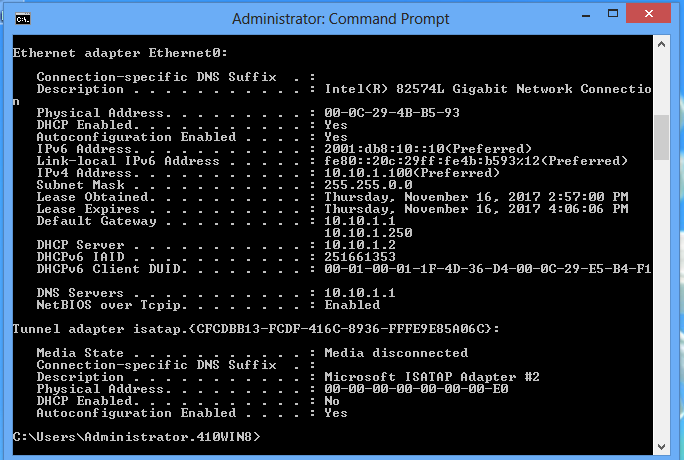 |
| 11-4 | Step 9 | 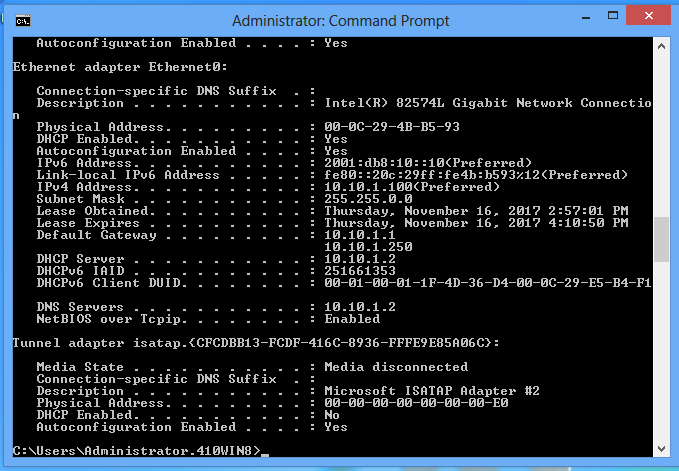 |
| 11-7 | Step 1 | 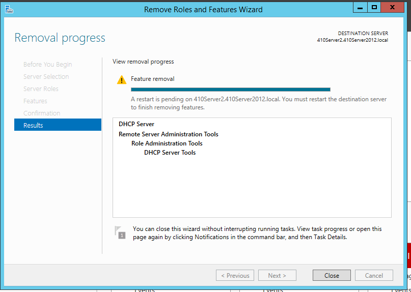 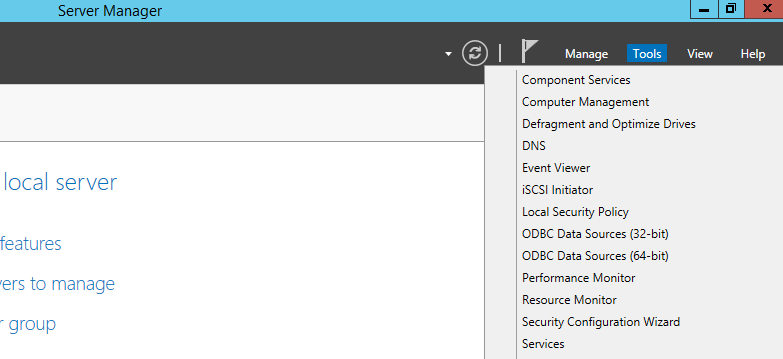 |
| 11-7 | Step 2 | 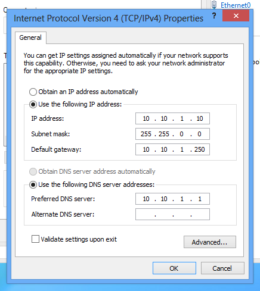 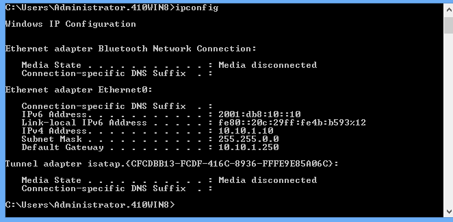 |

---
**Next Section**: [Week 12 — Introduction to Linux](week12-linux-intro.md)