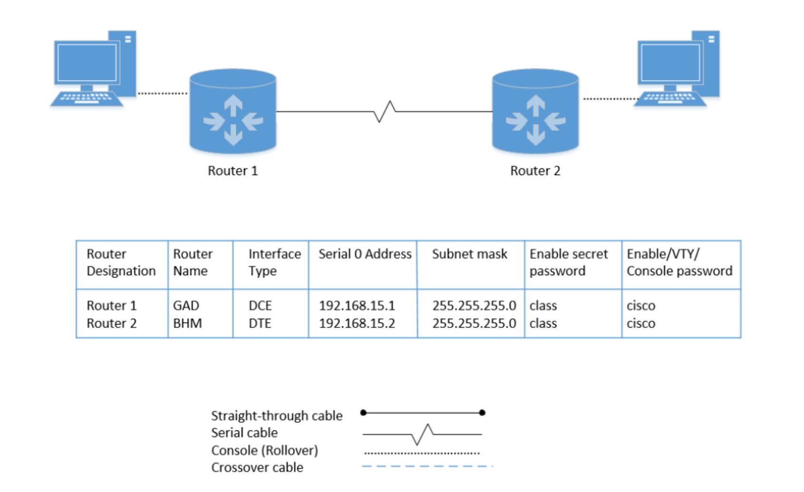
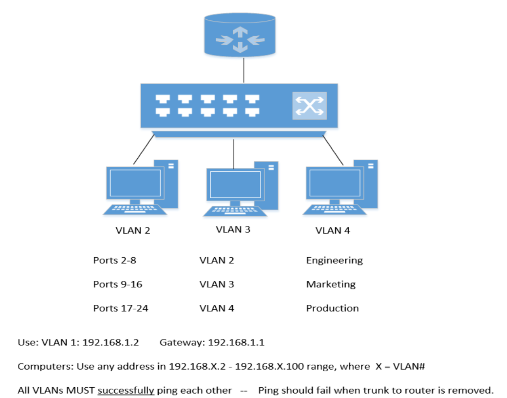
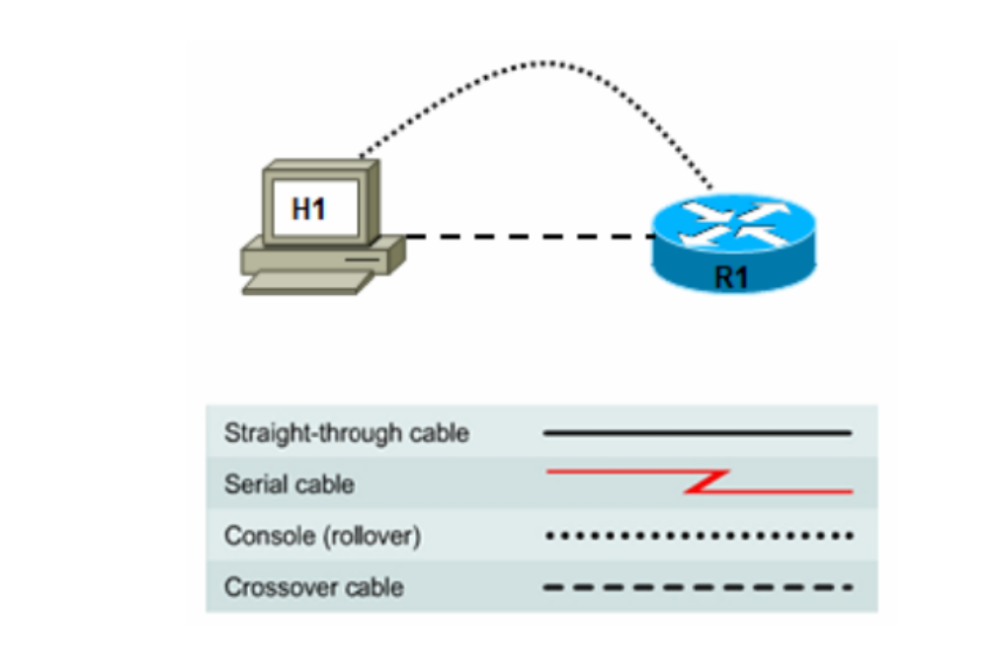

# Lab Exercises

## Lab 1: Identifying Data Link and Network Layer Addresses

### Objective
Identify MAC and IP addresses on a computer and understand their formats.

### Equipment
- PC with Windows
- Command Prompt

### Results

**NIC Information**
- Brand: Asustek Computer Inc.
- MAC Address: 08-62-66-C7-C4-D0
- OUI: 08-62-66 (Asustek)
- Serial Number: C7-C4-D0

**IP Configuration**
- IP Address: 10.1.40.103
- Subnet Mask: 255.255.255.0
- Default Gateway: 10.1.40.1

### Key Takeaways
- MAC addresses are 48 bits (6 octets) in hexadecimal
- OUI identifies the manufacturer
- IP addresses are 32 bits (4 octets) in decimal
- ARP resolves IP to MAC addresses

---

## Lab 2: ARP Protocol Analysis

### Objective
Use Wireshark to observe ARP requests and replies, understand the ARP cache.

### Setup
- Two PCs connected via switch
- Static IP addresses assigned
- Firewalls disabled

### Topology
PC1 (192.168.1.7) --- Switch --- PC2 (192.168.1.17)

### Procedure
1. Clear ARP cache: `arp -d`
2. Start Wireshark capture
3. Ping from PC1 to PC2
4. Observe ARP request/reply exchange

### Wireshark Analysis

**ARP Request**
- Source IP: 192.168.1.7
- Destination IP: 192.168.1.17
- Source MAC: 94:c6:91:a1:1e:7a
- Destination MAC: ff:ff:ff:ff:ff:ff (broadcast)

**ARP Reply**
- Source IP: 192.168.1.17
- Destination IP: 192.168.1.7
- Source MAC: ec:f4:bb:61:30:a1
- Destination MAC: 94:c6:91:a1:1e:7a

**ICMP Request**
- Source: 192.168.1.7
- Destination: 192.168.1.17

**ICMP Reply**
- Source: 192.168.1.17
- Destination: 192.168.1.7

### Observations
- First ping triggers ARP: 2 frames (request + reply)
- Subsequent pings are just ICMP: 8 frames (4 requests + 4 replies)
- ARP cache holds entries for about 2-5 minutes
- ARP requests are broadcasts, replies are unicasts

### Key Takeaways
- ARP is essential for IPv4 communication
- ARP caches speed up communication
- Wireshark is powerful for protocol analysis

---

## Lab 3: Router Command Line Fundamentals

### Objective
Learn basic Cisco IOS commands and navigation.

### Equipment
- Cisco 2600 Router
- Console cable
- PuTTY terminal

### Key Commands Learned

**Modes**
```
Router> User EXEC mode (limited commands)
Router# Privileged EXEC mode (all commands)
Router(config)# Global configuration mode
Router(config-if)# Interface configuration mode
Router(config-router)# Routing protocol configuration mode
```

**Navigation**
```
Router> enable Enter privileged EXEC
Router# config t Enter global config
Router(config)# interface serial 0/0 Enter interface config
Router(config-if)# exit Exit one level
Router(config)# end Exit to privileged EXEC
```

**Help System**
```
Router> ? List all commands
Router# show ? List show subcommands
Router# show ip ? List show ip subcommands
```


**Command History**
- Up arrow: Previous command
- Down arrow: Next command
- Show history: `show history`

### Observations
- Commands can be abbreviated (e.g., `show run` or `show running-config`)
- Context-sensitive help is available with `?`
- Tab key completes commands

---

## Lab 4: Configuring Serial Interfaces

### Objective
Configure two routers with serial connections, create a simple network.

### Topology
<!-- GAD (192.168.15.1) --- Serial Cable --- BHM (192.168.15.2) -->


### Configuration

**Router GAD**
```
GAD(config)# interface serial 0
GAD(config-if)# ip address 192.168.15.1 255.255.255.0
GAD(config-if)# clock rate 56000
GAD(config-if)# no shutdown
```

**Router BHM**
```
BHM(config)# interface serial 0
BHM(config-if)# ip address 192.168.15.2 255.255.255.0
BHM(config-if)# no shutdown
```

### Verification
```
GAD# show interface serial 0
Serial0 is up, line protocol is up
Internet address is 192.168.15.1/24
Encapsulation HDLC

GAD# ping 192.168.15.2
!!!!! (5 replies)
```

### Key Takeaways
- DCE side needs clock rate
- `no shutdown` enables the interface
- HDLC is default encapsulation
- Line protocol up means Layer 2 is working

---

## Lab 5: Basic RIP Configuration

### Objective
Configure RIP routing protocol on multiple routers.

### Topology
PC1 --- R1 --- R2 --- R3 --- PC2

### Configuration

**R1**
```
R1(config)# router rip
R1(config-router)# network 172.16.0.0
R1(config-router)# network 192.168.1.0
```

**R2**
```
R2(config)# router rip
R2(config-router)# network 192.168.1.0
R2(config-router)# network 192.168.2.0
```

**R3**
```
R3(config)# router rip
R3(config-router)# network 192.168.2.0
R3(config-router)# network 172.17.0.0
```

### Verification
```
R1# show ip route
C 172.16.0.0/16 is directly connected, FastEthernet0/0
C 192.168.1.0/24 is directly connected, Serial0/0
R 192.168.2.0/24 [120/1] via 192.168.1.2
R 172.17.0.0/16 [120/2] via 192.168.1.2

R1# debug ip rip
RIP: sending v1 update to 255.255.255.255
```


### Observations
- RIP broadcasts every 30 seconds
- RIP uses hop count metric (max 15)
- RIPv1 doesn't support subnet masks

---

## Lab 6: DHCP and NAT Configuration

### Objective
Configure router as DHCP server, implement static and dynamic NAT.

### Topology
PC1 (172.16.10.x) --- R1 --- R2 --- ISP --- Internet
PC2 (172.16.11.x) --- R1

### DHCP Configuration on R2
```
R2(config)# ip dhcp excluded-address 172.16.10.1 172.16.10.10
R2(config)# ip dhcp excluded-address 172.16.11.1 172.16.11.10
R2(config)# ip dhcp pool R1_LAN10
R2(dhcp-config)# network 172.16.10.0 255.255.255.0
R2(dhcp-config)# default-router 172.16.10.1
R2(dhcp-config)# dns-server 172.16.11.5
R2(dhcp-config)# exit
R2(config)# ip dhcp pool R1_LAN11
R2(dhcp-config)# network 172.16.11.0 255.255.255.0
R2(dhcp-config)# default-router 172.16.11.1
R2(dhcp-config)# dns-server 172.16.11.5
```

### NAT Configuration on R2
```
R2(config)# interface serial0/1
R2(config-if)# ip nat outside
R2(config-if)# exit
R2(config)# interface serial0/0
R2(config-if)# ip nat inside
R2(config-if)# exit
R2(config)# interface fastethernet0/0
R2(config-if)# ip nat inside
R2(config-if)# exit
R2(config)# ip nat pool NAT-POOL 209.165.201.9 209.165.201.14 netmask 255.255.255.248
R2(config)# ip nat inside source list NAT pool NAT-POOL
R2(config)# ip access-list extended NAT
R2(config-ext-nacl)# permit ip 172.16.10.0 0.0.0.255 any
R2(config-ext-nacl)# permit ip 172.16.11.0 0.0.0.255 any
```

### Static Route on R2
```
R2(config)# ip route 0.0.0.0 0.0.0.0 209.165.201.2
```

### Verification
```
PC1> ipconfig /all
IP Address: 172.16.10.11 (DHCP)
Subnet Mask: 255.255.255.0
Default Gateway: 172.16.10.1
DNS Server: 172.16.11.5
```

```
R2# show ip dhcp binding
IP address Hardware Address Lease expiration
172.16.10.11 00:50:79:66:68:01 Mar 01 2024 12:00 PM

R2# show ip nat translations
Pro Inside global Inside local Outside local Outside global
icmp 209.165.201.9:1 172.16.10.11:1 209.165.201.2:1 209.165.201.2:1
```

### Key Takeaways
- DHCP automatically assigns IP addresses
- `ip helper-address` forwards DHCP broadcasts across subnets
- NAT hides internal private addresses
- PAT (overload) allows many internal hosts to share one public IP

---

## Lab 7: Basic Switch Configuration

### Objective
Configure basic switch settings, VLANs, port security, and MAC tables.

### Equipment
- Cisco 2950 Switch
- 2-3 PCs

### Basic Configuration
```
Switch# config terminal
Switch(config)# hostname ALSwitch
ALSwitch(config)# enable secret class
ALSwitch(config)# enable password cisco
ALSwitch(config)# line console 0
ALSwitch(config-line)# password cisco
ALSwitch(config-line)# login
ALSwitch(config-line)# line vty 0 4
ALSwitch(config-line)# password cisco
ALSwitch(config-line)# login
```

### Management VLAN
```
ALSwitch(config)# interface vlan 1
ALSwitch(config-if)# ip address 192.168.1.2 255.255.255.0
ALSwitch(config-if)# no shutdown
ALSwitch(config)# ip default-gateway 192.168.1.1
```

### MAC Address Table
```
ALSwitch# show mac-address-table
MAC Address Table

Vlan Mac Address Type Ports
1 94c6.91a1.1e7a DYNAMIC Fa0/4
1 ecf4.bb61.30a1 DYNAMIC Fa0/1
```

### Static MAC Configuration
```
ALSwitch(config)# mac-address-table static 94c6.91a1.1e7a interface fastethernet 0/4 vlan 1
```

### Port Security
```
ALSwitch(config)# interface f0/4
ALSwitch(config-if)# switchport mode access
ALSwitch(config-if)# switchport port-security
ALSwitch(config-if)# switchport port-security mac-address sticky
ALSwitch(config-if)# switchport port-security maximum 1
ALSwitch(config-if)# switchport port-security violation shutdown
```

### Verification
```
ALSwitch# show port-security
Secure Port MaxSecureAddr CurrentAddr SecurityViolation Security Action
Fa0/4 1 1 0 Shutdown
```

### Observations
- Default VLAN is VLAN 1
- MAC addresses are learned dynamically
- Port security prevents unauthorized access
- Violation modes: shutdown, restrict, protect

---

## Lab 8: Router-on-a-Stick

### Objective
Configure inter-VLAN routing using a single router interface.

### Topology
<!-- R1 (192.168.x.1)
        |
Trunk (802.1Q)
        |
    Switch S1
/       |    \
VLAN2 VLAN3 VLAN4
(Eng) (Mkt) (Prod) -->


### Router Configuration
```
R1(config)# interface fastethernet 0/0
R1(config-if)# no ip address
R1(config-if)# no shutdown
R1(config-if)# exit
R1(config)# interface f0/0.1
R1(config-subif)# encapsulation dot1q 1 native
R1(config-subif)# ip address 192.168.1.1 255.255.255.0
R1(config-subif)# exit
R1(config)# interface f0/0.2
R1(config-subif)# encapsulation dot1q 2
R1(config-subif)# ip address 192.168.2.1 255.255.255.0
R1(config-subif)# exit
R1(config)# interface f0/0.7
R1(config-subif)# encapsulation dot1q 3
R1(config-subif)# ip address 192.168.3.1 255.255.255.0
R1(config-subif)# exit
R1(config)# interface f0/0.12
R1(config-subif)# encapsulation dot1q 4
R1(config-subif)# ip address 192.168.4.1 255.255.255.0
R1(config-subif)# exit
```

### Switch Configuration
```
S1(config)# interface f1/1
S1(config-if)# switchport mode trunk
S1(config-if)# exit
S1(config)# vlan database
S1(vlan)# vtp server
S1(vlan)# vlan 2 name Engineering
S1(vlan)# vlan 3 name Marketing
S1(vlan)# vlan 4 name Production
S1(vlan)# exit
S1(config)# interface range f1/2 - f1/6
S1(config-if-range)# switchport access vlan 2
S1(config-if-range)# exit
S1(config)# interface range f1/7 - f1/11
S1(config-if-range)# switchport access vlan 3
S1(config-if-range)# exit
S1(config)# interface range f1/12 - f1/15
S1(config-if-range)# switchport access vlan 4
```

### PC Configurations
```
PC1 (VLAN 2)
IP: 192.168.2.11
GW: 192.168.2.1

PC2 (VLAN 3)
IP: 192.168.3.11
GW: 192.168.3.1

PC3 (VLAN 4)
IP: 192.168.4.11
GW: 192.168.4.1
```

### Ping Tests
```
PC1> ping 192.168.3.11
Reply from 192.168.3.11: bytes=32 time=20ms TTL=254

PC1> ping 192.168.4.11
Reply from 192.168.4.11: bytes=32 time=20ms TTL=254

PC2> ping 192.168.4.11
Reply from 192.168.4.11: bytes=32 time=20ms TTL=254
```

### Failure Scenario
When trunk cable is removed:
PC1> ping 192.168.3.11
Request timed out. (No connectivity)

### Key Takeaways
- Router-on-a-stick uses one physical interface for multiple VLANs
- Sub-interfaces use 802.1Q tagging
- VTP simplifies VLAN management across switches
- Inter-VLAN routing requires routing between sub-interfaces

---

## Lab 9: Configuring Remote Router Using SSH

### Objective
Configure SSH for secure remote router access.

### Topology
<!-- PC (192.168.1.6) --- Router (192.168.1.1) -->


### Router Configuration
```
CustomerRouter(config)# hostname CustomerRouter
CustomerRouter(config)# ip domain-name customer.com
CustomerRouter(config)# username admin privilege 15 password 0 cisco123
CustomerRouter(config)# interface fastethernet 0/0
CustomerRouter(config-if)# ip address 192.168.1.1 255.255.255.0
CustomerRouter(config-if)# no shutdown
CustomerRouter(config-if)# exit
CustomerRouter(config)# line vty 0 4
CustomerRouter(config-line)# privilege level 15
CustomerRouter(config-line)# login local
CustomerRouter(config-line)# transport input telnet ssh
CustomerRouter(config-line)# exit
CustomerRouter(config)# crypto key generate rsa
How many bits in the modulus [512]: 768
```

### SSH Verification
```
CustomerRouter# show ip ssh
SSH Enabled - version 1.99
Authentication timeout: 120 secs
Authentication retries: 3
```

### PuTTY Configuration
- Connection type: SSH
- Host: 192.168.1.1
- Port: 22
- SSH version: 2

### TFTP Backup
```
R1# show version
System image file is "flash0:c2900-universalk9-mz.SPA.152-4.M3.bin"

R1# copy flash tftp
Source filename: c2900-universalk9-mz.SPA.152-4.M3.bin
Address of remote host: 172.17.0.2
Destination filename: [confirm]
!!!!!!!!!!!!!!!!!!!!!!!!!!!!!!!!!!!!!!!!!!!!!!!!!!!!!!!!
```

### Key Takeaways
- SSH encrypts all traffic (unlike Telnet)
- RSA key generation is required
- SSH version 2 is more secure than version 1
- TFTP can backup IOS images

---

## Lab Bonus: OSPF Configuration

### Objective
Configure OSPF routing protocol across multiple routers.

### Topology
R1 --- R2 --- R3

### Configurations

**R1**
```
R1(config)# router ospf 1
R1(config-router)# network 172.16.0.0 0.0.0.3 area 0
R1(config-router)# network 172.16.10.0 0.0.0.255 area 0
R1(config-router)# network 172.16.11.0 0.0.0.255 area 0
```

**R2**
```
R2(config)# router ospf 1
R2(config-router)# network 172.16.0.0 0.0.0.3 area 0
R2(config-router)# network 172.16.20.0 0.0.0.255 area 0
R2(config-router)# default-information originate
```

**R3**
```
R3(config)# router ospf 1
R3(config-router)# network 172.16.0.0 0.0.0.3 area 0
R3(config-router)# network 172.16.30.0 0.0.0.255 area 0
```

### Verification
```
R1# show ip ospf interface
FastEthernet0/0 is up, line protocol is up
Internet Address 172.16.10.1/24, Area 0
Process ID 1, Router ID 192.168.10.5, Network Type BROADCAST, Cost: 1
Transmit Delay is 1 sec, State DR, Priority 1

R1# show ip route
O 172.16.20.0/24 [110/2] via 192.168.10.2, 00:00:05, Serial0/0
O 172.16.30.0/24 [110/3] via 192.168.10.2, 00:00:05, Serial0/0
```

### Key Takeaways
- OSPF uses wildcard masks (inverse of subnet mask)
- OSPF has better convergence than RIP
- OSPF uses cost metric (based on bandwidth)
- OSPF is classless (supports VLSM)

---

**Next Section**: [Skills Summary](04-skills-summary.md)
