# Installing Windows Server 2012 R2

**Objective:** stand up the first Windows Server 2012 R2 VM from scratch — plan the server name, protocol, IP addressing and time zone up front, then walk the VMware + Windows Setup wizards end-to-end.

## Pre-install plan

| Decision | Value used |
|---|---|
| Server name | `410Server2` |
| Network protocol | TCP/IPv4 only |
| IP address | `10.10.1.2/16` (static) |
| Time zone | Eastern Time |

A server should always get a **static** IP rather than the automatic address Windows assigns by default — some roles (DHCP among them) require it.

## Task I — Building the VM and installing Windows Server 2012 R2

1. Launch VMware Workstation and start **Create a New Virtual Machine**.
2. Choose the **Typical** creation method.
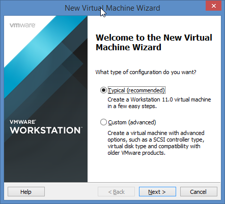
3. Point the installer at the install media, but decline VMware's **Easy Install** auto-detection (select *I will install the operating system later*) so the Windows installer runs normally instead of unattended.
4. Set the guest OS to Microsoft Windows Server 2012.
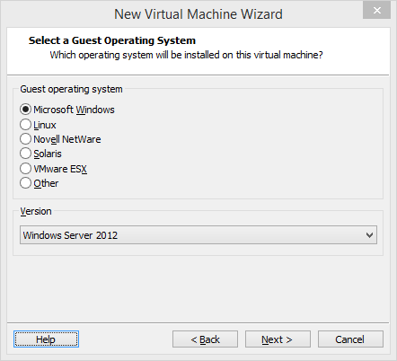
5. Name the VM and store it on the external SSD rather than the internal drive, for performance.
6. Set the virtual disk to 60 GB, split into multiple files.
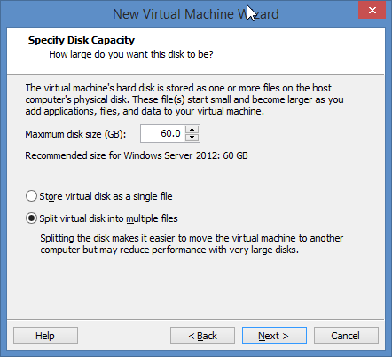
7. Bump the VM's memory to 8 GB, then finish the wizard.
8. Insert the Windows Server 2012 R2 install media and power on the VM.
9.  Work through Windows Setup: language → **Install Now** → **Windows Server 2012 Datacenter Evaluation (Server with a GUI)** → accept the license terms → **Custom: Install Windows only (advanced)** → accept the default disk layout → let installation run.

| | | |
|---|---|---|
| 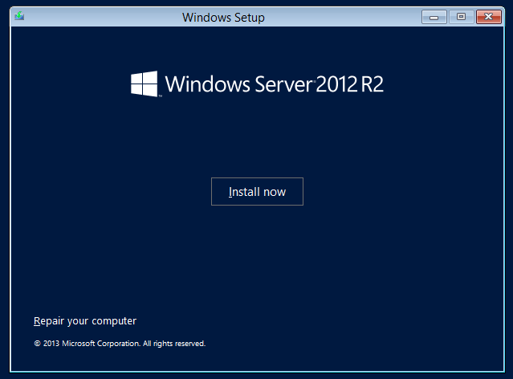 | 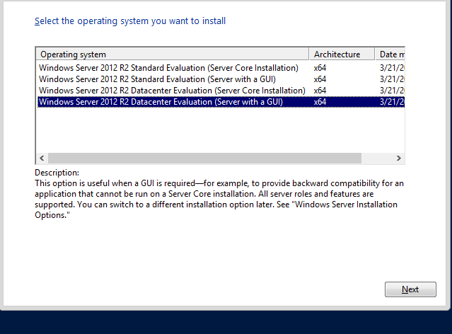 | 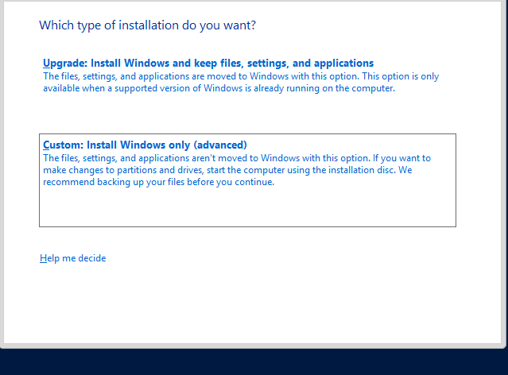 |
| 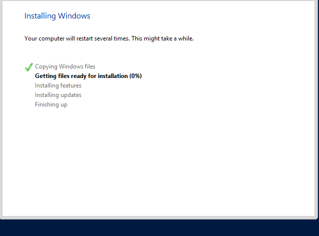 |
10. Set the built-in Administrator password on first boot.
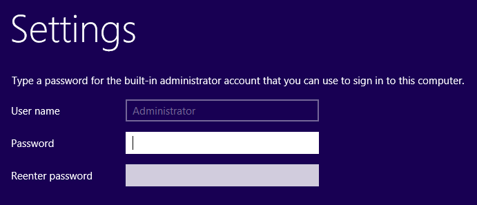
11. Log in using VMware's **Send Ctrl-Alt-Del to VM** button — pressing the physical key combo goes to the *host* machine, not the guest, so the VM needs its own dedicated shortcut for it.
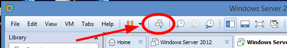

## Task II — Time, date, and time zone

Configured the server's clock and time zone via Control Panel / Settings, matching the pre-install plan (Eastern Time).

## Task III — Setting a static IP address

- **IP address assigned:** `10.10.1.2`
- **Network class:** Class A
- **Default subnet mask for that class:** `255.0.0.0`

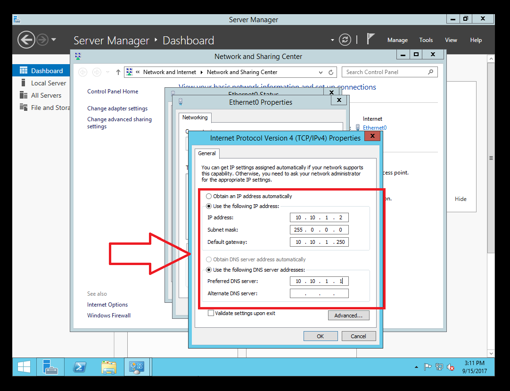

## Task IV — Changing the computer name and workgroup

Renamed the computer and confirmed the change by capturing the new workgroup name after the rename and reboot.

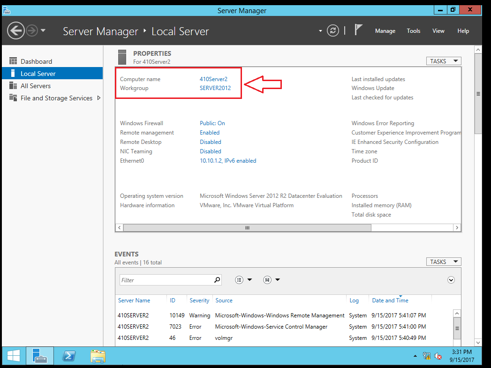

---
**Next Section**: [Configuring File and Printer Services](week04-file-and-printer-services.md)

