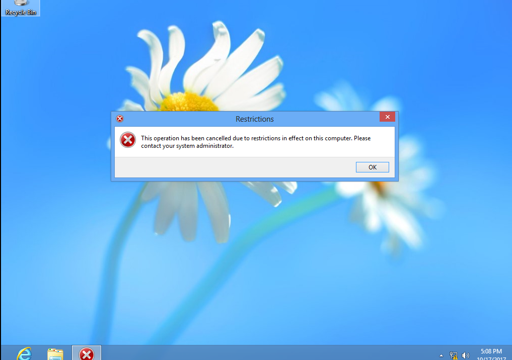
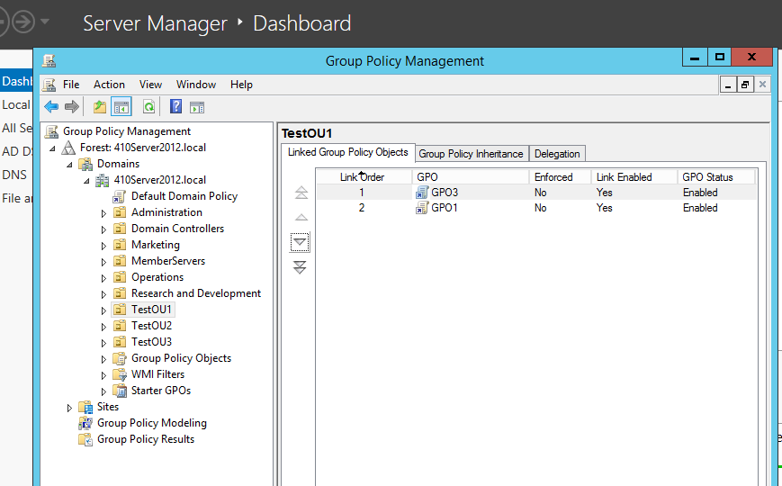
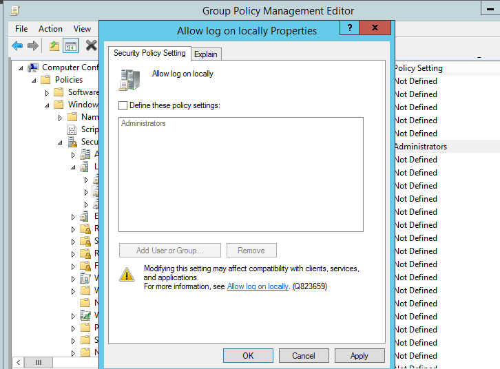
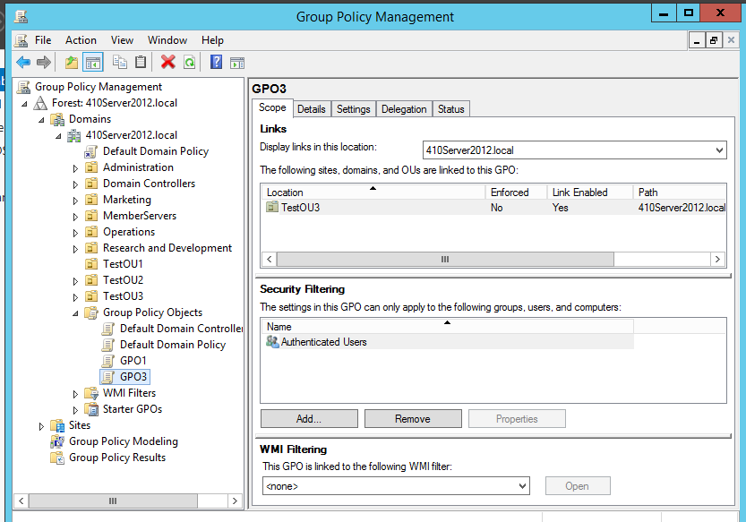
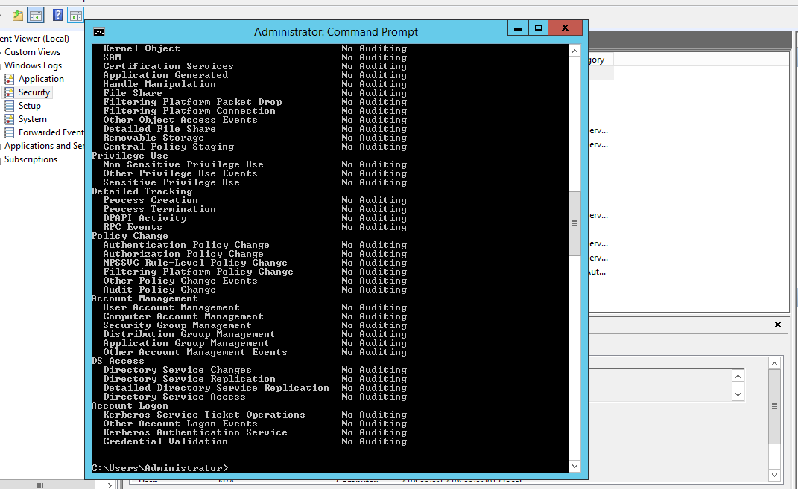
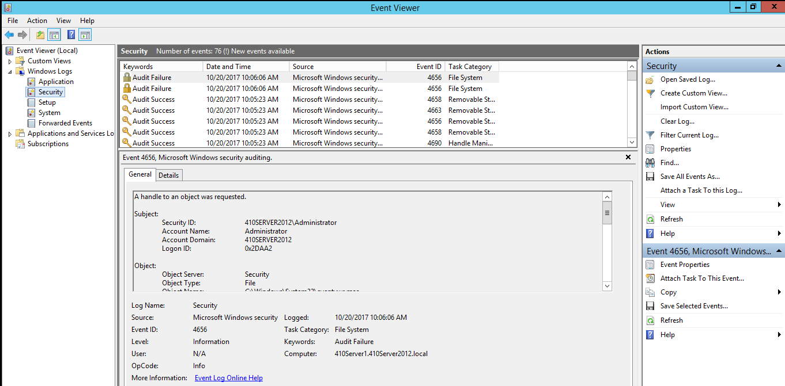
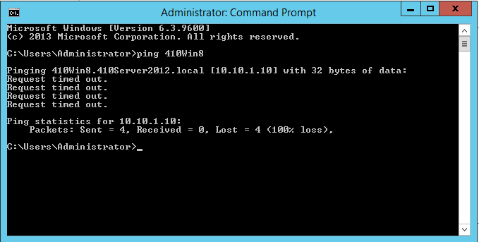
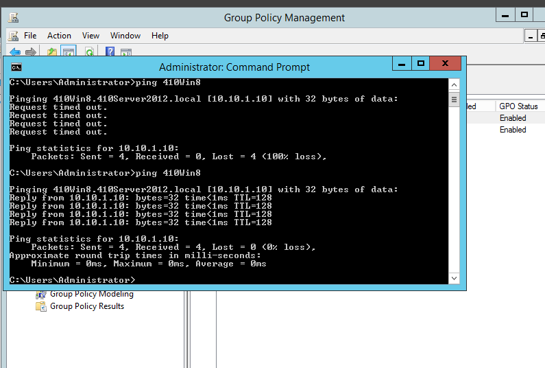

# Configuring Group Policies

**Objective:** apply and test Group Policy Objects against the OU structure built in [Managing OUs and Active Directory Accounts](week06-ch7-ous-and-ad-accounts.md).

Evidence captured at the checkpoint noted for each activity:

| Activity | Checkpoint | Screenshot |
|---|---|---|
| 8-1 | Step 18 |  |
| 8-4 | Step 11 |  |
| 8-5 | Step 11 |   |
| 8-11 | Step 9 |  |
| 8-12 | Step 9 |  |
| 8-19 | Step 2 |  |
| 8-19 | Step 15 |  |

Activity 8-19 (creating and linking a login-script GPO) also doubled as a bonus checkpoint for the [Configuring DNS](week10-dns.md) lab.

---
**Next Section**: [Configuring TCP/IP](week09-ch9-tcpip.md)