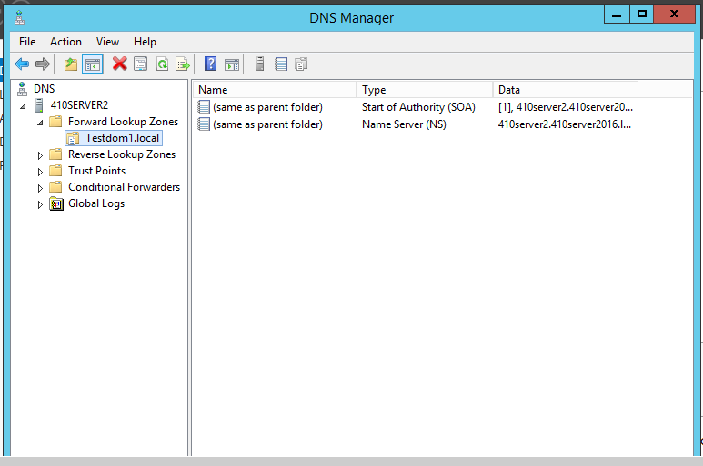
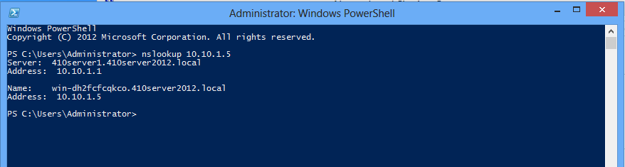
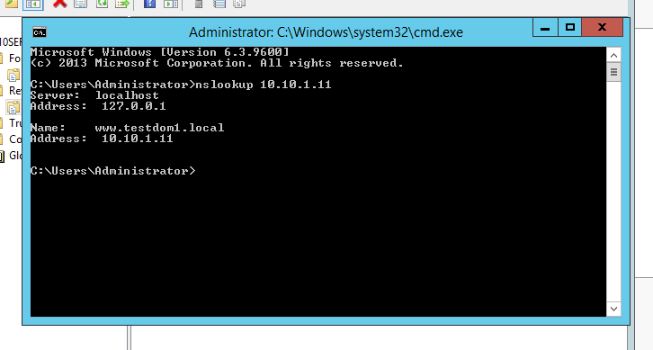
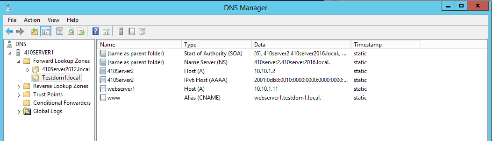
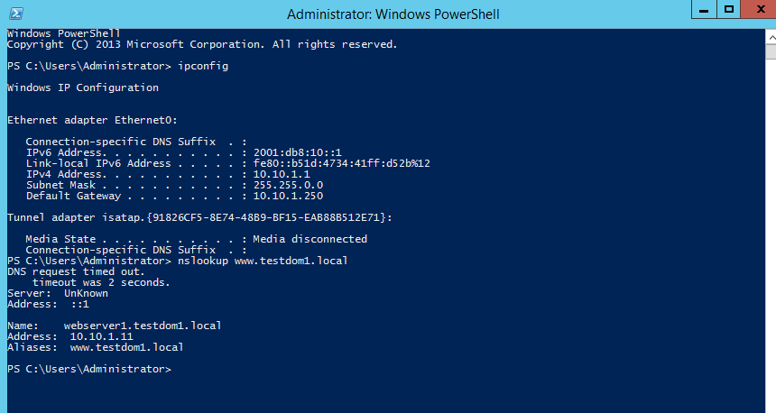
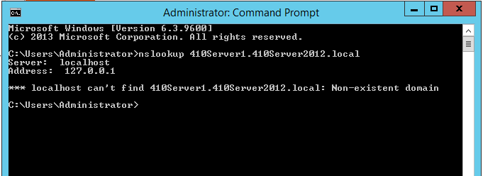
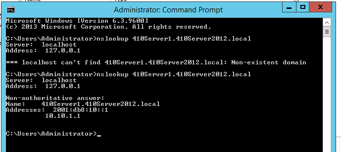
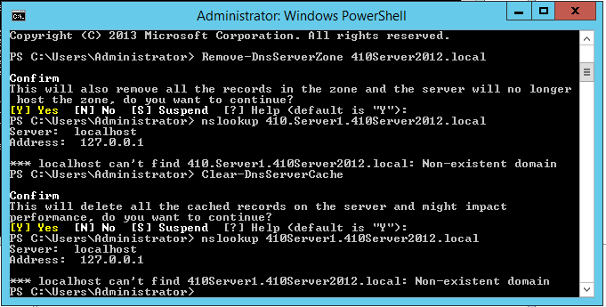
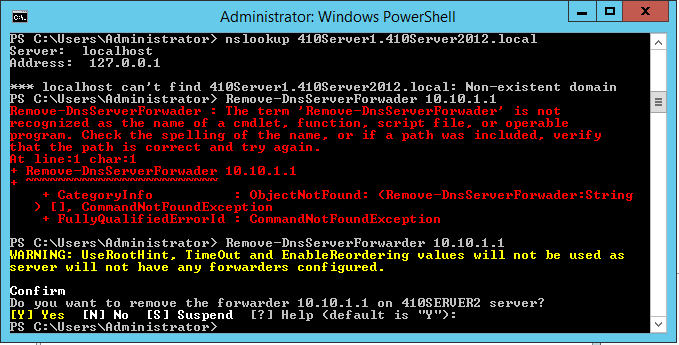
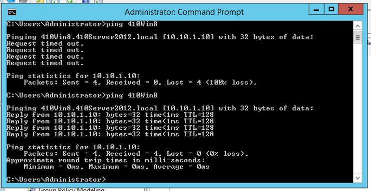

# Configuring DNS

**Objective:** work through the textbook's DNS configuration activities on **410Server1** — forward/reverse lookup zones, records, and DNS-dependent server behavior.

| Activity | Checkpoint | Screenshot |
|---|---|---|
| 10-2 | Step 14 |  |
| 10-3 | Step 7 |  |
| 10-4 | Step 12 |  |
| 10-5 | Step 9 |   |
| 10-6 | Steps 2, 4, 7, 8, 11 |     |
| 8-19 (bonus, carried over from Ch. 8) | Step 15 |  |

---
**Next Section**: [Configuring DHCP](week11-dhcp.md)