# Introduction to Linux

**Objective:** install Ubuntu Desktop and Ubuntu Server as VMs, compare the two, get them talking to each other over the network, and manage local user accounts on each.

## Task I — Installing Ubuntu Desktop

**Downloading Ubuntu**
- Recommended system requirements: 2 GHz dual-core CPU or better, 2 GB RAM, 25 GB free disk, DVD drive or USB port, internet access helpful.
- Version downloaded: **Ubuntu Desktop 16.04.3 LTS** ("LTS" = Long Term Support).
- Ubuntu Server, same release: **16.04.3 LTS**, supported for **3 years**, minimum **2 GB** free disk space.

**Creating the VM**
1. VMware Workstation → File → New Virtual Machine → Custom.
2. Point at the downloaded Ubuntu Desktop ISO and let VMware auto-detect the OS.
3. Full name **Ubuntu Desktop**, username **administrator**, password set.
4. Name the VM, accept the defaults through disk/processor screens.
5. Set VM memory to **1024 MB**.
6. Network type: **Bridged**.
7. Review every setting before clicking Finish.

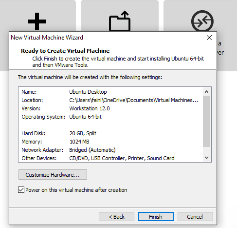

**Installing the OS**
- Welcome screen: language English, **Install Ubuntu** (not "Try Ubuntu").
- Preparing to install: leave "Download updates while installing" **unchecked**.
- Location: New York. Keyboard: English (US).
- User setup: full name, computer name `UbuntuPCXX`, lowercase username, password, then restart into the new desktop.

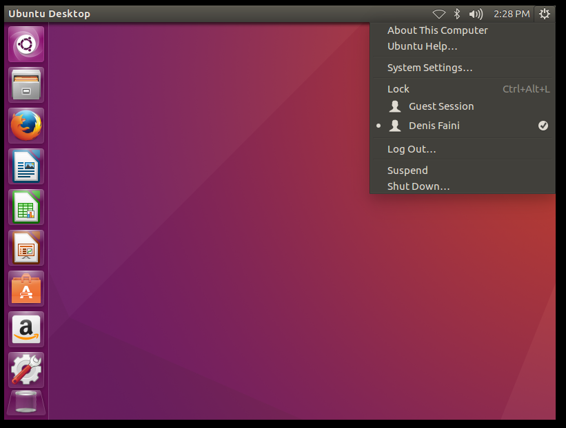

## Task II — Installing Ubuntu Server

Followed the same VM-creation flow for Ubuntu Server, restarted after install, and confirmed a clean login at the `login:` prompt.

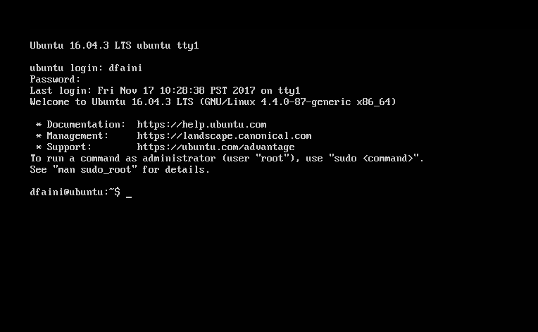

## Task III — Comparing Desktop and Server, and networking them together

**Activity 4 — Desktop vs. Server**
- Ubuntu Desktop ships a full GUI; Ubuntu Server is terminal-only — everything is done by typed command rather than pointing and clicking.
- Desktop needs meaningfully more free storage than Server, which needs as little as 2 GB.

**Activity 5 — Finding each machine's IP address**

| Host | IP address |
|---|---|
| Ubuntu Desktop | 192.168.153.130 |
| Ubuntu Server | 192.168.153.129 |

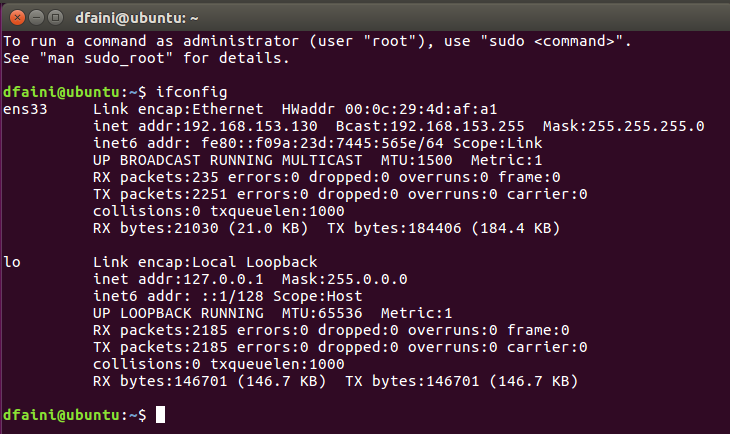
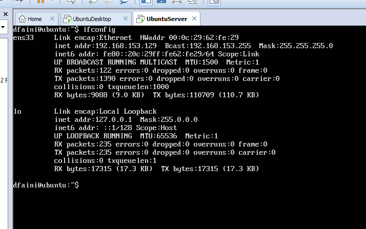

**Activity 6 — Pinging between them**

Confirmed connectivity in both directions between Desktop and Server.

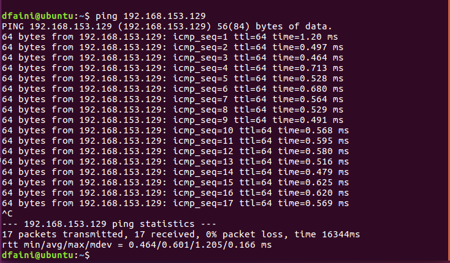
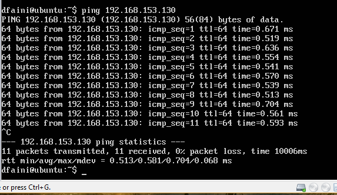

- `Ctrl + C` stops a running `ping`.
- `ping -c 7 192.168.153.129` limits the run to 7 replies.

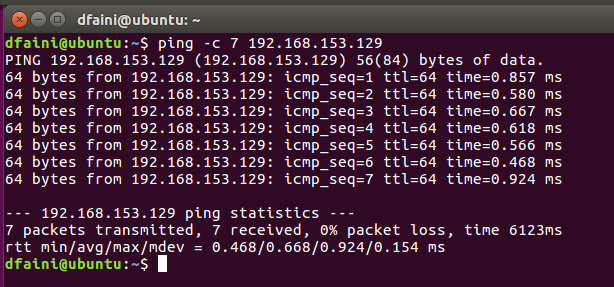

## Task IV — Adding a user account

Added a new administrator account through **System Settings → User Accounts** on Ubuntu Desktop, then set its password and confirmed login worked after logging off the built-in admin account.

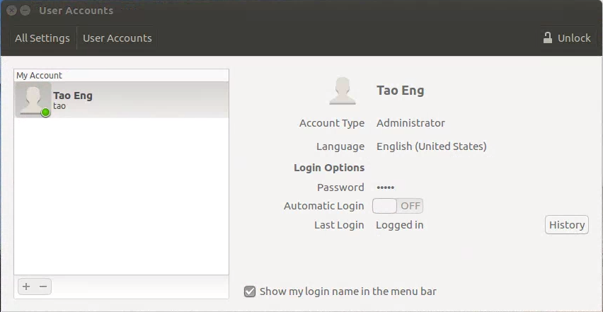
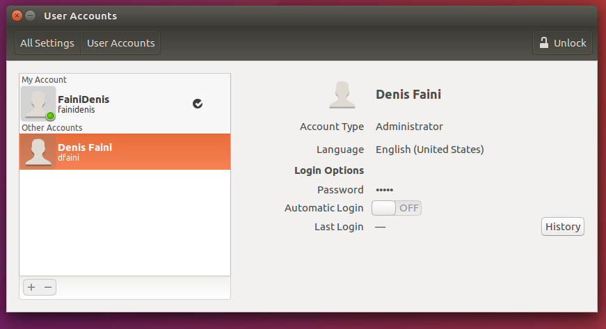

## Bonus — Installing Google Chrome on Ubuntu Desktop

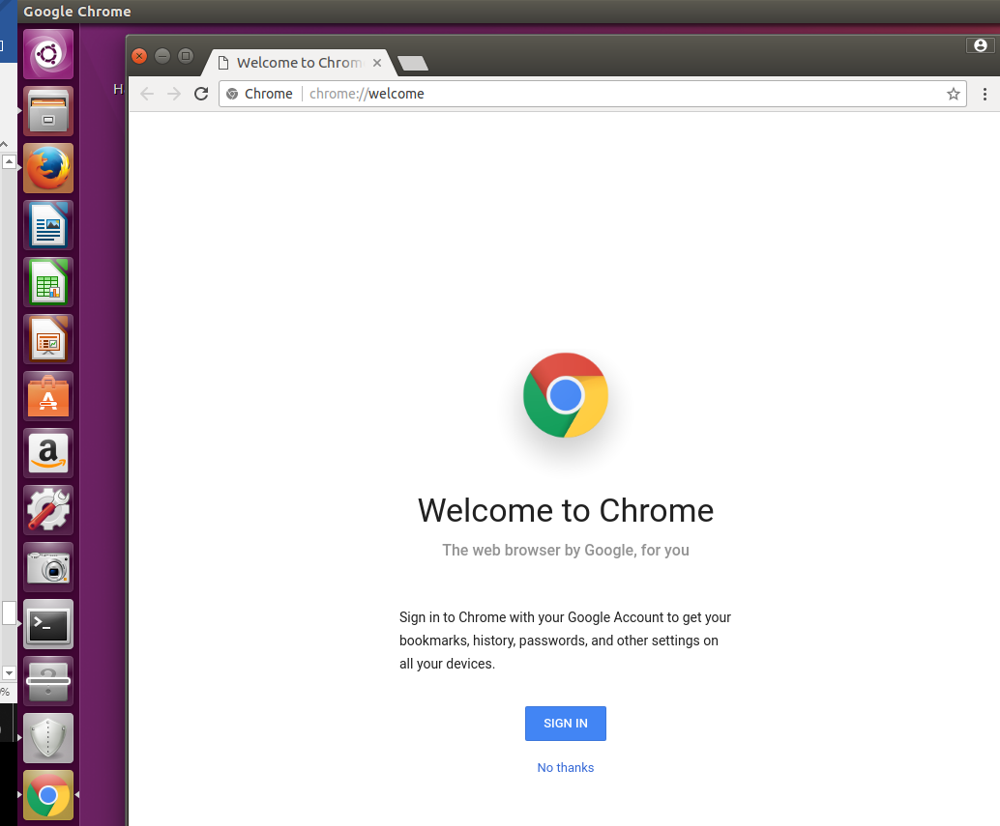

---
**Next Section**: [Remote Access & Long-Distance Communications](week14-vpn-remote-access.md)