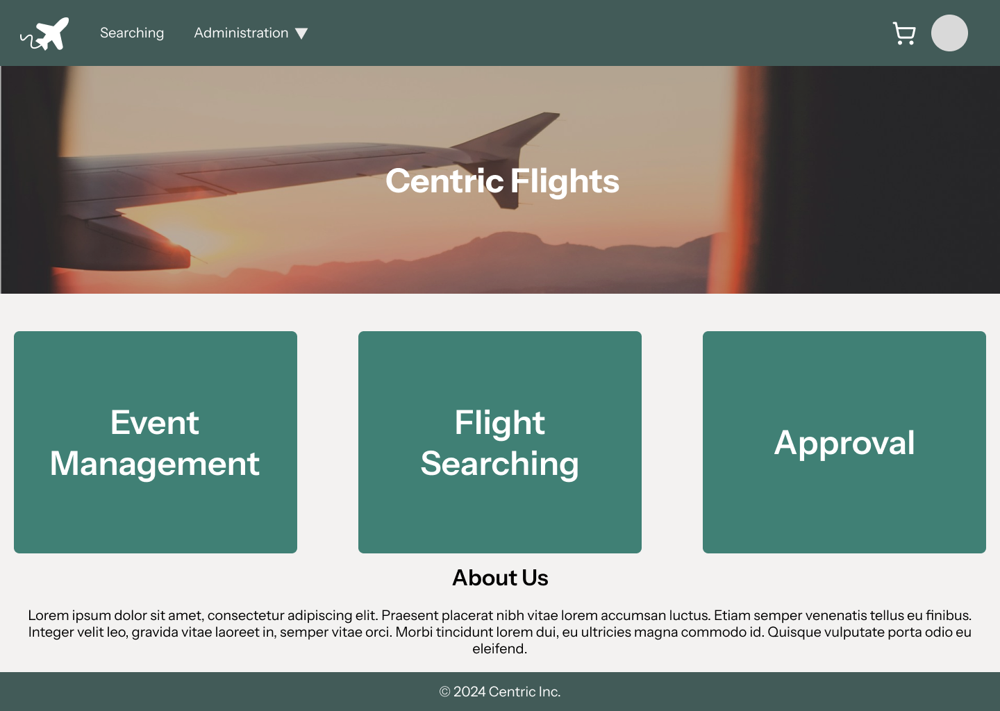
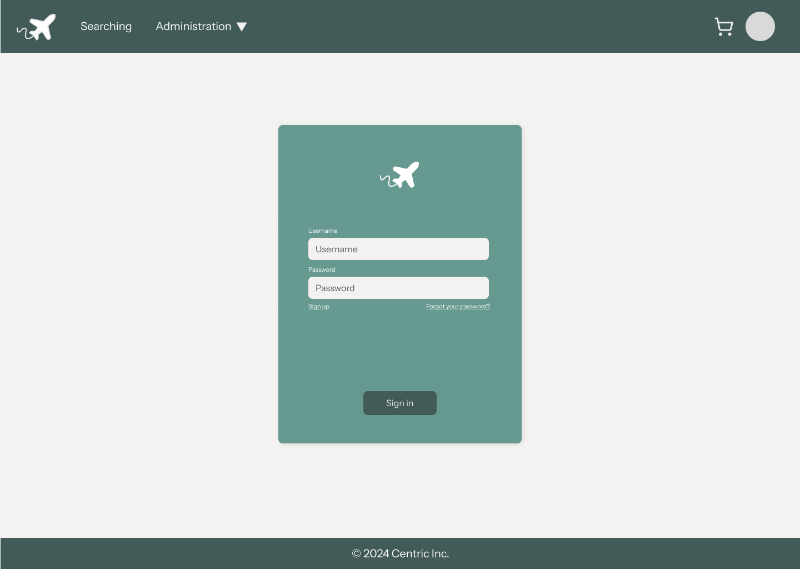
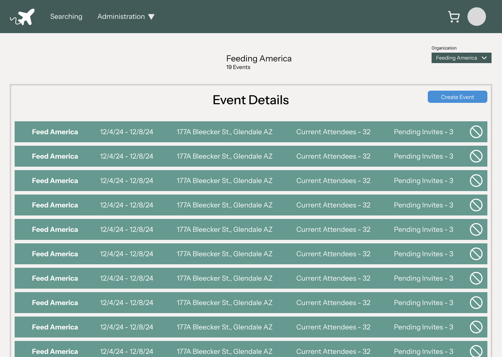
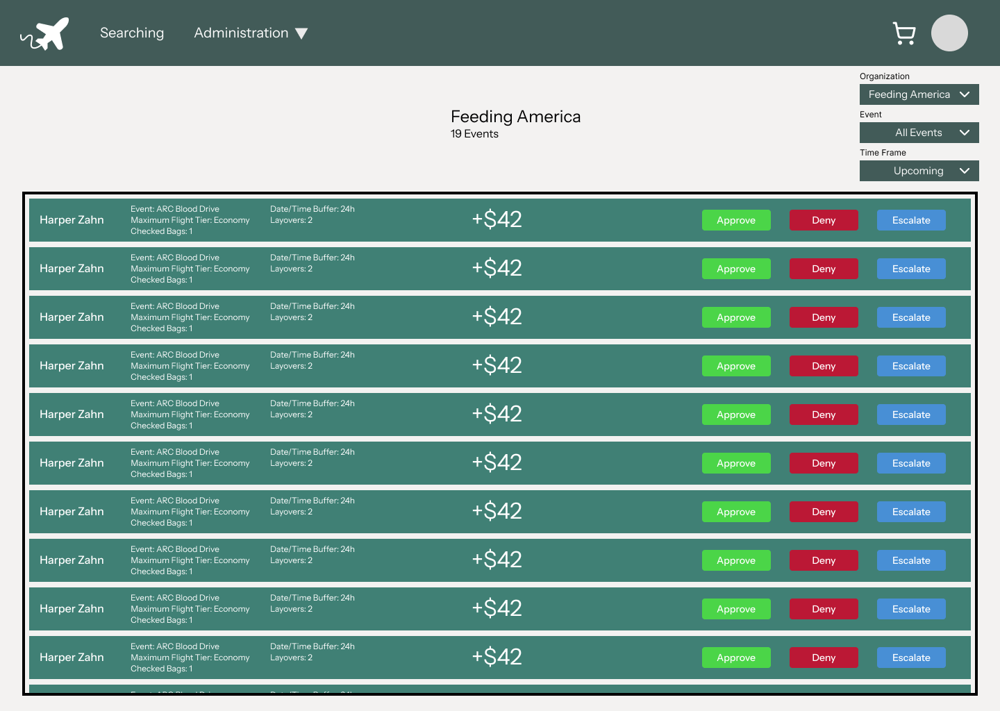
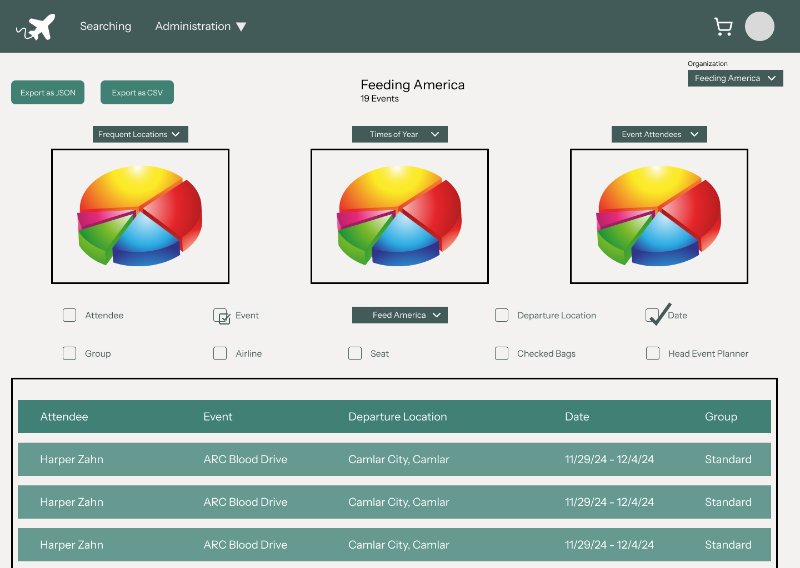
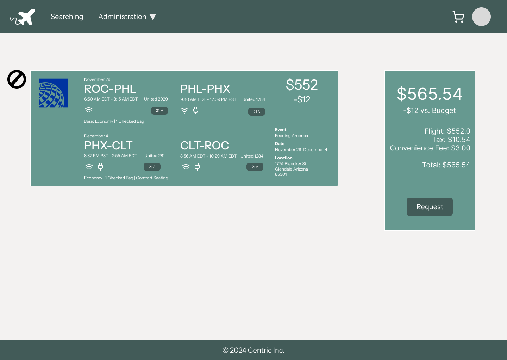

# Wireframe Design Demo

**The screens below are from the Figma wireframes* we built early in the project to plan the layout and flows before writing code.**

We treated the wireframes as working, testable mockups rather than final pixels — iterating on them caught UX problems (like a confusing mobile nav and an over-long checkout) before they cost us dev time.

*\*Design artifacts from our team work — included as a demo of the UI/UX work, without any user data or internal references.*

---

## Landing Page

The entry point: a clean sign-in / registration focus with no distractions.

## Login

Simple email + password login, the first step before multi-factor authentication.

## Event Management (Event Planner)

The event planner's workspace: list, create, and manage events, and invite attendees.

## Approval (Booking Workflow)

An approver reviewing a flight booking request — the heart of the planning/finance collaboration workflow.

## Reports — Event Planners

Reporting and analytics so planners can track attendance and event trends over time.

## Checkout

Booking confirmation — review the trip, passenger details, and total cost before submitting for approval.

---

**Design principles we followed** across every screen: clean and simple, consistent patterns, accessible (contrast, screen-reader, keyboard support, dark mode), and responsive across web and mobile.
