# Debian 10 (Buster)

| | |
|---|---|
| **ISO source** | https://www.debian.org/CD/http-ftp/#stable |
| **Version installed** | Debian 10 "Buster" |
| **Released** | July 6, 2019 |
| **Package manager** | apt (deb) |
| **Boot behavior** | Complete install first (no live session) |

## Steps

1. Download the Debian ISO from the official Debian website.
2. Boot the target machine from the installation media (USB or DVD ISO).
3. At the BIOS-mode boot menu, choose the first (Install) option.
4. Choose the installer language.
5. Select your location, which also sets the time zone.
6. Choose the keyboard layout.
7. Set a hostname for the machine.
8. Set a domain name, or leave it blank if none applies.
9. Set the root password.
10. Create a local (non-root) user account with its own password.
11. Choose a disk partitioning scheme — guided (recommended) is the simplest path.
12. Let the base system install; this stage runs unattended for a while.
13. On the software-selection screen, choose a desktop environment (GNOME was selected here).
14. Install the GRUB bootloader and pick the target disk for it.
15. Remove the installation media once setup finishes, then continue to reboot.
16. Log in with the user account created during setup.
17. Confirm Debian booted successfully into the desktop environment.

## Screenshots

Captured in order during the walkthrough (`screenshots/debian/`):

**Debian Linux installer menu**

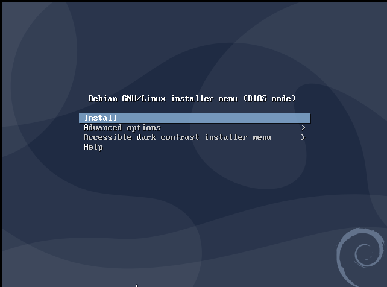

**Select a language to use debian system**

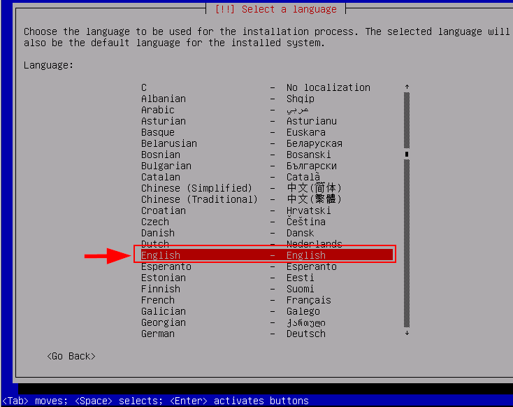

**Select a location for time zone**

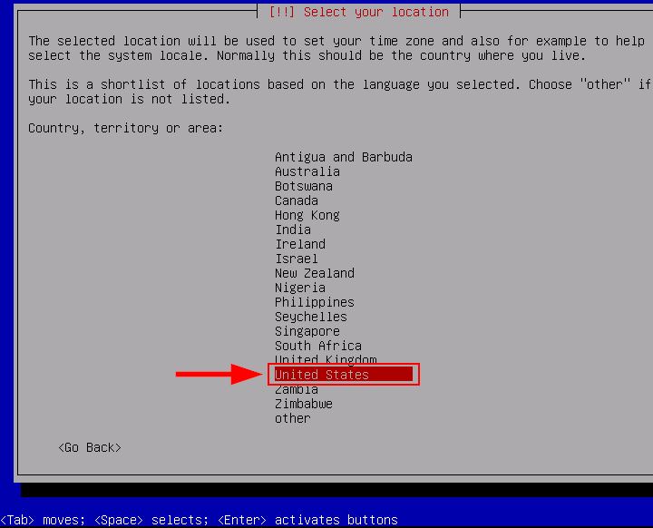

**Select your keyboard keymap to use**

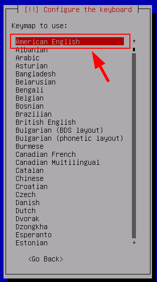

**Enter hostname for Debian**

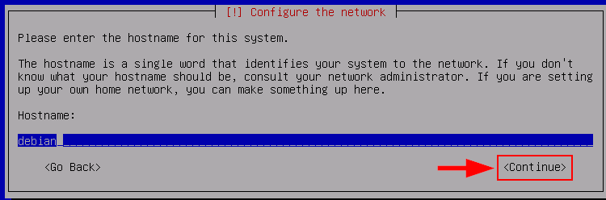

**Leave blank if you don't have domain name**

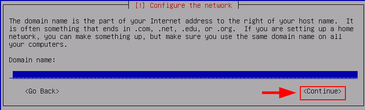

**Set up root password for debian**

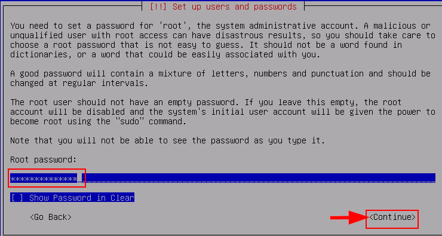

**Re-Enter debian root password**

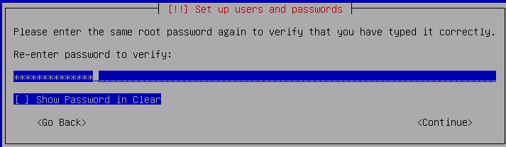

**New user full name**

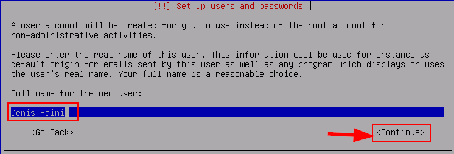

**username account for new user**

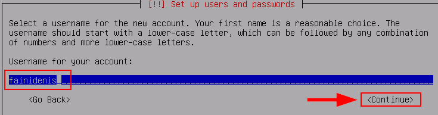

**Password for new user**

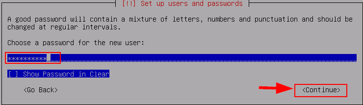

**Re enter password for new user**

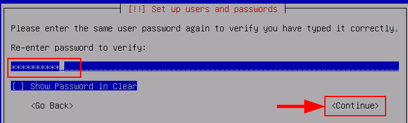

**Choose partitioning method to use the disk**

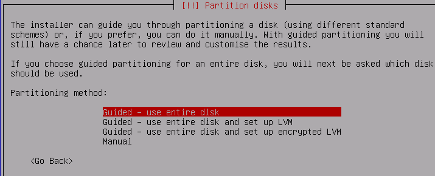

**Select disk to partition**

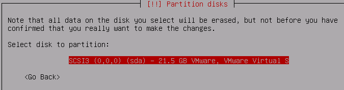

**Partitioning scheme choose recommended one**

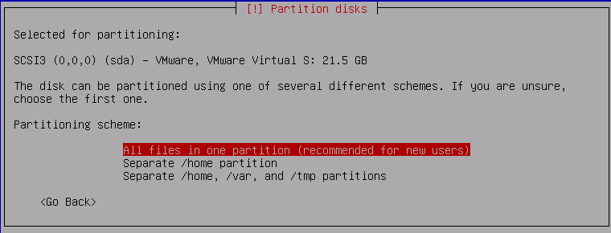

**Finish partitioning and write the change to disk**

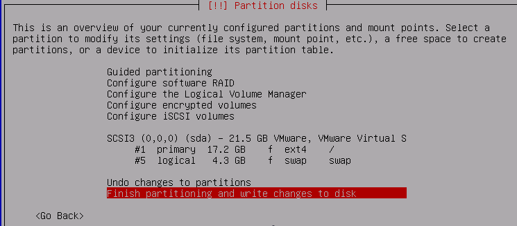

**Write the changes to disk**

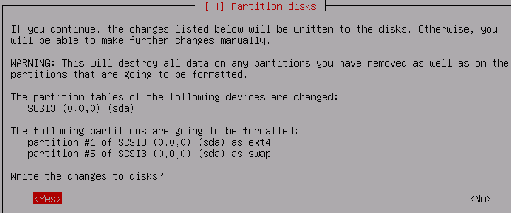

**Loading installing the base system**

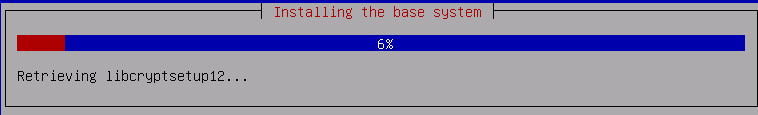

**Choose if you want to participate in the package usage survey**

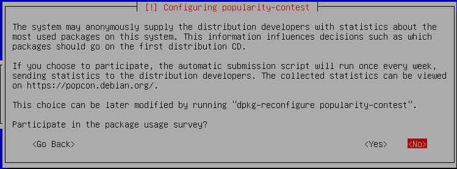

**Choose GNOME to use GUI**

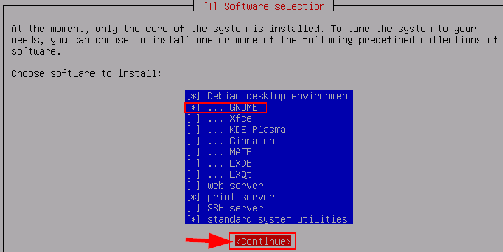

**Install the Grub boot loader to MBR**

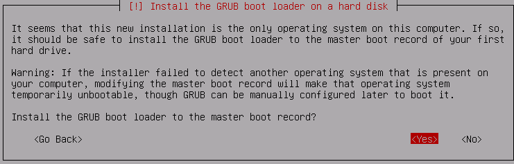

**Choose disk for boot loader**

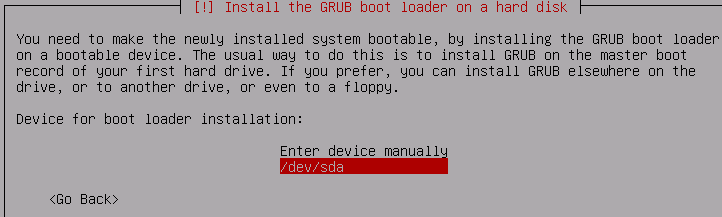

**Complete Debian installation**

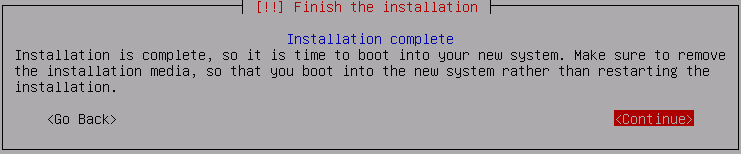

**Login to your user name with password**

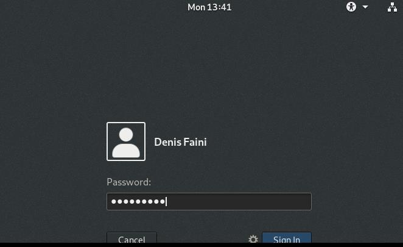
