# CentOS 8

| | |
|---|---|
| **ISO source** | http://isoredirect.centos.org/centos/8/isos/x86_64/CentOS-8-x86_64-1905-dvd1.iso |
| **Version installed** | CentOS 8 |
| **Released** | September 24, 2019 |
| **Package manager** | yum (rpm) |
| **Boot behavior** | Complete install first (no live session) |

## Steps

1. Download the CentOS ISO from the official CentOS website.
2. Boot the machine from the installation media (USB or ISO in a VM).
3. At the BIOS-mode boot menu, choose the first (Install) option.
4. Choose the installer language.
5. Configure the installation destination (target disk) in System Configuration.
6. On the Installation Summary screen, click Begin Installation.
7. While installation runs, configure the root and local user account settings.
8. Set the root password.
9. Create a new local user account.
10. After installation completes, reboot the system.
11. Accept the licensing agreement and finish initial setup.
12. Log in with the account created during installation.

## Screenshots

Captured in order during the walkthrough (`screenshots/centos/`):

**CentOS Installer Menu**

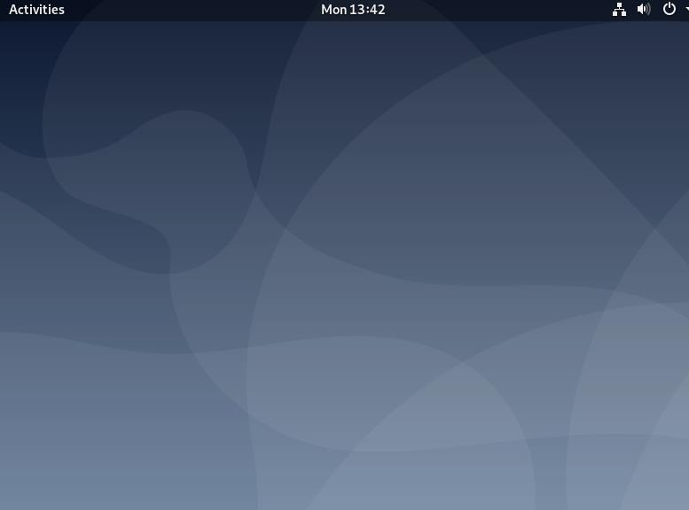

**Select a language to use CentOS**

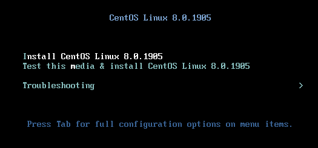

**Uncompleted Installation Summary configuration**

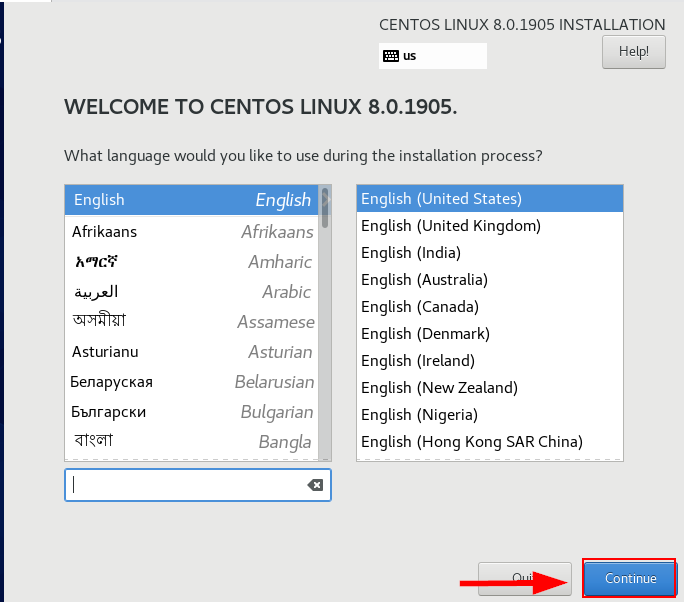

**Select Disk to Install the system**

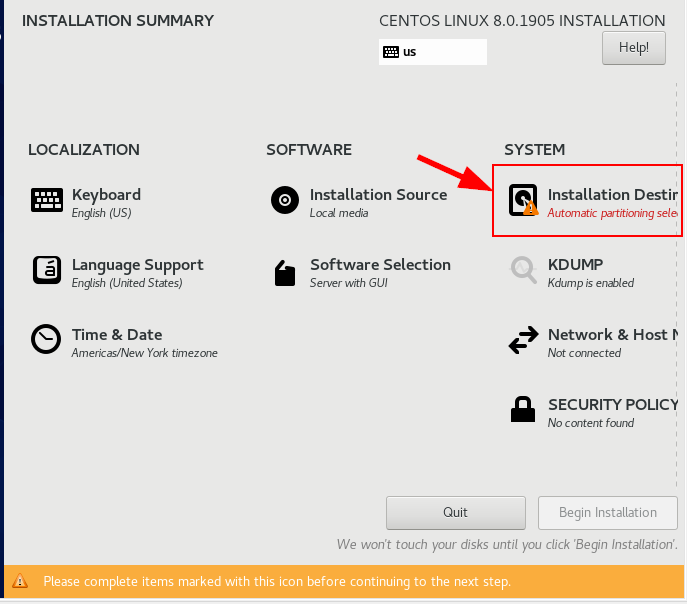

**Complete Installation Summary configuration**

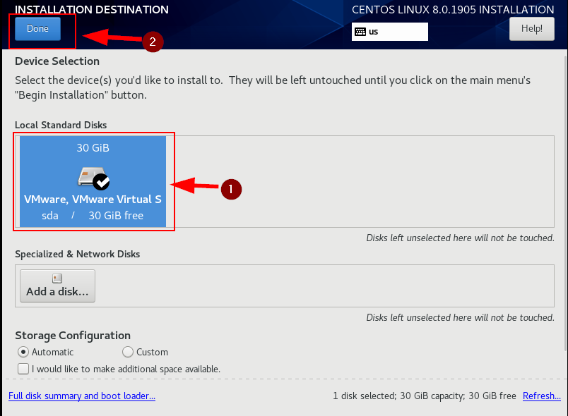

**Uncompleted configuration of User Settings during Installation process**

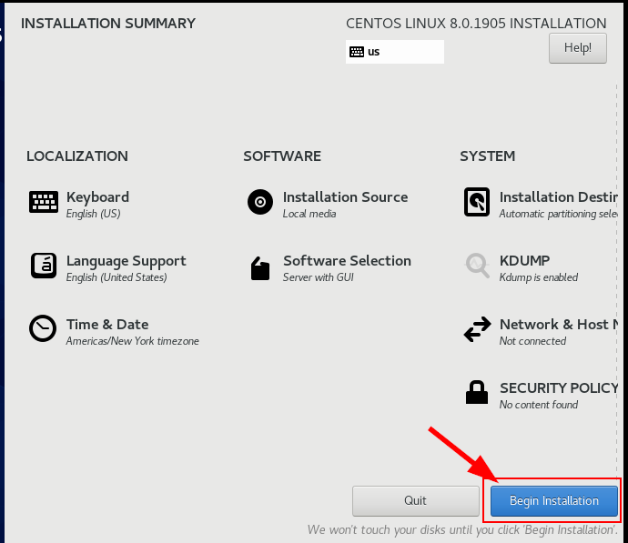

**Enter root password for the system**

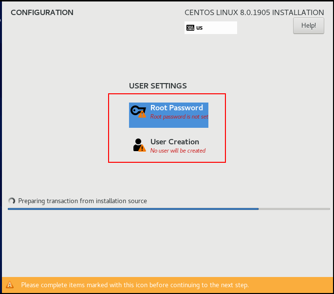

**Create a new user account**

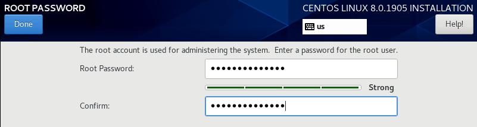

**Complete configuration of user settings**

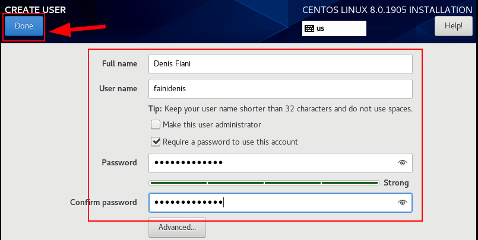

**Reboot system after Installation complete**

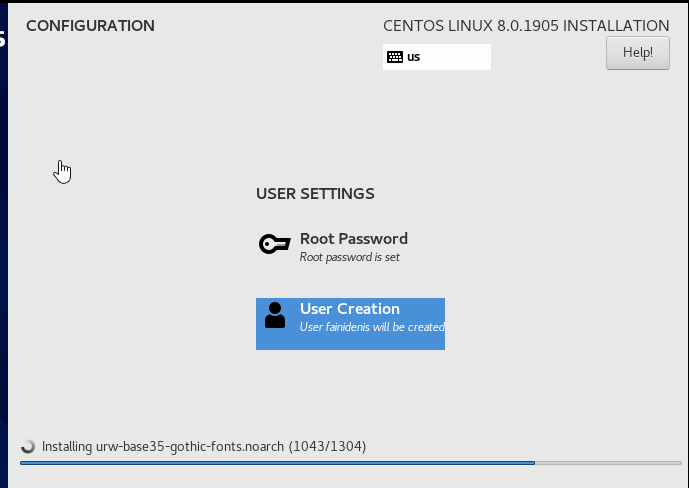

**Uncompleted Initial setup of licensing**

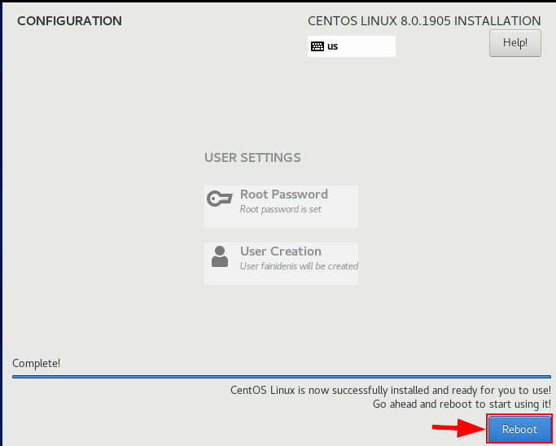

**Accept the License Agreement**

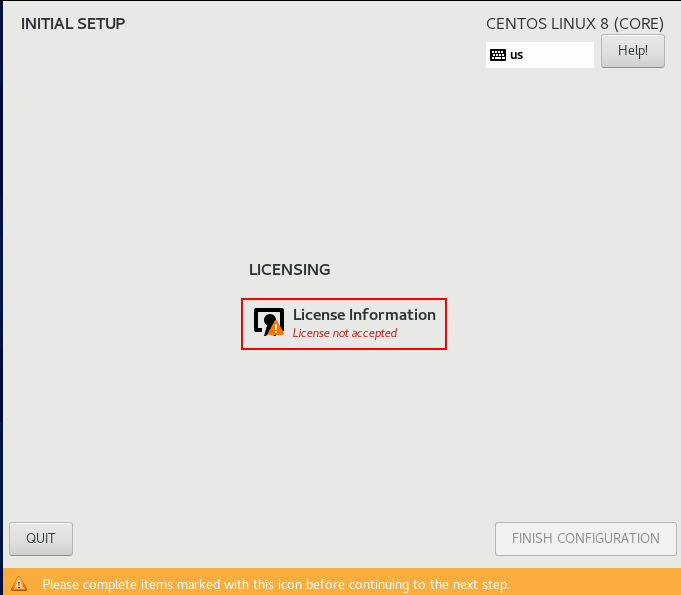

**Complete configuration after License accepted**

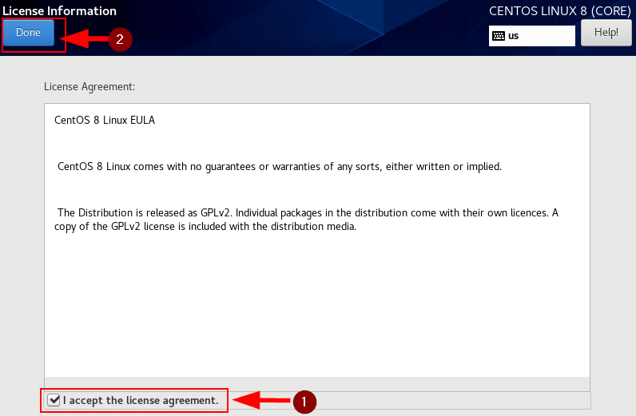

**Login to your user name with password**

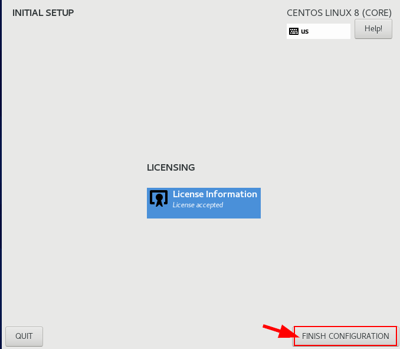

**CentOS Desktop Environment**

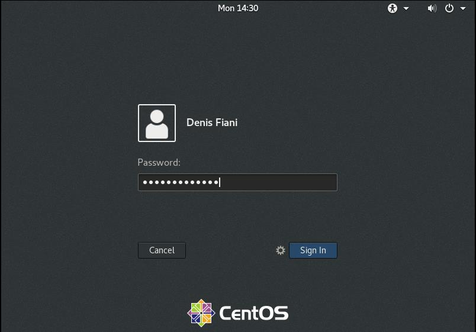
