# Fedora Workstation 31

| | |
|---|---|
| **ISO source** | https://getfedora.org/en/workstation/download/ |
| **Version installed** | Fedora Workstation 31 |
| **Released** | October 29, 2019 |
| **Package manager** | dnf/yum (rpm) |
| **Boot behavior** | Either "Try Fedora" (live) or "Install Fedora" directly |

## Steps

1. Download the Fedora Workstation ISO from the official Fedora website.
2. Boot the machine from the installation media.
3. At the BIOS-mode boot menu, choose the first option.
4. From the Fedora welcome screen, choose Install to Hard Drive.
5. Choose the installer language.
6. Configure the installation destination (target disk).
7. On the Installation Summary screen, click Begin Installation.
8. After installation completes, remove the installation media and click Finish Installation to reboot.
9. On first boot, fill in your account details.
10. Set a password for the new user account.
11. Click through to start using Fedora.

## Screenshots

Captured in order during the walkthrough (`screenshots/fedora/`):

**Fedora Workstation Installer Menu**

**Fedora choose options to either try live or Install to Hard Drive**

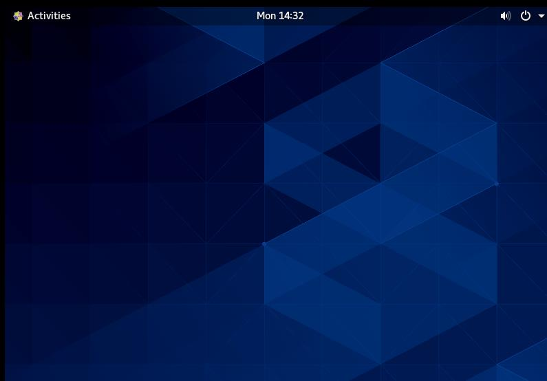

**Select a language to use Fedora Workstation**

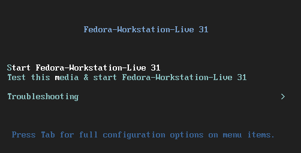

**Uncompleted Installation Summary configuration**

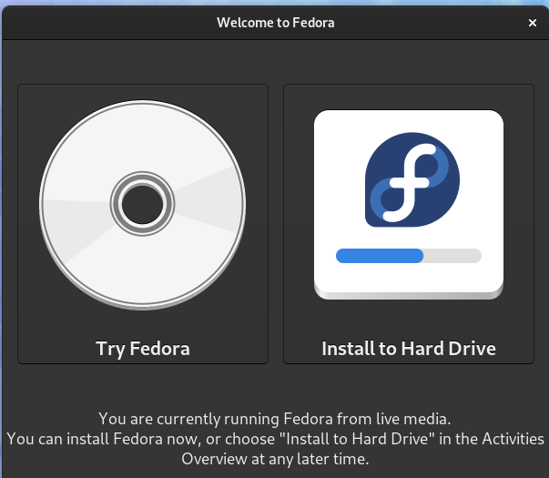

**Select Disk to Install the system**

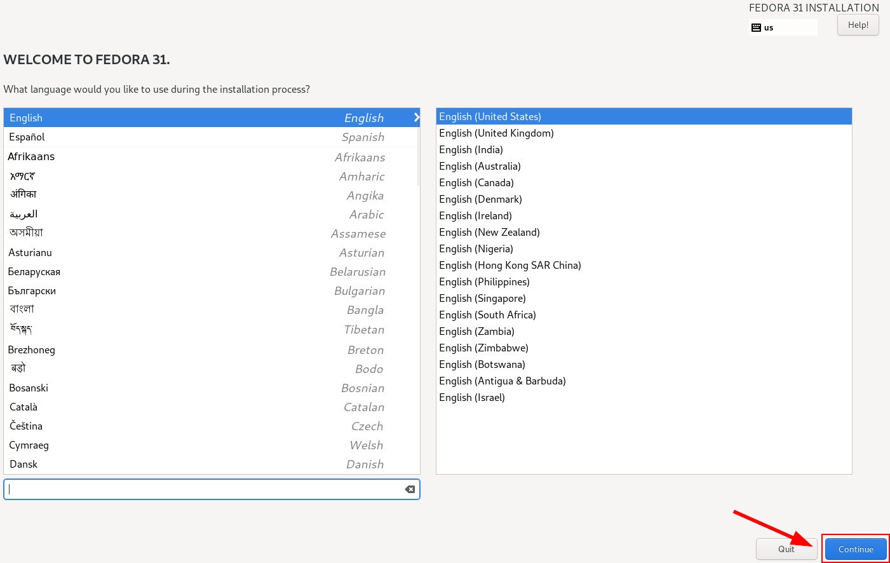

**Complete Installation Summary configuration**

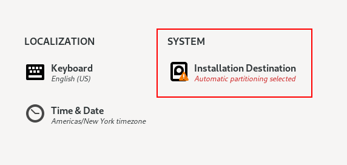

**Reboot system after Installation complete**

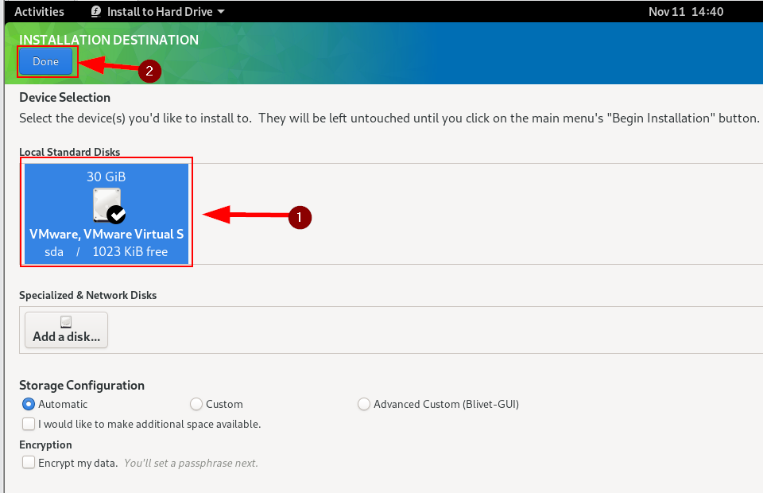

**Create a new user account**

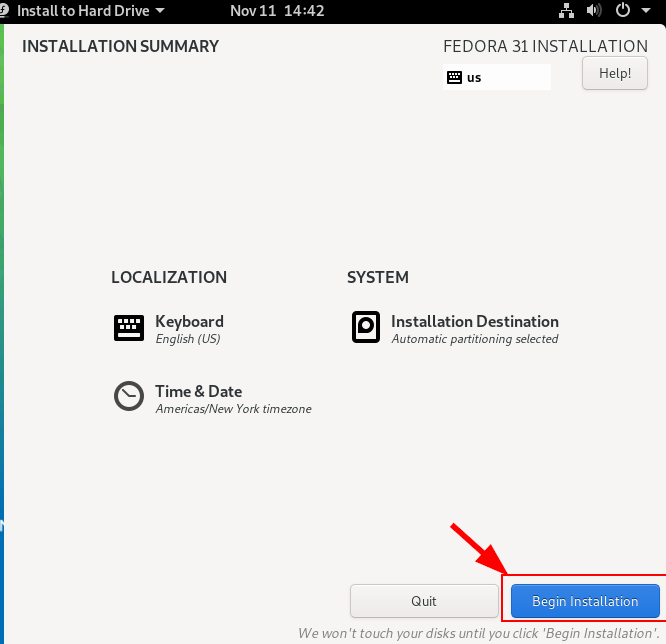

**Set a password for the new user account**

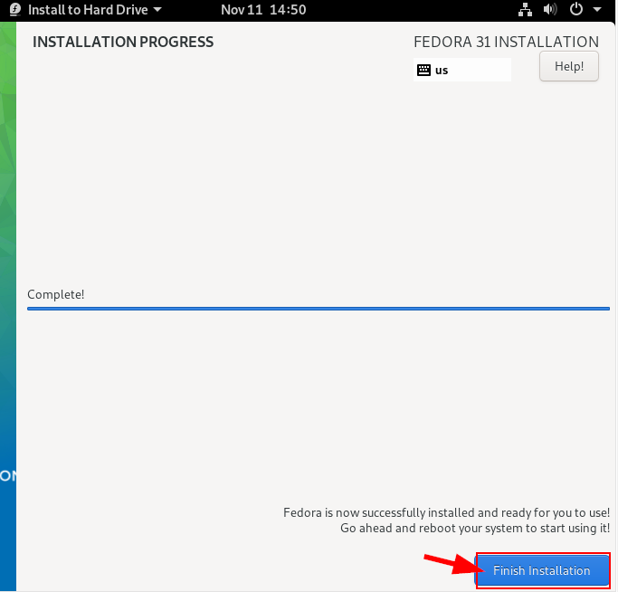

**Ready to go using Fedora**

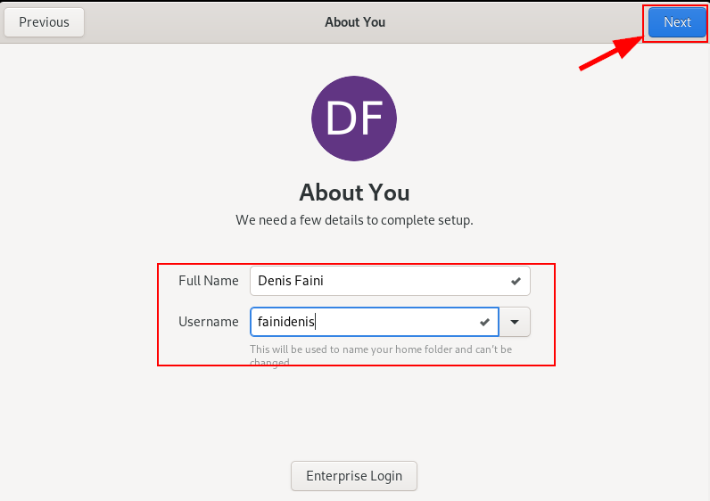

**Fedora Workstation Desktop Environment**

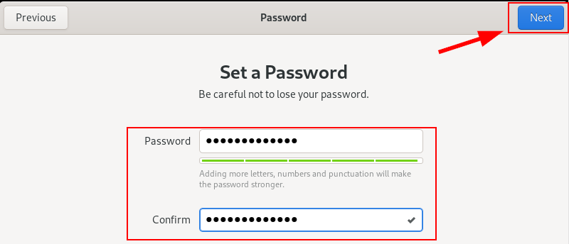

**Installer screenshot**

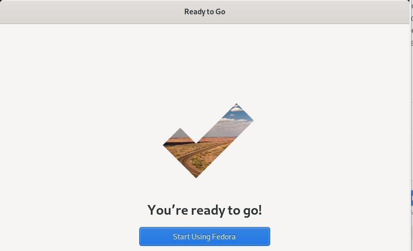
