# Red Hat Enterprise Linux 8

| | |
|---|---|
| **ISO source** | https://redhat.rit.edu/iso/ |
| **Version installed** | Red Hat Enterprise Linux 8 |
| **Released** | November 5, 2019 |
| **Package manager** | yum (rpm) |
| **Boot behavior** | Complete install first (no live session) · ISO was 6.61 GB |

## Steps

1. Download the Red Hat Enterprise Linux 8 ISO (via a licensed source — redhat.rit.edu for this run).
2. Boot the machine from the installation media.
3. At the BIOS-mode boot menu, choose the first option.
4. Choose the installer language.
5. Configure the installation destination (target disk).
6. On the Installation Summary screen, click Begin Installation.
7. While installation runs, configure root and local user account settings.
8. Set the root password and create a new local user account.
9. After installation completes, reboot the system.
10. Accept the licensing agreement, finish initial setup, and log in.

## Screenshots

Captured in order during the walkthrough (`screenshots/rhel8/`):

**Red Hat Enterprise Linux Installer Menu**

**Select a language to use the system**

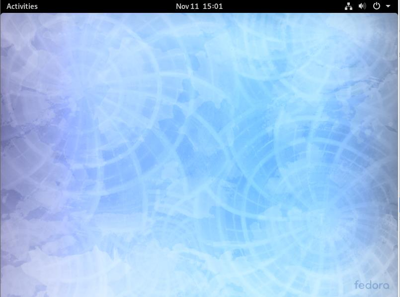

**Uncompleted Installation Summary configuration**

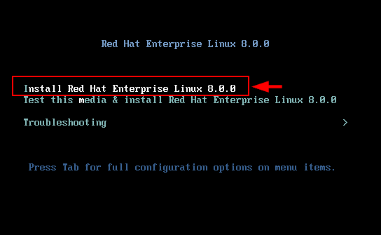

**Select Disk to Install the system**

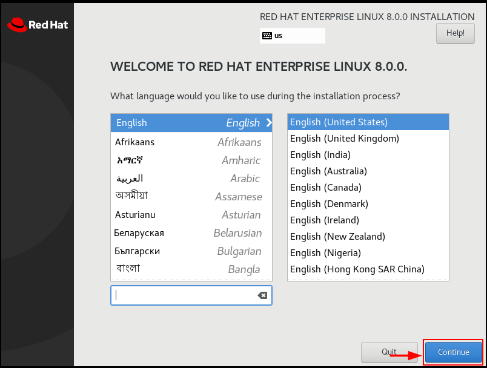

**Complete Installation Summary configuration**

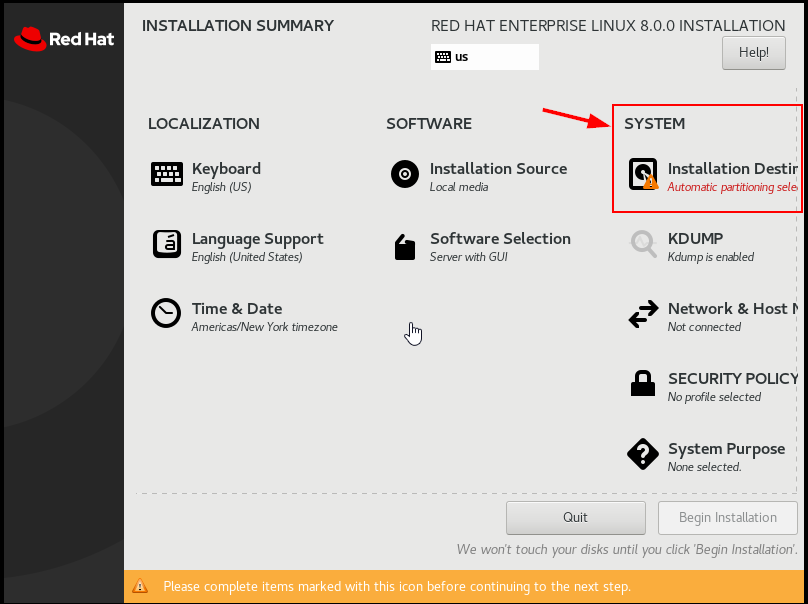

**Uncompleted Configuration of User Settings during Installation process**

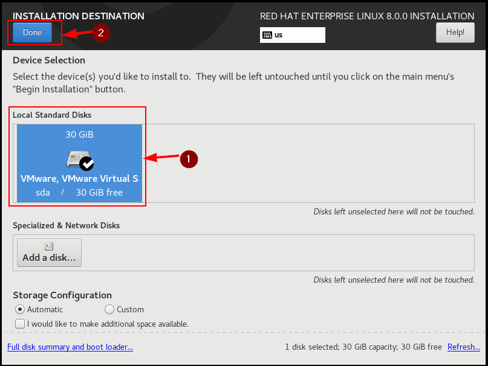

**Enter root password for the system**

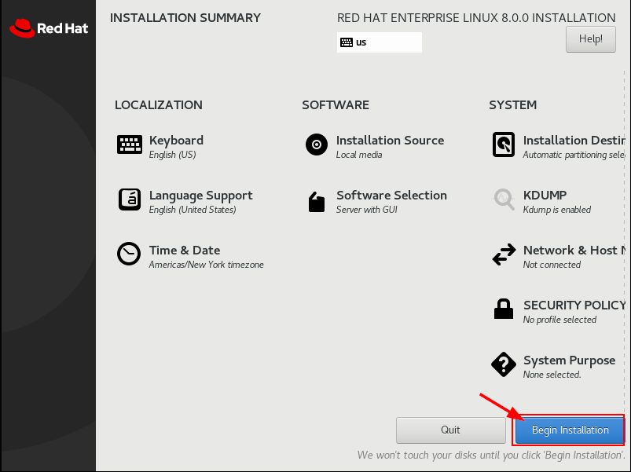

**Create a new user account**

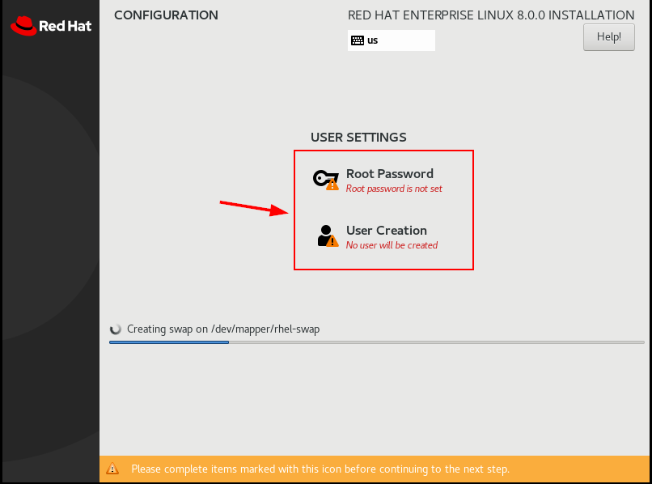

**Complete configuration of User Settings**

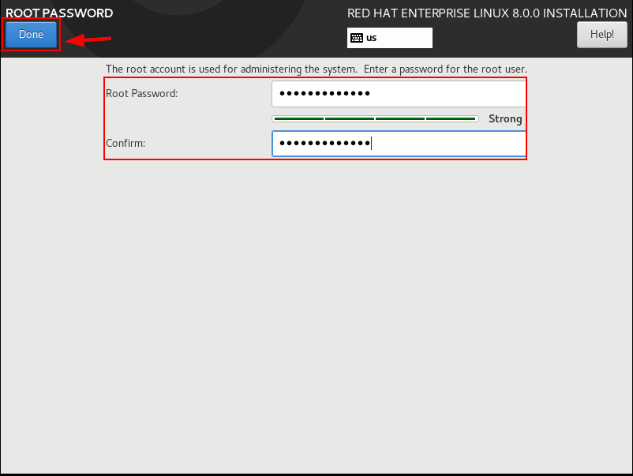

**Reboot system after Installation complete.**

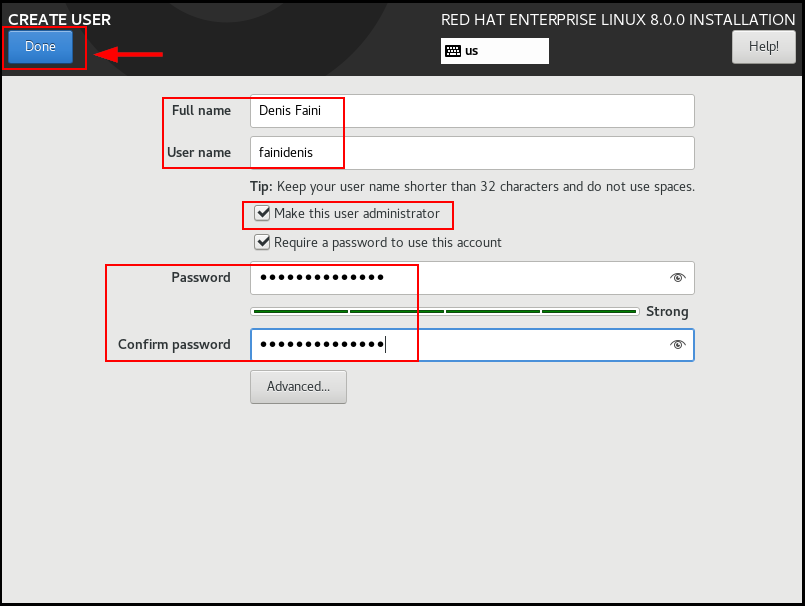

**Uncompleted Initial setup of licensing**

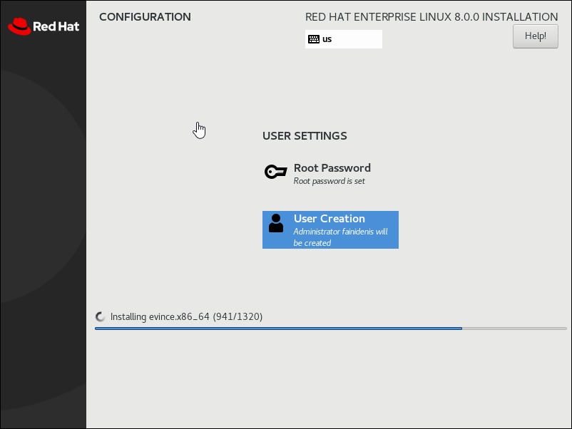

**Accept the License Agreement**

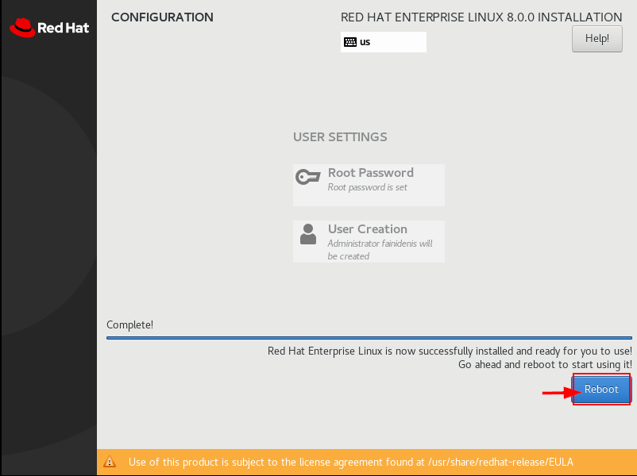

**Complete configuration after License accepted**

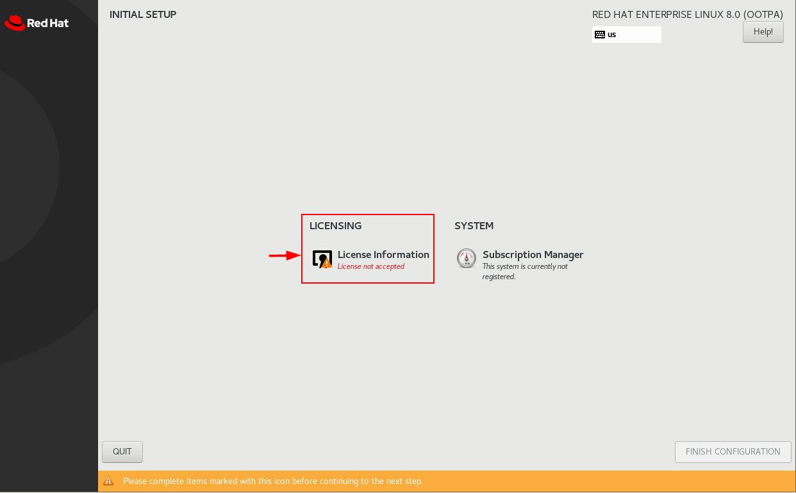

**Login to your user name with password**

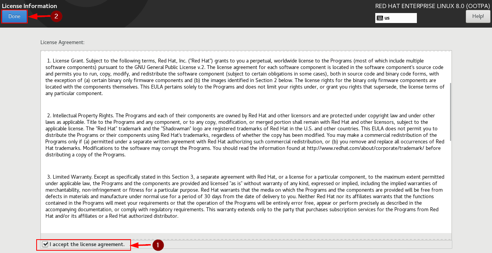

**Red Hat Enterprise Linux Desktop Environment**

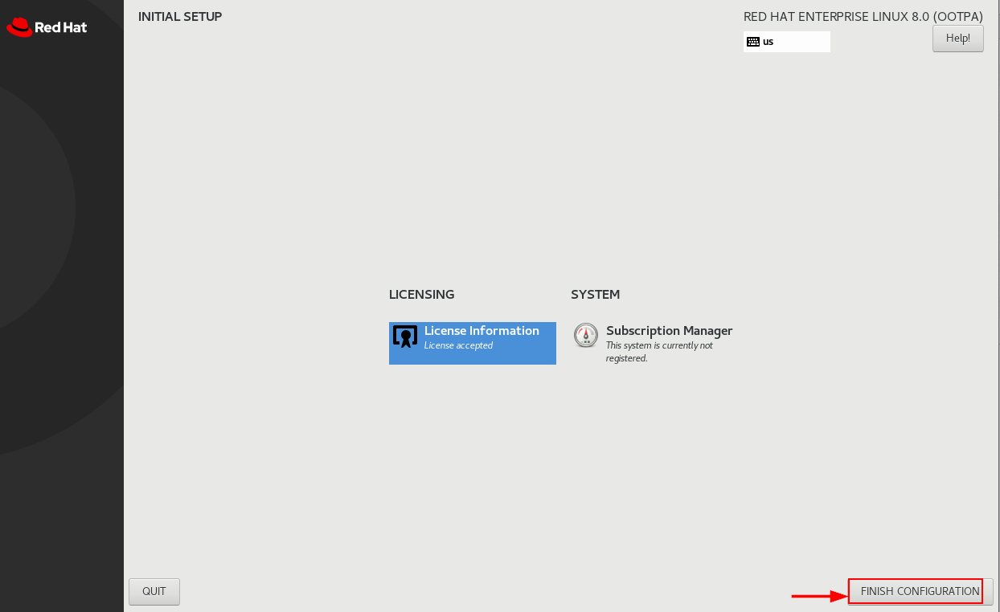

**Installer screenshot**

