# FreeBSD 12.1 (+ GNOME)

| | |
|---|---|
| **ISO source** | https://download.freebsd.org/ftp/releases/amd64/amd64/ISO-IMAGES/12.1/FreeBSD-12.1-RELEASE-amd64-disc1.iso |
| **Version installed** | FreeBSD 12.1-RELEASE |
| **Released** | November 4, 2019 |
| **Package manager** | pkg |
| **Boot behavior** | Complete install first (no live session) · ISO was 867 MB · no GUI by default |

## Steps

1. Download the FreeBSD ISO from the official FreeBSD website.
2. Boot the machine from the installation media.
3. At the BIOS-mode boot menu, choose the first option.
4. On the welcome screen, select Install.
5. Choose the system keymap.
6. Set the system hostname.
7. Partition the target disk using the guided partition editor.
8. Confirm the partitioning warning and let the base distribution fetch and extract.
9. Set the root password.
10. Configure networking — interface, DHCP or static IPv4/IPv6, and DNS resolver.
11. Select the time zone (region, then confirm the abbreviation).
12. Choose which system services to enable, and review the system-hardening options.
13. Add a local (non-root) user account.
14. Skip manual configuration (unless changes are needed) and reboot.
15. Log in with the account created during setup.
16. Update and upgrade the base system as root (`freebsd-update`, `pkg update && pkg upgrade`).
17. Install a desktop environment — GNOME, via `pkg install gnome`.
18. Edit `/etc/rc.conf` to enable the display manager and D-Bus/HAL services.
19. Edit `/etc/fstab` to add the `proc` filesystem entry GNOME expects (nano was used in place of vi here).
20. Reboot into the graphical login screen and log in — FreeBSD is now running a full GNOME desktop.

## Notes

This was the most involved install of the nine. FreeBSD's installer (bsdinstall) is text-based and doesn't ship a desktop by default, so getting to a graphical login meant a second phase after the base install: `pkg install gnome`, then hand-editing `/etc/rc.conf` (to enable `gdm`/`gnome` and `dbus`/`hald`) and `/etc/fstab` (to add the `proc` filesystem entry GNOME expects) before GDM would even start. This matches the lab's own conclusion — installing FreeBSD's base system is straightforward, but bolting a GUI on top is not.

## Screenshots

Captured in order during the walkthrough (`screenshots/freebsd/`):

**FreeBSD Installer boot menu**

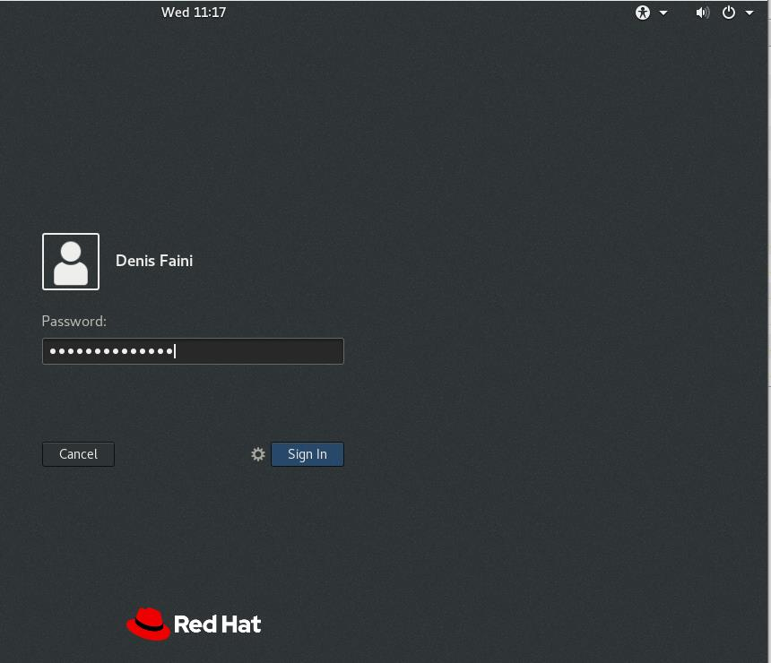

**Welcome installer window wizard**

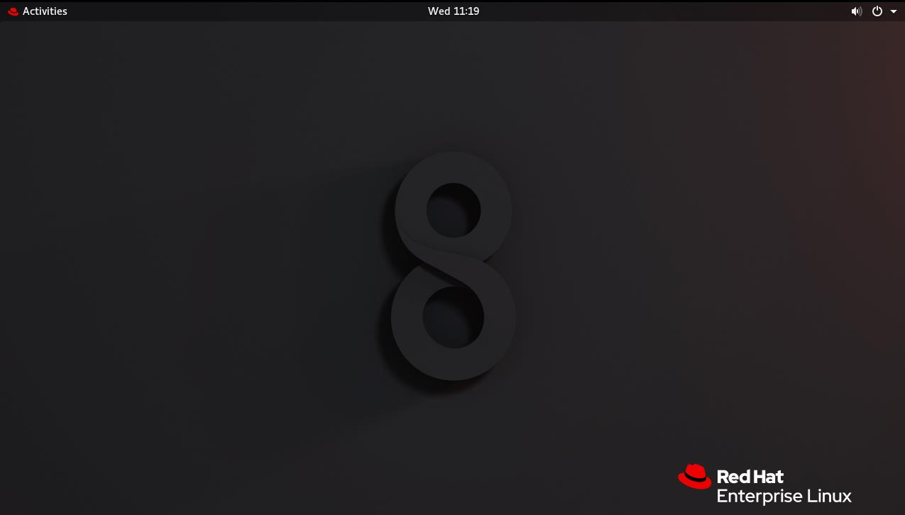

**FreeBSD keymap selection**

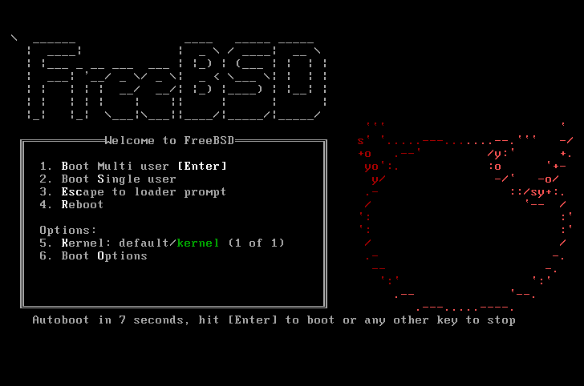

**FreeBSD hostname setup**

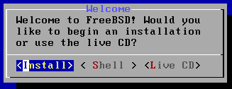

**FreeBSD Partition**

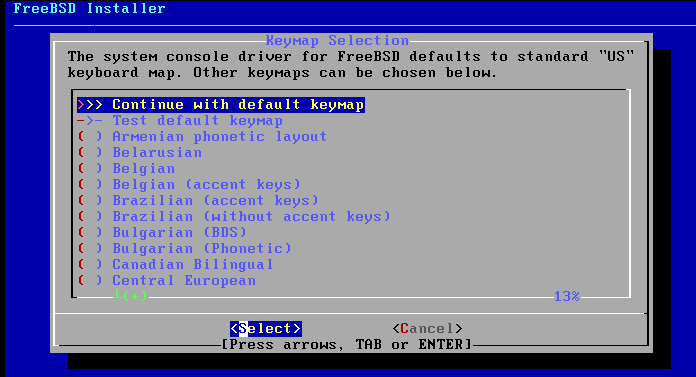

**FreeBSD partition types**

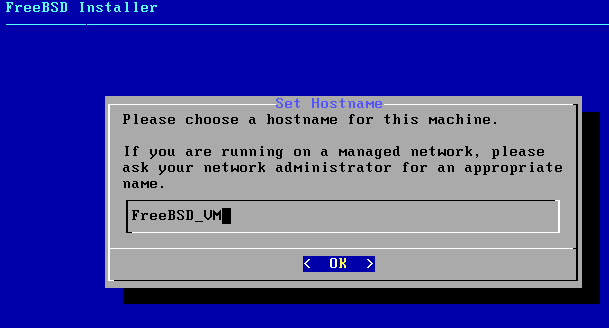

**FreeBSD Partition Editor**

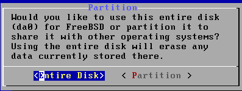

**FreeBSD warning confirmation message**

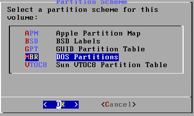

**FreeBSD Fetching Distribution in process**

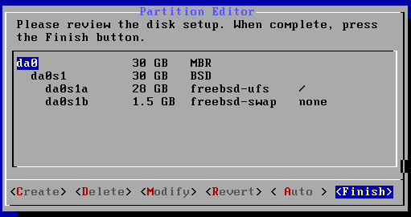

**FreeBSD Archive Extraction in process**

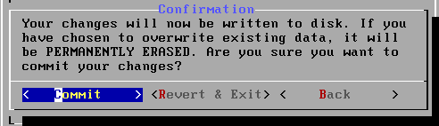

**Set up new FreeBSD root password**

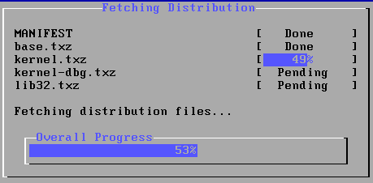

**FreeBSD Network Configuration**

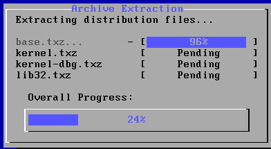

**FreeBSD IPv4 network interface configuration**

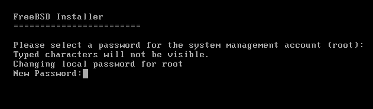

**FreeBSD DHCP network configuration**

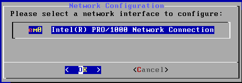

**FreeBSD IPv6 network configuration**

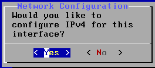

**FreeBSD DNS resolver configuration**

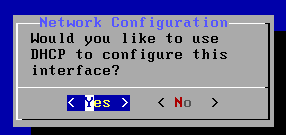

**FreeBSD time zone selector**

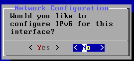

**FreeBSD Select a country or region**

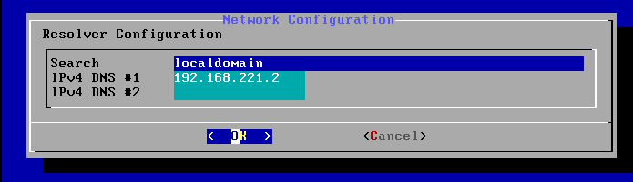

**FreeBSD USA Time Zone**

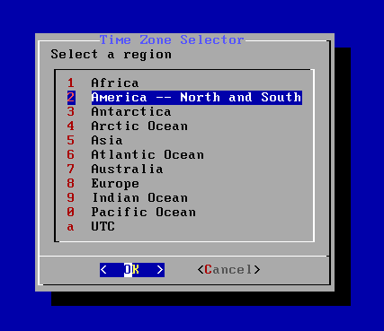

**FreeBSD confirmation of Time zone abbreviation**

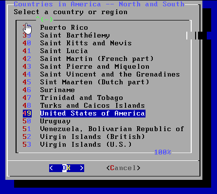

**FreeBSD System configuration for service**

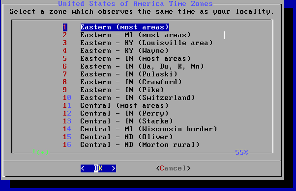

**FreeBSD System hardening options**

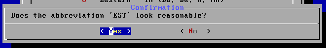

**FreeBSD Add User Accounts**

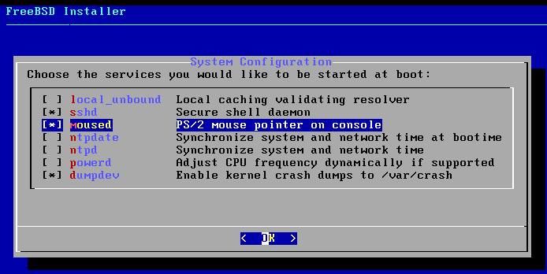

**FreeBSD added user to the system**

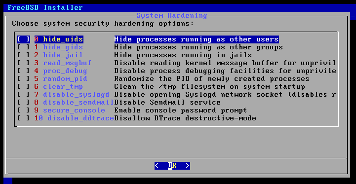

**User account review message before confirming if they are correct**

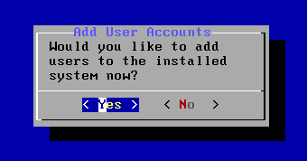

**FreeBSD Manual Configuration**

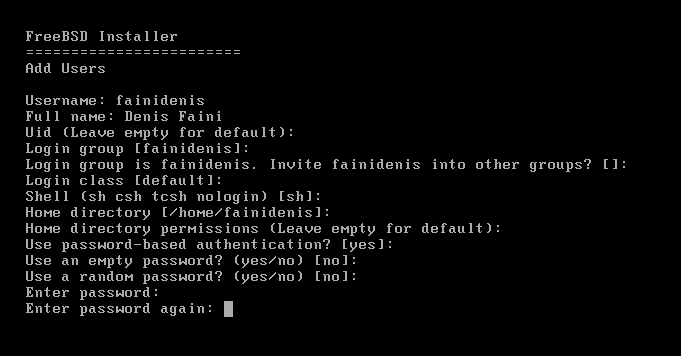

**Complete FreeBSD installation**

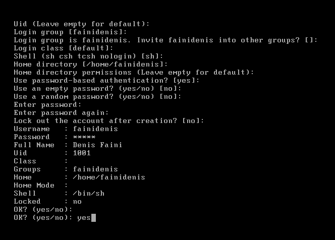

**Login to FreeBSD after reboot**

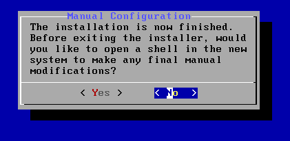

**FreeBSD Update the system**

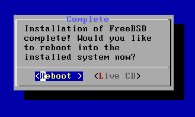

**FreeBSD Upgrade the system**

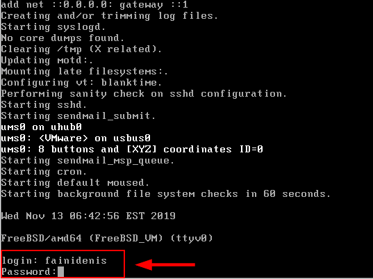

**FreeBSD GNOME install**

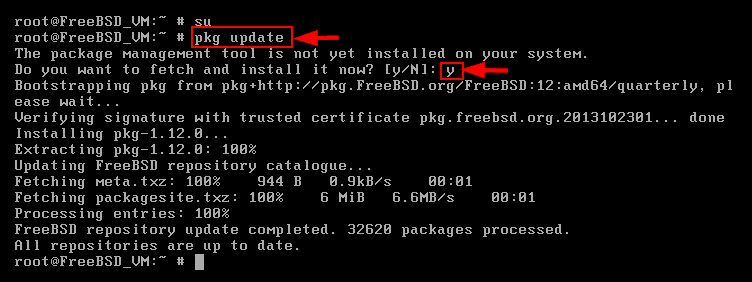

**Number of GNOME packages to be installed**

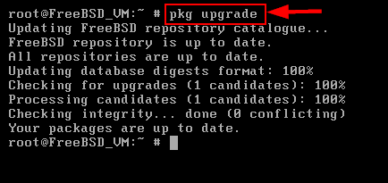

**GNOME installation is in process**

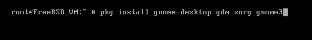

**GNOME is successful installed to the system**

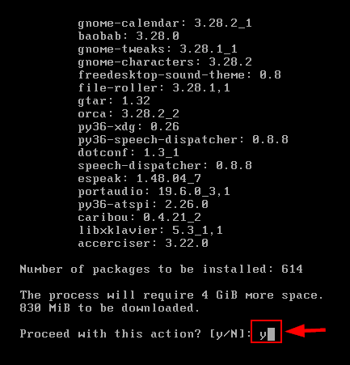

**Command for edit rc.conf file**

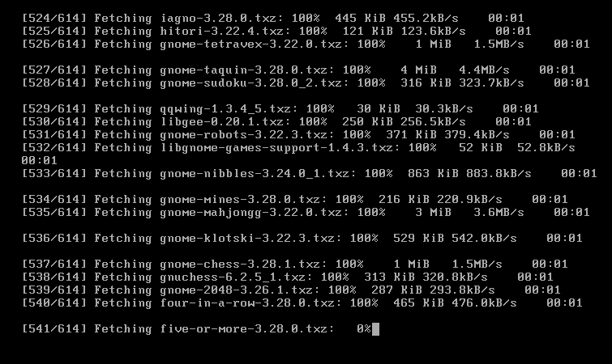

**Add few texts to the next lines**

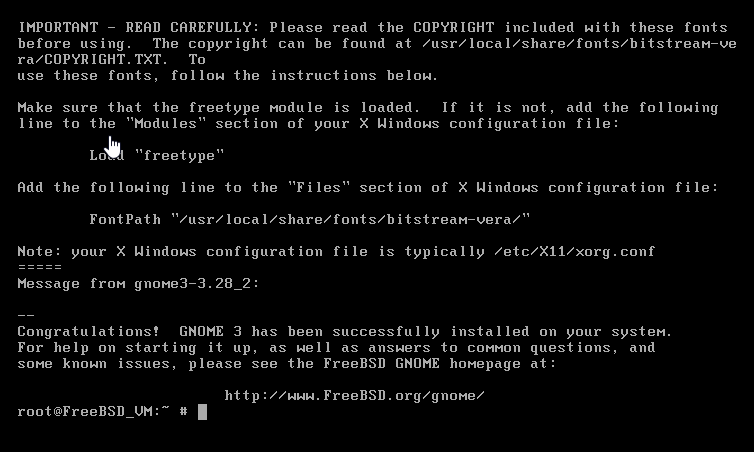

**Command for edit fstab file**

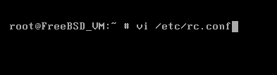

**Add few texts on the next line (I use nano instead of vi to modify the file)**

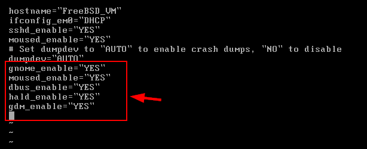

**FreeBSD login GUI Screen**

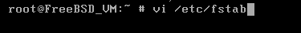

**Complete FreeBSD GUI installed**

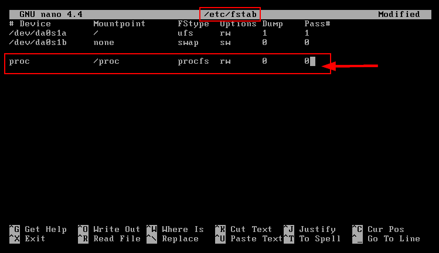

**Installer screenshot**

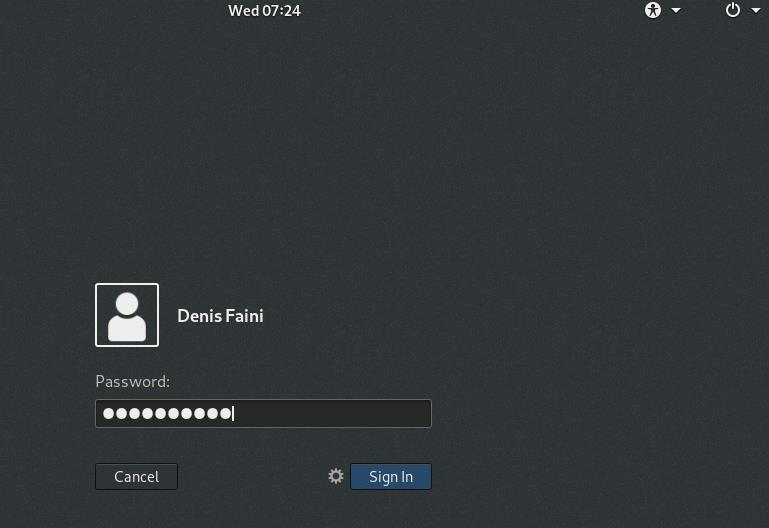
