# Puppy Linux (BionicPup64)

| | |
|---|---|
| **ISO source** | http://distro.ibiblio.org/puppylinux/puppy-bionic/bionicpup64/ |
| **Version installed** | Puppy BionicPup64 8.0 |
| **Released** | March 25, 2019 |
| **Package manager** | pet |
| **Boot behavior** | Live CD first, install-to-disk via desktop icon · ISO was 354 MB |

## Steps

1. Download the Puppy BionicPup64 ISO from its official distribution mirror.
2. Boot the machine from the installation media.
3. At the BIOS-mode boot menu, choose the first option.
4. In the live session, close the Quick Setup and Welcome windows.
5. Launch the Install icon from the desktop to install to the hard drive.
6. Choose the internal hard drive as the install target.
7. Use GParted to create a new partition table and a partition for the install (this took a couple of attempts — see notes below).
8. Point the installer at the freshly-partitioned drive and commit to install.
9. Choose FRUGAL or FULL install mode (FULL was selected here).
10. Let the installer transfer files to the hard drive.
11. Install the GRUB bootloader and pick the target disk / boot options.

## Notes

Partitioning was the rough edge here — the first attempt through GParted hit an error and needed a second pass (create a new partition table, erase the disk, then add the volume) before the installer would accept the target drive. Everything after that point was a standard FRUGAL/FULL install-to-disk flow.

## Screenshots

Captured in order during the walkthrough (`screenshots/puppy/`):

**Puppy Installer Menu**

**Close Quick Setup window**

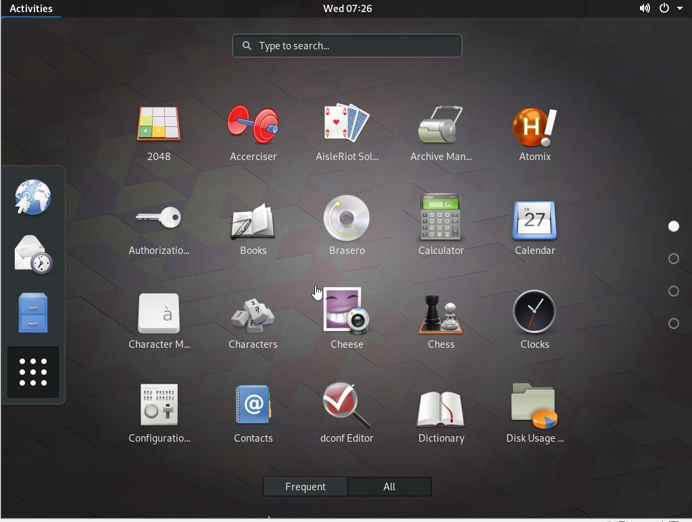

**Close Welcome window**

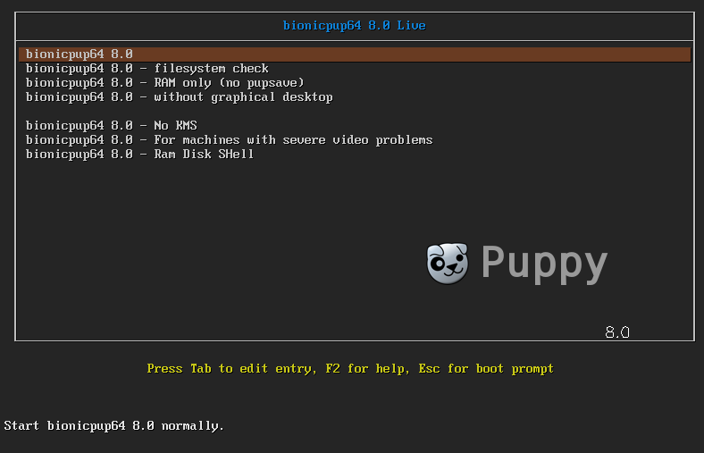

**Install puppy**

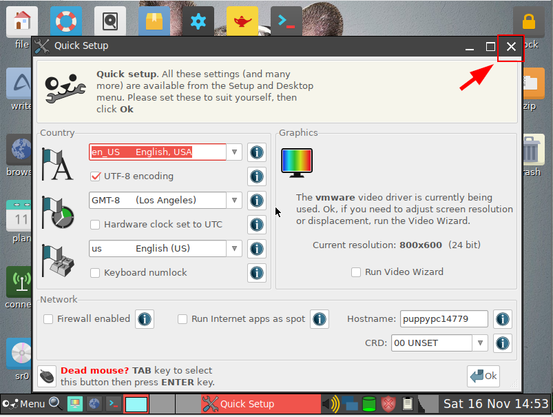

**Install puppy to the Internal Hard Drive**

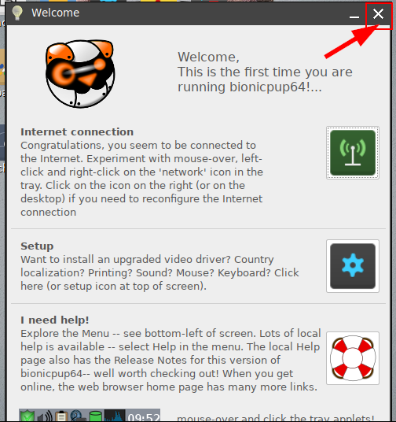

**Choose which drive to install**

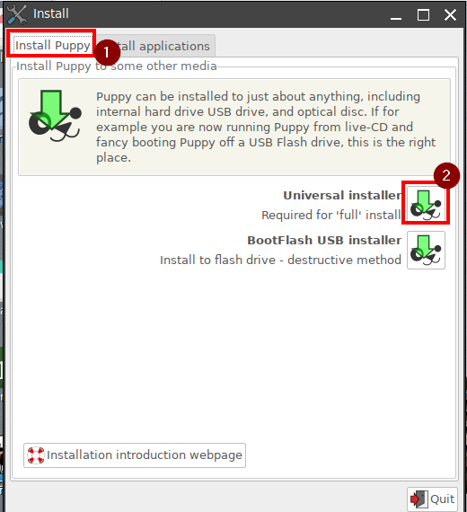

**Gparted message**

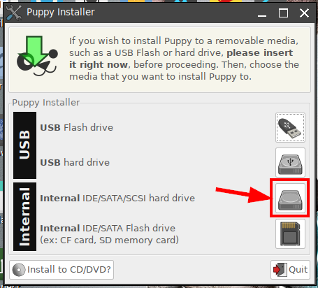

**Create new partition table**

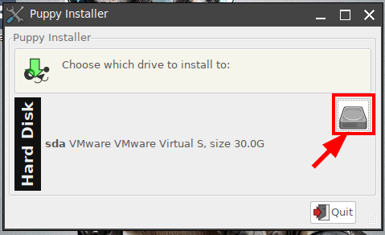

**Another alternative way partition table after this error**

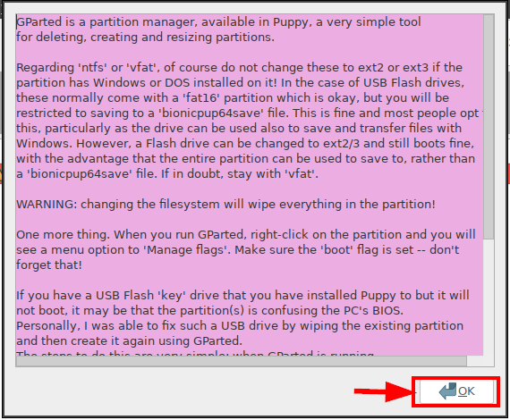

**Create Partition Table**

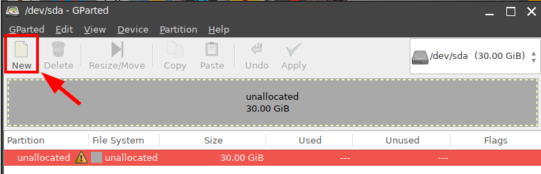

**Erase All entire disk data**

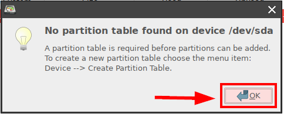

**Try again to create new partition under NEW tab**

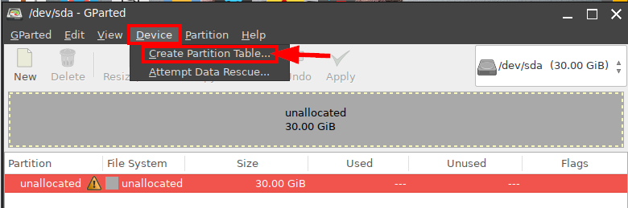

**Add partition Volume**

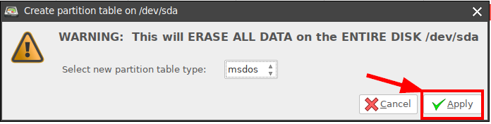

**Apply the change for partition**

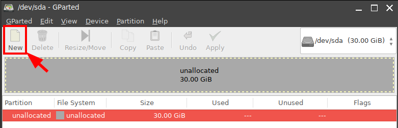

**Complete Gparted Operation**

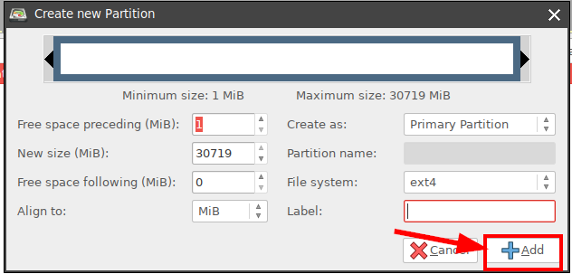

**Close GParted window**

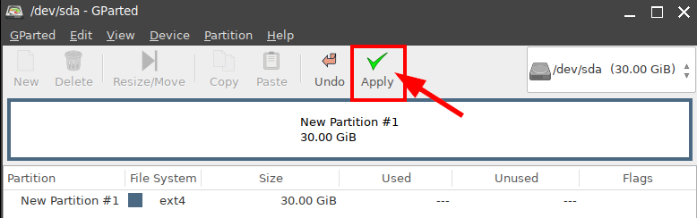

**Click again the Hard drive where you want to install**

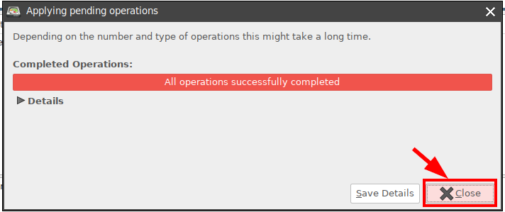

**Install puppy to the sda we created before**

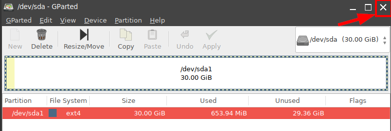

**Commit to install message**

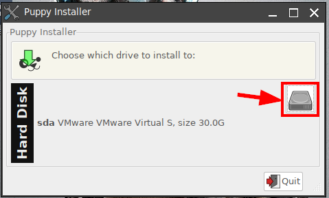

**Choose either FRUGAL or FULL to proceed (I choose FULL)**

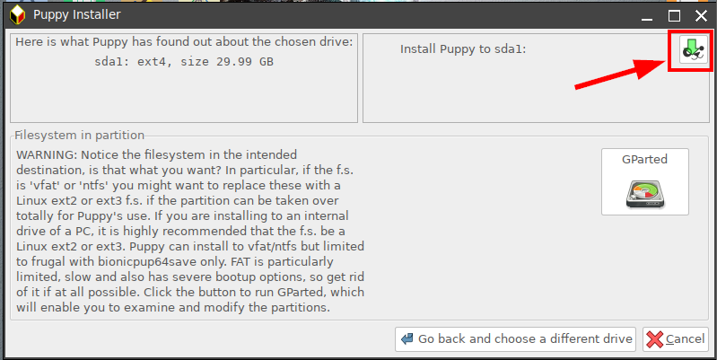

**Partition check message to install to hard drive**

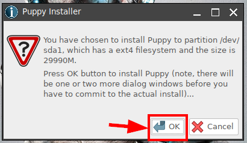

**Installer files are being transfer to hard drive**

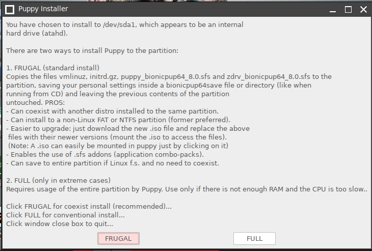

**Install Grub bootloader**

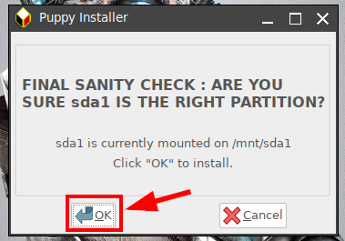

**Where you want to install grub bootloader**

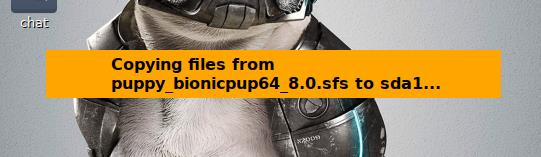

**List of extra boot loader will show here**

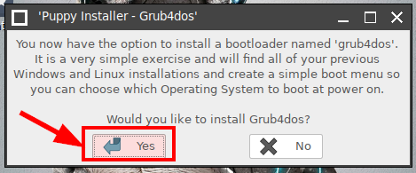

**Bootloader confirmation**

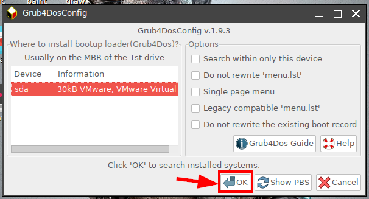

**Successfully installed grub bootloader**

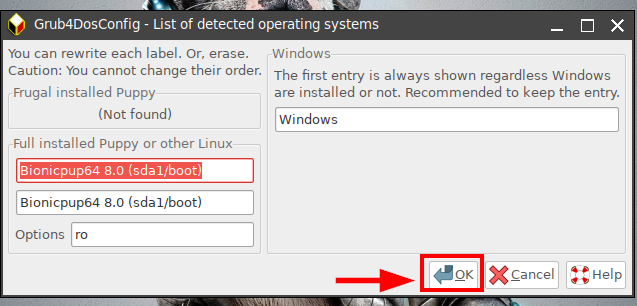

**Grub message if system doesn't have boot manager**

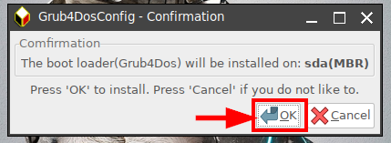

**Installer screenshot**

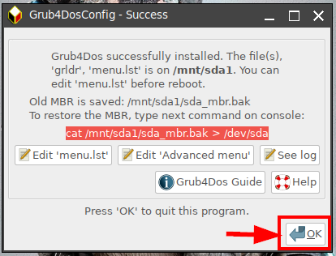

**Installer screenshot**

