# Zorin OS 15 Education

| | |
|---|---|
| **ISO source** | https://zorinos.com/download/#education |
| **Version installed** | Zorin OS 15 Education |
| **Released** | June 24, 2019 |
| **Package manager** | apt (deb) |
| **Boot behavior** | Either "Try Zorin" (live) or "Install Zorin" directly · ISO was 4.21 GB |

## Steps

1. Download the Zorin OS Education ISO from the official Zorin website.
2. Boot the machine from the installation media.
3. At the BIOS-mode boot menu, choose the first option.
4. From the welcome window, choose Install Zorin OS.
5. Choose the keyboard layout.
6. Optionally install updates and third-party software during setup if connected to the internet.
7. Select the installation type (erase disk was used here) after reading the warning message.
8. Confirm and write the changes to disk.
9. Set the time zone and create the user account.
10. Wait for installation to complete, then reboot.
11. Log in with the account created during setup.

## Screenshots

Captured in order during the walkthrough (`screenshots/zorin/`):

**Zorin OS Installer menu**

**Zorin OS Live CD or Install Welcome window**

**Zorin OS keyboard layout**

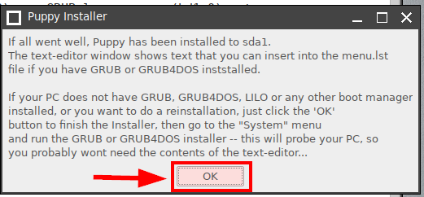

**Install Zorin OS updates and other software**

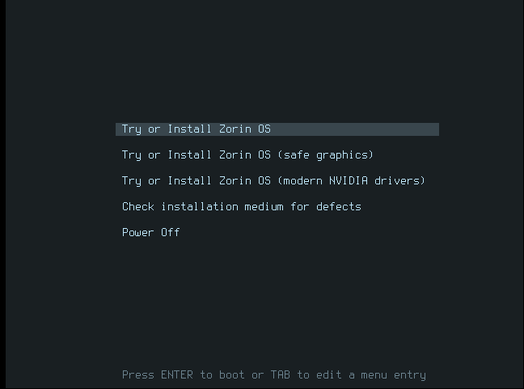

**Installation type to install Zorin OS**

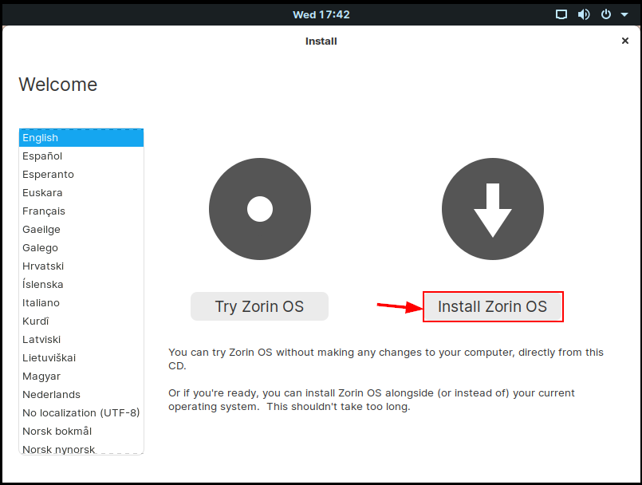

**Write the change to the disk**

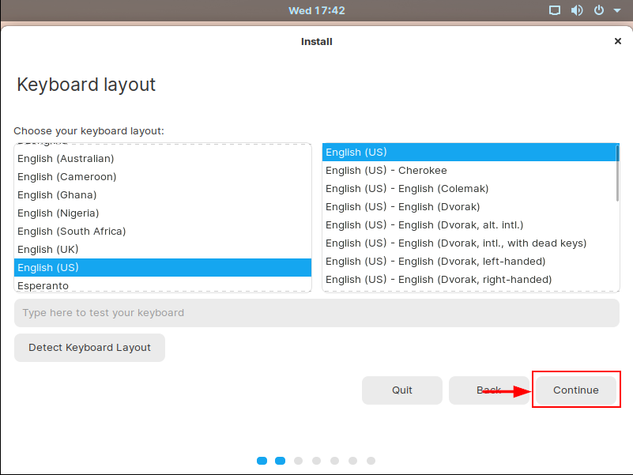

**Select your location for time zone**

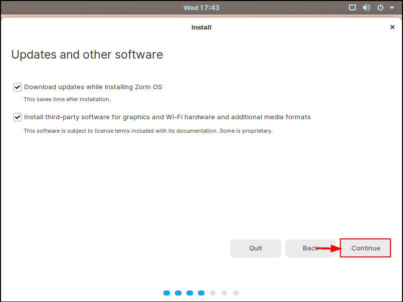

**Create new user account**

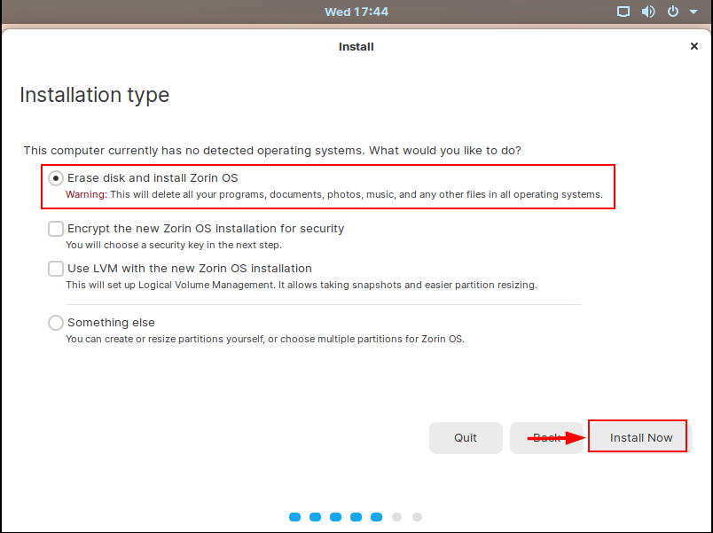

**Zorin OS installation is in process**

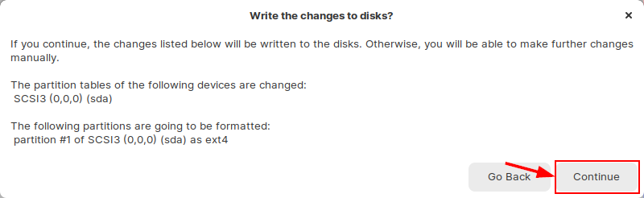

**Complete Zorin OS installation**

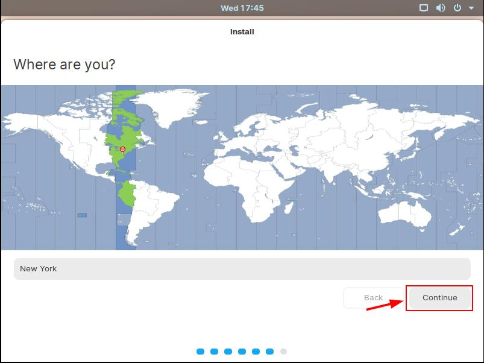

**Zorin OS login Screen**

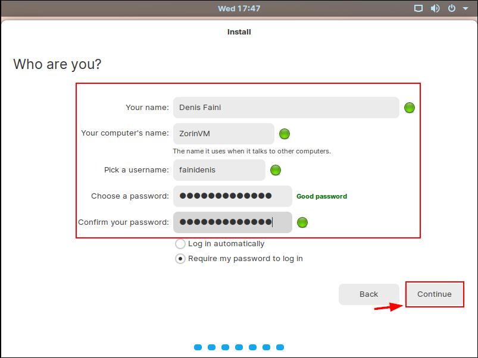

**Zorin OS Desktop Environment.**

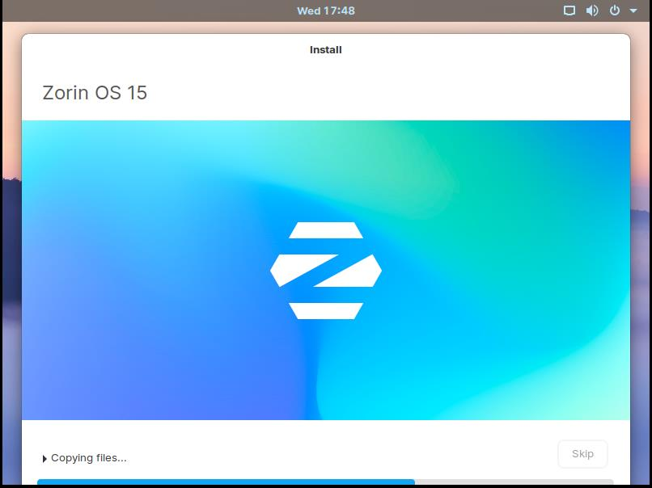

**Installer screenshot**

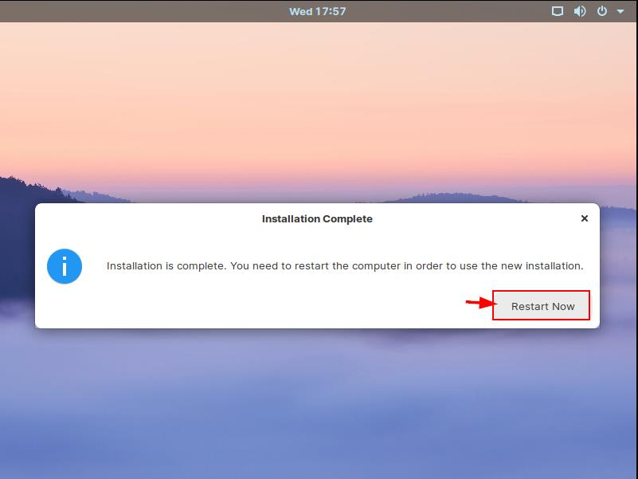

**Installer screenshot**

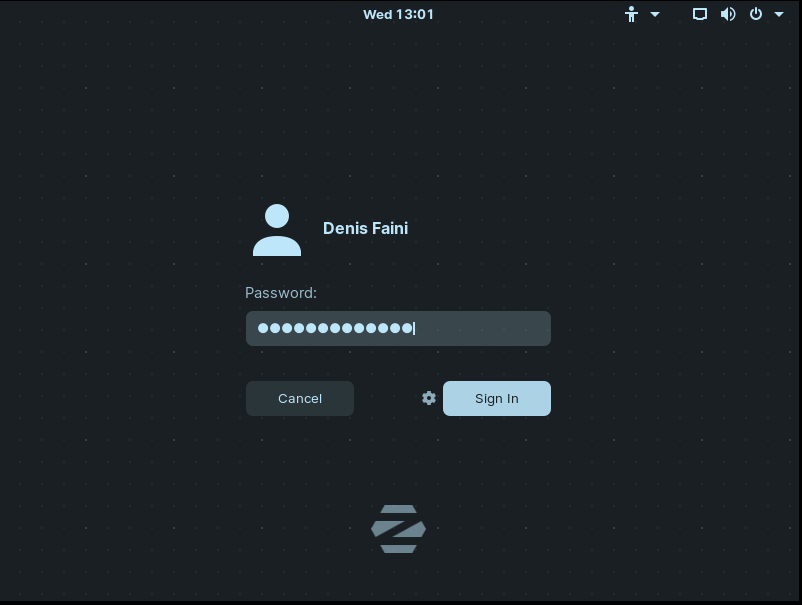
