# Parrot OS

| | |
|---|---|
| **Base** | Debian |
| **Version installed** | Parrot OS (Home/Workstation) |
| **Package manager** | apt (deb) |
| **Boot behavior** | Install-first |

## Steps

> Note: the original lab notes for this run were incomplete — a few later steps had been accidentally copy-pasted from the CentOS section, so only the genuine Parrot-specific steps are reproduced below.

1. Download the Parrot Home/Workstation ISO from its official website.
2. Boot the machine from the installation media.
3. At the BIOS-mode boot menu, choose Install.
4. Choose the installer language and location.
5. Choose the keyboard layout.
6. Set up the user account and password.
7. Configure the system clock.
8. Partition the disk for the Parrot install.

## Screenshots

Captured in order during the walkthrough (`screenshots/parrot/`). Because the original write-up for this section was incomplete, the screenshots below are shown without step annotations rather than guessed at:

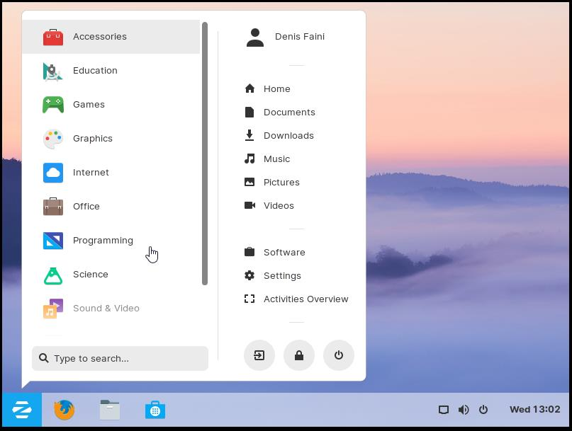

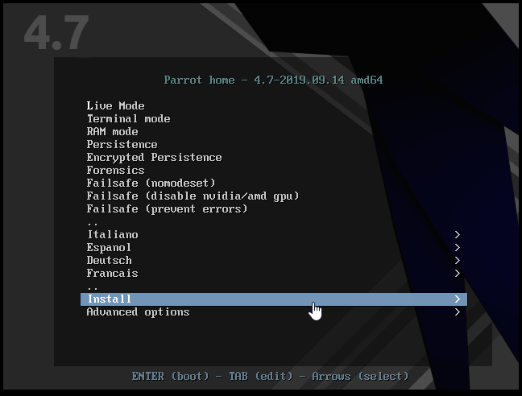

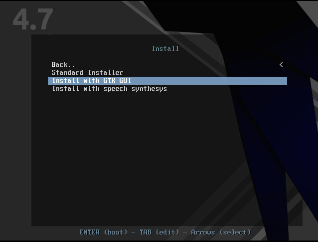

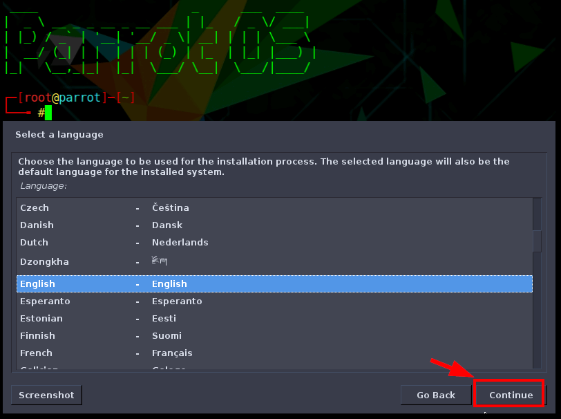

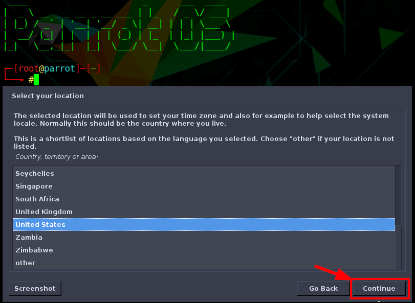

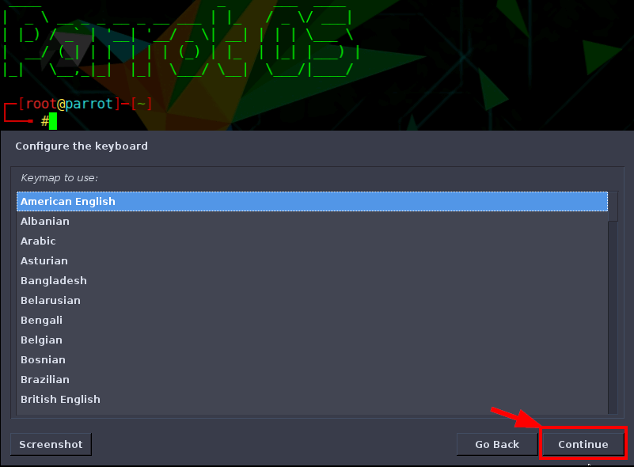

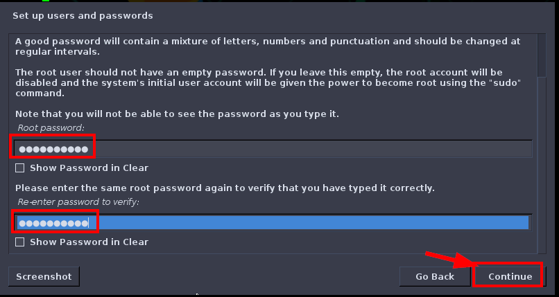

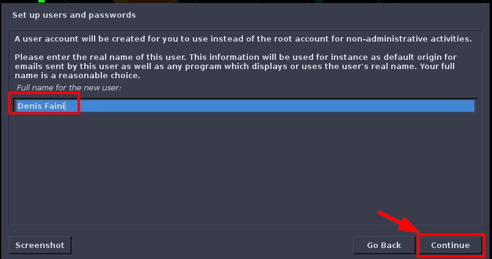

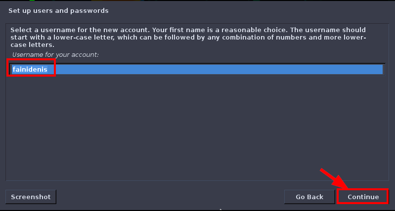

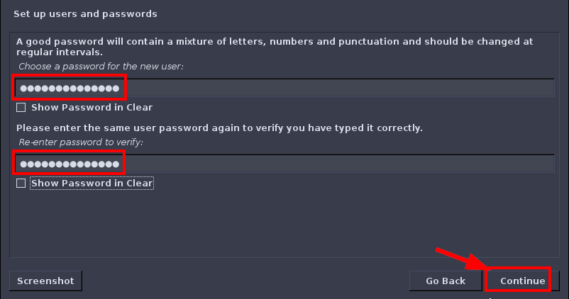

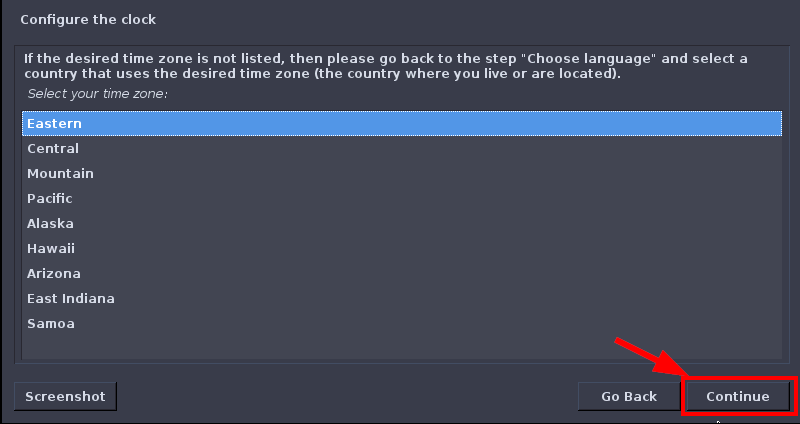

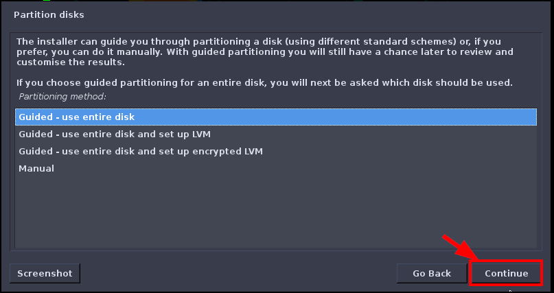

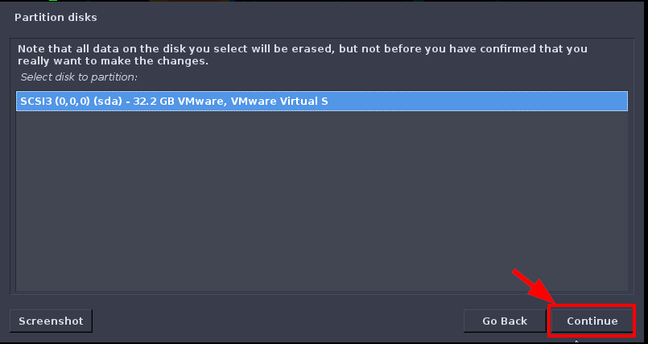

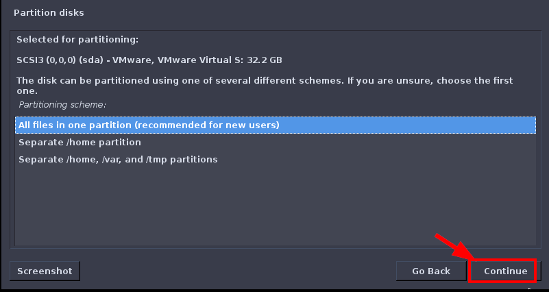

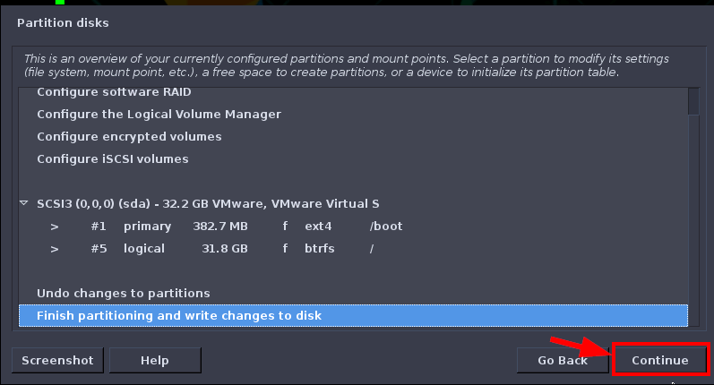

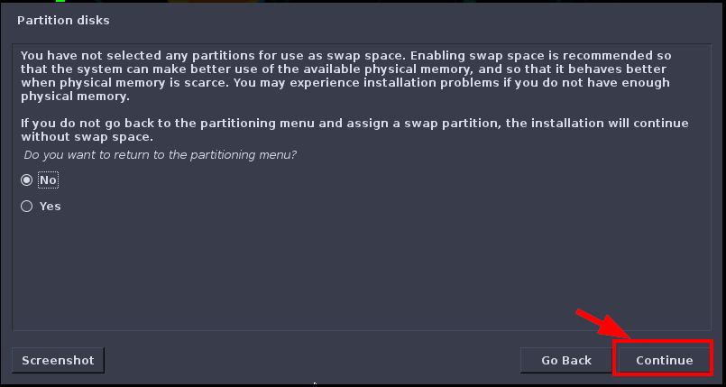

